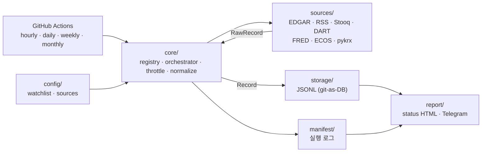

<div align="center">

# 🧭 Mimir

[English](README.md) · **한국어** · [中文](README.zh.md)

**무료로, 합법적으로 모은 공개 데이터에서 투자 인사이트를 길어 올린다.**

KR·US 시장의 공개 데이터(공시·가격·거시·뉴스)를 GitHub Actions에서 무료로 수집해<br/>
repo에 시계열로 저장(git-as-DB)하고, ⭐별점 인사이트와 일일 리포트로 만들어 텔레그램으로 전달하는 파이프라인.


[🚀 빠른 시작](#-빠른-시작) · [✨ 주요 기능](#-주요-기능) · [🗃️ 데이터 소스](#️-데이터-소스) · [🧱 아키텍처](#-아키텍처) · [⏰ 스케줄 & 저장](#-스케줄--저장) · [🔒 합법성 & 안전](#-합법성--안전) · [🗺️ Roadmap](#️-roadmap) · [📚 더 읽기](#-더-읽기)

[](docs/assets/dashboard.png)

<sub><code>python -m mimir.dashboard</code> 한 장 대시보드 → 정적 <code>reports/dashboard.html</code> — 목업 데이터로 표시.</sub>

</div>

---

> **왜 필요한가** — 투자 판단의 재료(공시, 가격, 금리, 뉴스)는 여러 곳에 흩어져 있고, 유료 데이터 벤더나 ToS를 어기는 스크래핑에 의존하기 쉽다. Mimir는 *공식 무료 API 우선*으로 합법적으로만 모아, 상시 서버 없이 GitHub Actions에서 돌리고, 데이터를 repo에 버전 관리되는 JSONL로 쌓는다. 그 위에 ⭐별점 인사이트·과거 사례 분석·일일 HTML 리포트·텔레그램 전달을 올리고, 최종적으로 분석과 실행을 분리한 자동매매의 기반이 된다.

Mímir는 북유럽 신화에서 지혜의 샘을 지키는 존재다.

---

## 🚀 빠른 시작

### 요구사항

| 항목 | 필요 조건 | 비고 |
| :--- | :--- | :--- |
| **Python** | `>=3.14` | `.tool-versions`로 asdf 핀(3.14.5) |
| **가상환경** | `.venv` | `python -m venv .venv` |
| **저장소** | 로컬 read/write | `data/`·`reports/`에 수집물·리포트 생성 |
| **API 키** | 전부 선택 | 키 없으면 해당 소스는 스킵(매니페스트에 기록). 키 없이도 SEC EDGAR + RSS 동작 |
| **GitHub** | 공개 repo 권장 | 공개 repo면 Actions 분(分) 무제한 |

```bash
# 1. 설치
python -m venv .venv
.venv/bin/python -m pip install -e ".[dev]"

# 2. 설정
cp .env.example .env          # 원하는 무료 키만 채우면 됨 (자동 로드됨, gitignore됨)
#   config/watchlist.yaml      추적 종목(US 티커 / KR 종목코드)
#   config/sources.yaml        소스 on/off · GRAY 정책 · 시리즈/feed catalog/종목별 RSS

# 3. 전체 파이프라인 실행 (수집→분석→과거패턴→평가→리포트)
.venv/bin/python -m mimir.run --cadence daily   # cadence: hourly|daily|weekly|monthly
#   또는 단계별로: mimir.collect / mimir.analyze / mimir.history / mimir.evaluate / mimir.deliver
```

`.env`는 실행 시 현재 디렉터리에서 자동 로드된다(키는 절대 커밋되지 않음). CI에서는 GitHub Actions Secrets가 우선한다.

과거 이력을 한 번에 적재(backfill)한다.

```bash
.venv/bin/python -m mimir.backfill --source stooq --since 2018-01-01
```

백필도 수집과 같은 manifest 형식을 쓴다. 성공하면 가져온 건수, 저장된 건수, 무효 레코드 수를 기록한다. 실패하면 `ok=false`를 먼저 남기고 호출자에게 에러를 그대로 올린다.

수집 결과는 repo에 쌓이고, 최신 실행 현황은 한 장의 HTML로 본다.

```text
data/<dataset>/YYYY/MM/DD.jsonl   # 수집물 (소스별 dedup 정책)
data/_manifest/YYYY/MM/DD.jsonl   # 실행 로그
reports/status.html               # 소스별 수집 현황
```

> 💡 `collect`는 일부 소스가 실패해도 나머지를 계속 수집하고, 실패를 매니페스트에 남긴 뒤 exit code `1`로 신호한다. `backfill`은 한 번에 한 소스만 처리하므로, 실패를 기록한 뒤 비제로 종료한다.

---

## ✨ 주요 기능

### 🔌 수집 (Collector)

| 기능 | 동작 |
| :--- | :--- |
| **소스 어댑터** | 공통 `Source` 프로토콜 뒤에 7개 내장 소스를 격리 구현한다. RSS는 정적 feed catalog와 종목별 feed를 지원한다. 외부 package는 `mimir.sources` entry point와 `sources.plugins.<source_id>` 설정 namespace로 source plugin을 등록할 수 있다 |
| **소스 격리** | 한 소스의 실패·포맷 변경이 다른 소스나 전체 실행을 멈추지 않음 |
| **정규화 envelope** | 모든 소스가 pydantic으로 검증되는 공통 레코드로 수렴 (`prices`·`filings`·`macro`·`news`) |
| **멱등 저장** | 같은 수집을 다시 돌려도 `idempotency_key`로 중복 없이 append |
| **스로틀 + 합법성** | 소스별 `rate_limit`·`legal_status`를 코드로 강제 |
| **백필** | Stooq·FRED·ECOS 등에서 과거 이력을 일괄 적재해 과거패턴 분석을 앞당김 |

### ⏱️ 스케줄 & 전달

| 기능 | 동작 |
| :--- | :--- |
| **무료 cron** | GitHub Actions `hourly/daily/weekly/monthly` 워크플로 (정시 혼잡을 피한 오프셋 분) |
| **git-as-DB 커밋백** | 수집 후 데이터를 repo로 커밋(`concurrency` 가드 + rebase) |
| **최소 가시성** | 데이터 현황 HTML + (옵션) "수집 완료" 텔레그램 핑 |
| **시크릿 분리** | API 키·봇 토큰은 GitHub Actions Secrets로만, 절대 커밋하지 않음 |

---

## 🗃️ 데이터 소스

모든 소스는 무료이며, 합법성을 *소스 단위*로 판단한다. 공식 API를 우선하고, 스크래핑(pykrx)은 ⚠️로 명시하고 토글 가능하게 둔다.

| 소스 | 시장 | 데이터셋 | cadence | 인증 | 합법성 |
| :--- | :--- | :--- | :--- | :--- | :--- |
| **SEC EDGAR** | 🇺🇸 US | filings (10-K/Q·8-K) | daily | User-Agent만 (가입 불필요) | ✅ 공식(스크립트 접근 명시 허용) |
| **RSS** | 🌐 | news 헤드라인 | hourly | 불필요 (공식 피드) | ✅ 공식 |
| **Stooq** | 🇺🇸 US | EOD 가격(OHLCV) | daily | 무료 `apikey`(캡차 발급) | ✅ 무료 |
| **DART** | 🇰🇷 KR | 공시 | daily | 무료 API 키 | ✅ 공식 |
| **FRED** | 🇺🇸 US | 거시 시계열 | daily | 무료 API 키 | ✅ 공식 |
| **ECOS** | 🇰🇷 KR | 거시 시계열 | daily | 무료 API 키 | ✅ 공식 |
| **pykrx** | 🇰🇷 KR | OHLCV 가격 | daily | 불필요 (`pip install -e '.[kr]'`) | ⚠️ 그레이(스크래핑) |

키·패키지가 없으면 **SEC EDGAR + RSS**만 즉시 동작한다. 무료 키를 넣으면 Stooq/DART/FRED/ECOS가 켜지고, `[kr]` extra를 설치하면 pykrx가 켜진다. `yfinance`(야후)는 ToS가 자동수집을 금지하므로 1차 가격원에서 제외했다.

---

## 🧱 아키텍처



| 개념 | 설명 |
| :--- | :--- |
| **Source** | `fetch(ctx) → Iterable[RawRecord]`와 메타(market·dataset·cadence·legal·rate_limit)를 가진 어댑터 |
| **RawRecord → Record** | 소스별 원본을 공통 envelope로 정규화(pydantic 검증), `idempotency_key`로 멱등 |
| **Registry** | cadence와 GRAY 정책으로 "이번 틱에 돌릴 소스"를 선택 |
| **Orchestrator** | 선택 → 스로틀 → fetch → 정규화 → 저장 → 매니페스트 (소스별 격리) |
| **JsonlStore** | `data/<dataset>/YYYY/MM/DD.jsonl` 날짜 파티션 저장. 가격/공시/뉴스는 first-write-wins, 거시 관측값은 공식 개정을 반영하기 위해 last-write-wins |
| **Manifest** | 매 실행을 한 줄씩 기록(무엇을·언제·몇 건·성공 여부) — 데이터 신뢰성의 근거 |

내장 소스 추가는 `sources/`에 어댑터 하나 + `SourceSpec` 등록 한 줄로 끝난다. 외부 package는 `mimir.sources` entry point로 `SourceSpec`을 등록하고 자기 `sources.plugins.<source_id>` 설정 블록을 읽을 수 있다. 신뢰한 plugin만 설치해야 한다. Plugin은 Mimir 프로세스 안에서 실행되고 sandbox되지 않으며, API key를 포함한 설정값을 받을 수 있다. 상위 레이어(분석·매매)는 저장된 envelope만 읽는다.

---

## ⏰ 스케줄 & 저장

| cadence | 워크플로 | 주 용도 |
| :--- | :--- | :--- |
| **hourly** | `collect-hourly.yml` | 뉴스(RSS) |
| **daily** | `collect-daily.yml` | 가격 EOD · 공시 · 거시 |
| **weekly** | `collect-weekly.yml` | 저빈도 정리(예약) |
| **monthly** | `collect-monthly.yml` | 저빈도 거시(예약) |

- **GitHub cron은 best-effort** — 정시(`0 * * * *`)는 혼잡하므로 오프셋 분(`:23`, `:37` 등)을 쓴다.
- **저장은 날짜 파티션 JSONL** — 텍스트라 diff 친화적이고 append가 순수 추가 diff가 되어 git 비대화를 막는다. (SQLite/Parquet 바이너리 커밋은 피한다.)
- **공개 repo** 사용 시 Actions 분 무제한. 매 실행이 커밋하므로 60일 비활성 자동 비활성화에도 안 걸린다.

---

## 🔒 합법성 & 안전

| 경계 | 동작 |
| :--- | :--- |
| **소스 단위 합법성** | 각 소스가 `legal_status`(official/gray)·`rate_limit`을 메타로 들고 스로틀러가 강제 |
| **공식 API 우선** | DART·SEC EDGAR·FRED·ECOS 같은 공식 무료 API를 1차로 사용 |
| **GRAY 토글** | pykrx(스크래핑)는 스로틀 + 짧은 backoff 재시도 + 내부분석 한정, `sources.yaml`의 `gray_enabled: false`로 차단 가능 |
| **시크릿 분리** | 모든 키/토큰은 `.env`(로컬)·Actions Secrets(CI)로만, 커밋 금지 |
| **무침묵 실패** | `collect`와 `backfill` 실패는 매니페스트에 기록하고 비제로 종료로 신호 — 조용히 삼키지 않음 |
| **면책** | 모든 인사이트·평가에 "투자 권유가 아님(not financial advice)" 고지 포함 |

---

## 🛠️ CLI

```text
mimir.collect  --cadence {hourly|daily|weekly|monthly} [--config-dir config]
mimir.backfill --source <id> --since YYYY-MM-DD [--config-dir config]
mimir.analyze  [--date YYYY-MM-DD] [--config-dir config] [--data-root data]
mimir.deliver  [--cadence daily] [--date YYYY-MM-DD] [--reports-root reports]
mimir.history  [--symbol S] [--date YYYY-MM-DD] [--data-root data]
mimir.doctor   [--config-dir config] [--data-root data] [--format text|json] [--strict]
mimir.evaluate [--date YYYY-MM-DD] [--config-dir config] [--data-root data]
mimir.dashboard [--reports-root reports] [--date YYYY-MM-DD] [--lang en|ko|zh]
```

```bash
.venv/bin/python -m mimir.collect --cadence daily     # 수집 → data/
.venv/bin/python -m mimir.analyze --date 2026-05-31   # 분석 → insights/
#   [mimir] AAPL bullish ★★★★☆ (conf 0.85)
.venv/bin/python -m mimir.deliver --cadence daily     # 리포트+다이제스트
#   reports/2026/05/31.html + reports/index.html (+ 텔레그램 발송)
.venv/bin/python -m mimir.backfill --source stooq --since 2018-01-01
```

> 매일 워크플로는 `collect → analyze → history → evaluate → deliver`를 체이닝하고 `data/`·`reports/`를 repo에 커밋한다. 일일 HTML 리포트는 `reports/YYYY/MM/DD.html`로 영구 보관되고 `reports/index.html`에서 열람한다.

---

## 🧪 개발

```bash
.venv/bin/ruff check .                          # lint (target py314)
.venv/bin/mypy mimir                            # 타입 (strict)
.venv/bin/coverage run -m pytest                # 테스트
.venv/bin/coverage report --fail-under=80       # 커버리지 게이트
```

| 항목 | 값 |
| :--- | :--- |
| **테스트** | 438 passing (어댑터는 녹화 픽스처로 네트워크 없이 검증) |
| **커버리지** | `mimir/` 97% (게이트 80%) |
| **lint/type** | ruff + mypy `--strict` clean |
| **CI** | `.github/workflows/ci.yml` — push/PR마다 lint·type·test·coverage |

TDD를 따르며, HTTP 소스는 `responses`로, pykrx 같은 라이브러리 소스는 함수 주입으로 결정론적으로 테스트한다.

---

## 🗺️ Roadmap

| 스펙 | 내용 | 상태 |
| :--- | :--- | :--- |
| **S1 Collector** | 데이터 수집 & 저장 (7개 소스, git-as-DB, cron) | ✅ 완료 (Inc 1+2) |
| **S2 Analysis & Scoring** | 규칙 기반 → 하이브리드 ⭐별점(방향성+확신도) 인사이트 | ✅ 구현 (규칙 기반, LLM 후속) |
| **S3 Delivery & Reporting** | 풍부한 일일 HTML 리포트 + 매시간/매일/매주/매월 텔레그램 다이제스트 | ✅ 구현 |
| **S4 Historical / Event-Analog** | "과거 비슷한 일이 있었을 때 어떤 종목이 올랐/내렸나" | ✅ 구현 (event-study) |
| **S5 Automated Trading** | 전략·체결·리스크(페이퍼 먼저). 분석은 시그널만 발행, 실행 엔진이 소비 | 미래 |

전체 그림은 [`docs/architecture/roadmap.md`](docs/architecture/roadmap.md)를 기준으로 관리한다.

---

## ⚠️ 현재 한계

| 영역 | 상태 |
| :--- | :--- |
| **인사이트/별점** | 규칙 기반 시그널로 구현됨. ⭐ 확신도, confidence, attention, 면책 문구를 포함한다. 뉴스 매칭은 정적 `sources.rss.catalogs` catalog, 종목별 RSS feed, 보수적 기본 회사명 alias, 사용자 alias를 함께 쓰며, LLM 감성 시그널은 off-by-default seam으로 제공. 자동/live feed discovery는 아직 없다 |
| **KR 가격** | pykrx는 GRAY·선택 설치(`[kr]`). 키 없이 동작하는 가격원은 Stooq(무료 apikey 필요) |
| **과거패턴 분석** | S4 구현(event-study). 표본 `n`이 충분한 가격 이력이 필요 — 백필 권장 |
| **시그널 성적표** | `mimir.evaluate`로 구현되어 일일 리포트와 대시보드에 표시된다. 초기 실행에서는 과거 인사이트와 가격 표본이 충분해질 때까지 표본 부족으로 나올 수 있음 |
| **자동매매** | S5(미래). 지금은 경계만 설계(분석/실행 분리) |
| **API 한도** | 일부 무료 키의 일일 한도는 발급 콘솔에서 확인 필요 |

---

## 📚 더 읽기

| 문서 | 내용 |
| :--- | :--- |
| [`docs/architecture/roadmap.md`](docs/architecture/roadmap.md) | 전체 프로그램 분해와 단계별 가치 전달 |
| [`docs/architecture/extensibility/README.md`](docs/architecture/extensibility/README.md) | 현재 확장 지점, source-spec 등록, macro series registry, 재생성 데이터 정책 |
| [`docs/reference/config/sources.md`](docs/reference/config/sources.md) | `config/sources.yaml` 운영 레퍼런스 |
| [`docs/superpowers/specs/2026-05-31-collector-design.md`](docs/superpowers/specs/2026-05-31-collector-design.md) | S1 Collector 설계(아키텍처·소스 카탈로그·완료기준) |
| [`docs/superpowers/specs/2026-05-31-analysis-design.md`](docs/superpowers/specs/2026-05-31-analysis-design.md) | S2 Analysis & Scoring 설계(시그널·스코어러·Insight) |
| [`docs/superpowers/specs/2026-05-31-delivery-design.md`](docs/superpowers/specs/2026-05-31-delivery-design.md) | S3 Delivery & Reporting 설계(HTML 리포트·다이제스트) |
| [`docs/superpowers/specs/2026-05-31-historical-design.md`](docs/superpowers/specs/2026-05-31-historical-design.md) | S4 Historical / Event-Analog 설계(이벤트·사후수익) |
| [`docs/superpowers/specs/2026-05-31-trading-seam.md`](docs/superpowers/specs/2026-05-31-trading-seam.md) | S5 자동매매 seam(미래) — 분석/실행 분리·안전 모델 |
| [`docs/superpowers/plans/2026-05-31-s1-collector.md`](docs/superpowers/plans/2026-05-31-s1-collector.md) | S1 구현 계획(TDD, 태스크별) |
| [`.env.example`](.env.example) | 필요한(선택) 무료 키 목록 |

---

## License

MIT License. 자세한 내용은 [`LICENSE`](LICENSE)를 확인해 주세요.
