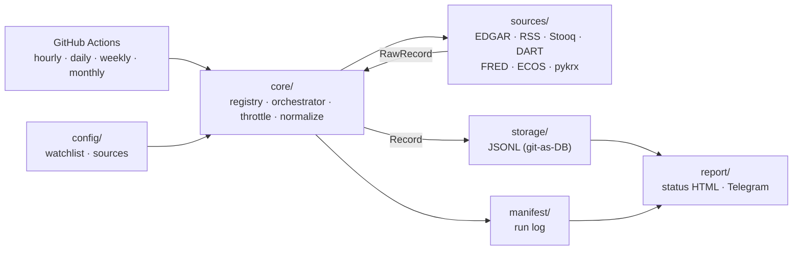

<div align="center">

# 🧭 Mimir

**English** · [한국어](README.ko.md) · [中文](README.zh.md)

**Drawing investment insight from public data gathered for free and legally.**

A pipeline that collects public data from the KR and US markets (filings, prices, macro, news) for free on GitHub Actions,<br/>
stores it as time series in the repo (git-as-DB), and turns it into ⭐ star-rated insights and daily reports delivered over Telegram.


[🚀 Quick Start](#-quick-start) · [✨ Features](#-features) · [🗃️ Data Sources](#️-data-sources) · [🧱 Architecture](#-architecture) · [⏰ Schedule & Storage](#-schedule--storage) · [🔒 Legality & Safety](#-legality--safety) · [🗺️ Roadmap](#️-roadmap) · [📚 Further Reading](#-further-reading)

</div>

---

> **Why it matters** — The raw materials of an investment decision (filings, prices, interest rates, news) are scattered across many places, and it's easy to fall back on paid data vendors or scraping that violates Terms of Service. Mimir gathers everything legally, with a *free official API first* approach, runs on GitHub Actions without an always-on server, and accumulates the data in the repo as version-controlled JSONL. On top of that it layers ⭐ star-rated insights, historical-analog analysis, daily HTML reports, and Telegram delivery — ultimately becoming the foundation for automated trading that keeps analysis and execution separate.

Mímir is the guardian of the well of wisdom in Norse mythology.

---

## 🚀 Quick Start

### Requirements

| Item | Requirement | Notes |
| :--- | :--- | :--- |
| **Python** | `>=3.14` | Pinned for asdf via `.tool-versions` (3.14.5) |
| **Virtualenv** | `.venv` | `python -m venv .venv` |
| **Repository** | Local read/write | Collected data and reports are written to `data/` and `reports/` |
| **API keys** | All optional | Without a key, that source is skipped (recorded in the manifest). SEC EDGAR + RSS work even with no keys |
| **GitHub** | Public repo recommended | Public repos get unlimited Actions minutes |

```bash
# 1. Install
python -m venv .venv
.venv/bin/python -m pip install -e ".[dev]"

# 2. Configure
cp .env.example .env          # fill in only the free keys you want (auto-loaded, gitignored)
#   config/watchlist.yaml      tracked symbols (US tickers / KR stock codes)
#   config/sources.yaml        source on/off · GRAY policy · series/feeds (extend coverage, no code)

# 3. Run the full pipeline (collect → analyze → historical patterns → report)
.venv/bin/python -m mimir.run --cadence daily   # cadence: hourly|daily|weekly|monthly
#   or step by step: mimir.collect / mimir.analyze / mimir.history / mimir.deliver
```

`.env` is auto-loaded from the current directory at runtime (keys are never committed). In CI, GitHub Actions Secrets take precedence.

Backfill historical data in one pass.

```bash
.venv/bin/python -m mimir.backfill --source stooq --since 2018-01-01
```

Collection results accumulate in the repo, and you can view the latest run status as a single HTML page.

```text
data/<dataset>/YYYY/MM/DD.jsonl   # collected data (append-only)
data/_manifest/YYYY/MM/DD.jsonl   # run log
reports/status.html               # per-source collection status
```

> 💡 If some sources fail, `collect` keeps collecting the rest, records the failures in the manifest, and signals with exit code `1`. A single source's outage does not halt the whole pipeline.

---

## ✨ Features

### 🔌 Collection (Collector)

| Feature | Behavior |
| :--- | :--- |
| **Source adapters** | 7 sources implemented in isolation behind a shared `Source` protocol (adding a source = one file + registration) |
| **Source isolation** | One source's failure or format change never halts another source or the whole run |
| **Normalized envelope** | Every source converges to a common record validated with pydantic (`prices` · `filings` · `macro` · `news`) |
| **Idempotent storage** | Re-running the same collection appends without duplicates thanks to the `idempotency_key` |
| **Throttle + legality** | Per-source `rate_limit` and `legal_status` are enforced in code |
| **Backfill** | Bulk-loads historical data from Stooq, FRED, ECOS, and others to jump-start historical-pattern analysis |

### ⏱️ Schedule & Delivery

| Feature | Behavior |
| :--- | :--- |
| **Free cron** | GitHub Actions `hourly/daily/weekly/monthly` workflows (offset minutes to avoid top-of-the-hour congestion) |
| **git-as-DB commit-back** | After collection, data is committed back to the repo (`concurrency` guard + rebase) |
| **Minimal visibility** | Data-status HTML + (optional) "collection complete" Telegram ping |
| **Secret separation** | API keys and bot tokens live only in GitHub Actions Secrets, never committed |

---

## 🗃️ Data Sources

Every source is free, and legality is judged *per source*. Official APIs come first; scraping (pykrx) is flagged with ⚠️ and kept toggleable.

| Source | Market | Dataset | Cadence | Auth | Legality |
| :--- | :--- | :--- | :--- | :--- | :--- |
| **SEC EDGAR** | 🇺🇸 US | filings (10-K/Q · 8-K) | daily | User-Agent only (no signup) | ✅ Official (scripted access explicitly allowed) |
| **RSS** | 🌐 | news headlines | hourly | None (official feeds) | ✅ Official |
| **Stooq** | 🇺🇸 US | EOD prices (OHLCV) | daily | Free `apikey` (issued via captcha) | ✅ Free |
| **DART** | 🇰🇷 KR | filings | daily | Free API key | ✅ Official |
| **FRED** | 🇺🇸 US | macro time series | daily | Free API key | ✅ Official |
| **ECOS** | 🇰🇷 KR | macro time series | daily | Free API key | ✅ Official |
| **pykrx** | 🇰🇷 KR | OHLCV prices | daily | None (`pip install -e '.[kr]'`) | ⚠️ Gray (scraping) |

With no keys or packages, only **SEC EDGAR + RSS** work right away. Adding free keys turns on Stooq/DART/FRED/ECOS, and installing the `[kr]` extra turns on pykrx. `yfinance` (Yahoo) is excluded as a primary price source because its ToS prohibits automated collection.

---

## 🧱 Architecture



| Concept | Description |
| :--- | :--- |
| **Source** | An adapter with `fetch(ctx) → Iterable[RawRecord]` and metadata (market · dataset · cadence · legal · rate_limit) |
| **RawRecord → Record** | Normalizes each source's raw output into the common envelope (validated with pydantic), made idempotent via `idempotency_key` |
| **Registry** | Selects "which sources run this tick" based on cadence and GRAY policy |
| **Orchestrator** | Select → throttle → fetch → normalize → store → manifest (isolated per source) |
| **JsonlStore** | Append-only storage in date-partitioned `data/<dataset>/YYYY/MM/DD.jsonl` |
| **Manifest** | Records every run one line at a time (what · when · how many · success or not) — the basis for data trustworthiness |

Adding a source is done with a single adapter in `sources/` plus a builder registration, and the upper layers (analysis, trading) read only the stored envelope.

---

## ⏰ Schedule & Storage

| Cadence | Workflow | Main use |
| :--- | :--- | :--- |
| **hourly** | `collect-hourly.yml` | News (RSS) |
| **daily** | `collect-daily.yml` | EOD prices · filings · macro |
| **weekly** | `collect-weekly.yml` | Low-frequency cleanup (reserved) |
| **monthly** | `collect-monthly.yml` | Low-frequency macro (reserved) |

- **GitHub cron is best-effort** — the top of the hour (`0 * * * *`) is congested, so offset minutes (`:23`, `:37`, etc.) are used.
- **Storage is date-partitioned JSONL** — being text, it's diff-friendly, and an append becomes a pure additive diff, preventing git bloat. (Committing SQLite/Parquet binaries is avoided.)
- With a **public repo**, Actions minutes are unlimited. Since every run commits, it never trips the 60-day-inactivity auto-disable.

---

## 🔒 Legality & Safety

| Boundary | Behavior |
| :--- | :--- |
| **Per-source legality** | Each source carries `legal_status` (official/gray) and `rate_limit` as metadata, enforced by the throttler |
| **Official APIs first** | Official free APIs like DART, SEC EDGAR, FRED, and ECOS are used as the primary source |
| **GRAY toggle** | pykrx (scraping) is throttled and limited to internal analysis; it can be blocked via `gray_enabled: false` in `sources.yaml` |
| **Secret separation** | All keys/tokens live only in `.env` (local) and Actions Secrets (CI); never committed |
| **No silent failures** | Failures are recorded in the manifest and signaled with a non-zero exit — never swallowed quietly |
| **Disclaimer** | Every insight and rating includes a "not financial advice" notice |

---

## 🛠️ CLI

```text
mimir.collect  --cadence {hourly|daily|weekly|monthly} [--config-dir config]
mimir.backfill --source <id> --since YYYY-MM-DD [--config-dir config]
mimir.analyze  [--date YYYY-MM-DD] [--config-dir config] [--data-root data]
mimir.deliver  [--cadence daily] [--date YYYY-MM-DD] [--reports-root reports]
mimir.history  [--symbol S] [--date YYYY-MM-DD] [--data-root data]
mimir.doctor   [--config-dir config] [--data-root data] [--format text|json] [--strict]
```

```bash
.venv/bin/python -m mimir.collect --cadence daily     # collect → data/
.venv/bin/python -m mimir.analyze --date 2026-05-31   # analyze → insights/
#   [mimir] AAPL bullish ★★★★☆ (conf 0.85)
.venv/bin/python -m mimir.deliver --cadence daily     # report + digest
#   reports/2026/05/31.html + reports/index.html (+ Telegram send)
.venv/bin/python -m mimir.backfill --source stooq --since 2018-01-01
```

> The daily workflow chains `collect → analyze → deliver` and commits `data/` and `reports/` to the repo. The daily HTML report is kept permanently at `reports/YYYY/MM/DD.html` and browsed from `reports/index.html`.

---

## 🧪 Development

```bash
.venv/bin/ruff check .                          # lint (target py314)
.venv/bin/mypy mimir                            # types (strict)
.venv/bin/coverage run -m pytest                # tests
.venv/bin/coverage report --fail-under=80       # coverage gate
```

| Item | Value |
| :--- | :--- |
| **Tests** | 179 passing (adapters verified with recorded fixtures, no network) |
| **Coverage** | `mimir/` 96% (gate 80%) |
| **lint/type** | ruff + mypy `--strict` clean |
| **CI** | `.github/workflows/ci.yml` — lint · type · test · coverage on every push/PR |

It follows TDD, testing HTTP sources deterministically with `responses` and library sources like pykrx via function injection.

---

## 🗺️ Roadmap

| Spec | Description | Status |
| :--- | :--- | :--- |
| **S1 Collector** | Data collection & storage (7 sources, git-as-DB, cron) | ✅ Done (Inc 1+2) |
| **S2 Analysis & Scoring** | Rule-based → hybrid ⭐ star-rated insights (direction + confidence) | ✅ Implemented (rule-based, LLM to follow) |
| **S3 Delivery & Reporting** | Rich daily HTML report + hourly/daily/weekly/monthly Telegram digest | ✅ Implemented |
| **S4 Historical / Event-Analog** | "When something similar happened in the past, which stocks rose or fell?" | ✅ Implemented (event-study) |
| **S5 Automated Trading** | Strategy, execution, risk (paper first). Analysis emits signals only; the execution engine consumes them | Future |

The full picture is managed against [`docs/architecture/roadmap.md`](docs/architecture/roadmap.md).

---

## ⚠️ Current Limitations

| Area | Status |
| :--- | :--- |
| **Insights / star ratings** | S2 planned — currently only raw-data collection |
| **KR prices** | pykrx is GRAY and optional to install (`[kr]`). The price source that works without keys is Stooq (free apikey required) |
| **Historical-pattern analysis** | S4 implemented (event-study). Needs price history with a large enough sample `n` — backfill recommended |
| **Automated trading** | S5 (future). For now only the boundary is designed (analysis/execution split) |
| **API limits** | Daily limits for some free keys must be checked in the issuing console |

---

## 📚 Further Reading

| Document | Contents |
| :--- | :--- |
| [`docs/architecture/roadmap.md`](docs/architecture/roadmap.md) | Full program breakdown and phased value delivery |
| [`docs/superpowers/specs/2026-05-31-collector-design.md`](docs/superpowers/specs/2026-05-31-collector-design.md) | S1 Collector design (architecture · source catalog · acceptance criteria) |
| [`docs/superpowers/specs/2026-05-31-analysis-design.md`](docs/superpowers/specs/2026-05-31-analysis-design.md) | S2 Analysis & Scoring design (signals · scorer · Insight) |
| [`docs/superpowers/specs/2026-05-31-delivery-design.md`](docs/superpowers/specs/2026-05-31-delivery-design.md) | S3 Delivery & Reporting design (HTML report · digest) |
| [`docs/superpowers/specs/2026-05-31-historical-design.md`](docs/superpowers/specs/2026-05-31-historical-design.md) | S4 Historical / Event-Analog design (events · post-event returns) |
| [`docs/superpowers/specs/2026-05-31-trading-seam.md`](docs/superpowers/specs/2026-05-31-trading-seam.md) | S5 automated-trading seam (future) — analysis/execution split · safety model |
| [`docs/superpowers/plans/2026-05-31-s1-collector.md`](docs/superpowers/plans/2026-05-31-s1-collector.md) | S1 implementation plan (TDD, per task) |
| [`.env.example`](.env.example) | List of required (optional) free keys |

---

## License

MIT License. See [`LICENSE`](LICENSE) for details.
