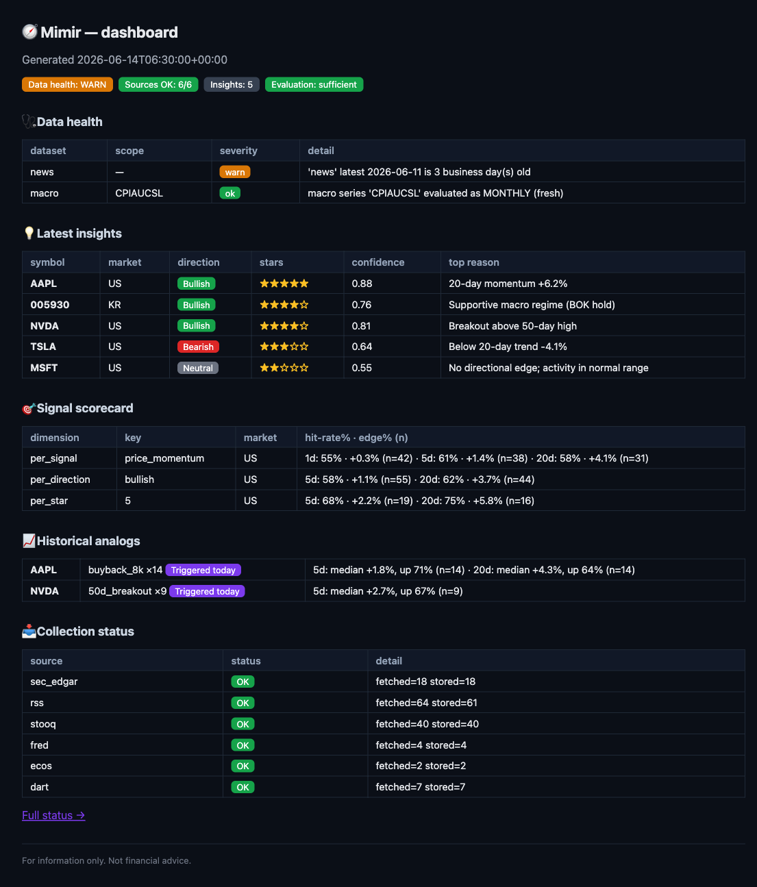
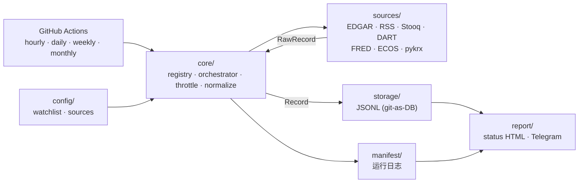

<div align="center">

# 🧭 Mimir

[English](README.md) · [한국어](README.ko.md) · **中文**

**从免费、合法收集的公开数据中汲取投资洞见。**

将 KR·US 市场的公开数据（公告·价格·宏观·新闻）在 GitHub Actions 上免费采集，<br/>
以时间序列存入 repo（git-as-DB），并加工成 ⭐星级洞见与每日报告，通过 Telegram 投递的流水线。


[🚀 快速开始](#-快速开始) · [✨ 主要功能](#-主要功能) · [🗃️ 数据源](#️-数据源) · [🧱 架构](#-架构) · [⏰ 调度 & 存储](#-调度--存储) · [🔒 合法性 & 安全](#-合法性--安全) · [🗺️ Roadmap](#️-roadmap) · [📚 延伸阅读](#-延伸阅读)

[](docs/assets/dashboard.png)

<sub>单页仪表盘 <code>python -m mimir.dashboard</code> → 静态 <code>reports/dashboard.html</code> — 使用模拟数据展示。</sub>

</div>

---

> **为什么需要它** — 投资判断所需的素材（公告、价格、利率、新闻）散落在各处，很容易依赖收费的数据供应商或违反 ToS 的爬取。Mimir *以官方免费 API 为优先*，只做合法收集，无需常驻服务器即可在 GitHub Actions 上运行，并将数据以受版本管理的 JSONL 形式堆积在 repo 中。在此之上叠加 ⭐星级洞见·历史案例分析·每日 HTML 报告·Telegram 投递，最终成为将分析与执行分离的自动交易的基础。

Mímir 是北欧神话中守护智慧之泉的存在。

---

## 🚀 快速开始

### 要求

| 项目 | 必要条件 | 备注 |
| :--- | :--- | :--- |
| **Python** | `>=3.14` | 通过 `.tool-versions` 固定 asdf（3.14.5） |
| **虚拟环境** | `.venv` | `python -m venv .venv` |
| **存储库** | 本地 read/write | 在 `data/`·`reports/` 生成采集物·报告 |
| **API 密钥** | 全部可选 | SEC EDGAR + RSS 无密钥也能运行。需要密钥的数据源在缺少密钥时会被跳过；定向回填会把已注册但不可用的数据源写入 manifest |
| **GitHub** | 推荐公开 repo | 公开 repo 时 Actions 分钟数无限制 |

```bash
# 1. 安装
python -m venv .venv
.venv/bin/python -m pip install -e ".[dev]"

# 2. 配置
cp .env.example .env          # 只需填入想用的免费密钥（自动加载，已被 gitignore）
#   config/watchlist.yaml      追踪标的（US 代码 / KR 证券代码）
#   config/sources.yaml        数据源 on/off · GRAY 策略 · 系列/feed catalog/带 symbol 的 RSS

# 3. 运行完整流水线（采集→分析→历史模式→评估→报告）
.venv/bin/python -m mimir.run --cadence daily   # cadence: hourly|daily|weekly|monthly
#   已安装 CLI: .venv/bin/mimir run --cadence daily
#   或按阶段运行: mimir collect / mimir analyze / mimir history / mimir evaluate / mimir deliver
```

`.env` 在运行时会从当前目录自动加载（密钥绝不会被提交）。在 CI 中以 GitHub Actions Secrets 为优先。

一次性回填（backfill）历史数据。

```bash
.venv/bin/python -m mimir.backfill --source stooq --since 2018-01-01
```

回填也写入与采集相同的 manifest 格式。成功时记录获取数量、保存数量和无效记录数量。已注册数据源失败时会先记录 `ok=false`，再把错误抛给调用方；缺少 API key 或可选 package 导致 fetch 前不可用时，也会以 0 条计数记录失败。完全未知的 source id 没有可记录的 cadence，因此只作为参数错误结束，不写 manifest。

采集结果会堆积在 repo 中，最新运行状况可通过一张 HTML 查看。

```text
data/<dataset>/YYYY/MM/DD.jsonl   # 采集物（按数据源策略去重）
data/_manifest/YYYY/MM/DD.jsonl   # 运行日志
reports/status.html               # 各数据源采集状况
```

> 💡 `collect` 即使部分数据源失败也会继续采集其余数据源，并把 runtime 数据源失败写入 manifest 后以 exit code `1` 发出信号。`backfill` 一次只处理一个已注册数据源，因此会先记录 runtime 失败和已注册但不可用的失败，再以非零状态退出。

---

## ✨ 主要功能

### 🔌 采集 (Collector)

| 功能 | 行为 |
| :--- | :--- |
| **数据源适配器** | 在统一的 `Source` 协议背后隔离实现 7 个内置数据源。RSS 支持静态 feed catalog、SEC 公司公告 feed helper 和带 symbol 的 feed。外部 package 可通过 `mimir.sources` entry point 与 `sources.plugins.<source_id>` 配置 namespace 注册 source plugin |
| **数据源隔离** | 单个数据源的失败·格式变更不会让其他数据源或整次运行停下 |
| **规范化 envelope** | 所有数据源汇聚为经 pydantic 校验的统一记录（`prices`·`filings`·`macro`·`news`） |
| **幂等存储** | 即便重跑同一次采集，也通过 `idempotency_key` 无重复地 append |
| **限流 + 合法性** | 通过代码强制各数据源的 `rate_limit`·`legal_status` |
| **回填** | 从 Stooq·FRED·ECOS 等批量回填历史数据，提前用于历史模式分析 |

### ⏱️ 调度 & 投递

| 功能 | 行为 |
| :--- | :--- |
| **免费 cron** | GitHub Actions `hourly/daily/weekly/monthly` 工作流（避开整点拥堵的偏移分钟） |
| **git-as-DB 提交回写** | 采集后将数据提交到 repo（`concurrency` 守卫 + rebase） |
| **最小可见性** | 数据状况 HTML +（可选）“采集完成” Telegram 推送 |
| **密钥隔离** | API 密钥·机器人令牌仅放在 GitHub Actions Secrets，绝不提交 |

---

## 🗃️ 数据源

所有数据源均为免费，且*以数据源为单位*判断合法性。优先使用官方 API，对爬取（pykrx）以 ⚠️ 明确标注并设为可切换。

| 数据源 | 市场 | 数据集 | cadence | 认证 | 合法性 |
| :--- | :--- | :--- | :--- | :--- | :--- |
| **SEC EDGAR** | 🇺🇸 US | filings (10-K/Q·8-K) | daily | 仅需 User-Agent（无需注册） | ✅ 官方（明确允许脚本访问） |
| **RSS** | 🌐 | news 头条 | hourly | 不需要（官方订阅源） | ✅ 官方 |
| **Stooq** | 🇺🇸 US | EOD 价格(OHLCV) | daily | 免费 `apikey`（验证码发放） | ✅ 免费 |
| **DART** | 🇰🇷 KR | 公告 | daily | 免费 API 密钥 | ✅ 官方 |
| **FRED** | 🇺🇸 US | 宏观时间序列 | daily | 免费 API 密钥 | ✅ 官方 |
| **ECOS** | 🇰🇷 KR | 宏观时间序列 | daily | 免费 API 密钥 | ✅ 官方 |
| **pykrx** | 🇰🇷 KR | OHLCV 价格 | daily | 不需要（`pip install -e '.[kr]'`） | ⚠️ 灰色（爬取） |

无密钥·无安装包时，只有 **SEC EDGAR + RSS** 可即时运行。填入免费密钥即可开启 Stooq/DART/FRED/ECOS，安装 `[kr]` extra 即可开启 pykrx。`yfinance`（雅虎）的 ToS 禁止自动采集，因此已将其排除在一级价格源之外。

---

## 🧱 架构



| 概念 | 说明 |
| :--- | :--- |
| **Source** | 拥有 `fetch(ctx) → Iterable[RawRecord]` 以及元数据（market·dataset·cadence·legal·rate_limit）的适配器 |
| **RawRecord → Record** | 将各数据源的原始数据规范化为统一 envelope（pydantic 校验），并以 `idempotency_key` 保证幂等 |
| **Registry** | 依据 cadence 和 GRAY 策略选择“本次 tick 要运行的数据源” |
| **Orchestrator** | 选择 → 限流 → fetch → 规范化 → 存储 → 清单（各数据源隔离） |
| **JsonlStore** | `data/<dataset>/YYYY/MM/DD.jsonl` 按日期分区存储；价格/公告/新闻保持 first-write-wins，宏观观测值用 last-write-wins 反映官方修订 |
| **Manifest** | 每次运行逐行记录（做了什么·何时·多少条·是否成功）——数据可信度的依据 |

新增内置数据源只需在 `sources/` 加一个适配器 + 一条 `SourceSpec` 注册即可完成。外部 package 可以通过 `mimir.sources` entry point 注册 `SourceSpec`，并读取自己的 `sources.plugins.<source_id>` 配置块。只应安装可信 plugin：plugin 在 Mimir 进程内运行，不会被 sandbox 隔离，并且会收到包含 API key 在内的 settings。上层（分析·交易）只读取已存储的 envelope。

---

## ⏰ 调度 & 存储

| cadence | 工作流 | 主要用途 |
| :--- | :--- | :--- |
| **hourly** | `collect-hourly.yml` | 新闻(RSS) |
| **daily** | `collect-daily.yml` | 价格 EOD · 公告 · 宏观 |
| **weekly** | `collect-weekly.yml` | 低频整理（预留） |
| **monthly** | `collect-monthly.yml` | 低频宏观（预留） |

- **GitHub cron 为 best-effort** — 整点（`0 * * * *`）较拥堵，因此使用偏移分钟（`:23`、`:37` 等）。
- **存储为按日期分区的 JSONL** — 因为是文本，所以对 diff 友好，append 成为纯追加 diff，避免 git 膨胀。（避免提交 SQLite/Parquet 二进制文件。）
- 使用 **公开 repo** 时 Actions 分钟数无限制。每次运行都会提交，因此也不会触发 60 天无活动自动停用。

---

## 🔒 合法性 & 安全

| 边界 | 行为 |
| :--- | :--- |
| **数据源级合法性** | 各数据源以元数据携带 `legal_status`（official/gray）·`rate_limit`，由限流器强制执行 |
| **官方 API 优先** | 优先使用 DART·SEC EDGAR·FRED·ECOS 等官方免费 API |
| **GRAY 切换** | pykrx（爬取）限于限流、短 backoff 重试和内部分析，可通过 `sources.yaml` 的 `gray_enabled: false` 阻断 |
| **密钥隔离** | 所有密钥/令牌仅放在 `.env`（本地）·Actions Secrets（CI），禁止提交 |
| **无静默失败** | `collect` 和 `backfill` 的失败都会记录到清单并以非零退出发出信号——绝不悄悄吞掉 |
| **免责** | 所有洞见·评估均包含“并非投资建议（not financial advice）”提示 |

---

## 🛠️ CLI

```text
mimir run       --cadence {hourly|daily|weekly|monthly} [--config-dir config] [--data-root data] [--reports-root reports]
mimir collect   --cadence {hourly|daily|weekly|monthly} [--config-dir config]
mimir backfill  --source <id> --since YYYY-MM-DD [--config-dir config]
mimir analyze   [--date YYYY-MM-DD] [--config-dir config] [--data-root data]
mimir deliver   [--cadence daily] [--date YYYY-MM-DD] [--config-dir config] [--data-root data] [--reports-root reports]
mimir history   [--symbol S] [--date YYYY-MM-DD] [--config-dir config] [--data-root data]
mimir doctor    [--config-dir config] [--data-root data] [--format text|json] [--html reports/doctor.html] [--lang en|ko|zh] [--strict]
mimir evaluate  [--date YYYY-MM-DD] [--data-root data]
mimir dashboard [--config-dir config] [--data-root data] [--reports-root reports] [--date YYYY-MM-DD] [--lang en|ko|zh]
```

```bash
.venv/bin/mimir collect --cadence daily               # 采集 → data/
.venv/bin/mimir analyze --date 2026-05-31             # 分析 → insights/
#   [mimir] AAPL bullish ★★★★☆ (conf 0.85)
.venv/bin/mimir deliver --cadence daily               # 报告+摘要
#   reports/2026/05/31.html + reports/index.html (+ Telegram 发送)
.venv/bin/mimir.backfill --source stooq --since 2018-01-01
```

每个命令也继续支持 module 形式，例如 `.venv/bin/python -m mimir.collect --cadence daily`。`mimir.collect` 这类带点号的 alias 会一起安装，用于兼容已经采用旧命令名的文档和脚本。

> 调度工作流（hourly/daily/weekly/monthly）会调用 reusable pipeline，按 `collect → analyze → history → evaluate → deliver → dashboard` 执行，并把 `data/` 和 `reports/` 提交到 repo。每日 HTML 报告以 `reports/YYYY/MM/DD.html` 永久保存，`reports/index.html` 用于浏览报告归档，`reports/dashboard.html` 会刷新为最新运维仪表盘。

---

## 🧪 开发

```bash
.venv/bin/ruff check .                          # lint (target py314)
.venv/bin/mypy mimir                            # 类型 (strict)
.venv/bin/coverage run -m pytest                # 测试
.venv/bin/coverage report --fail-under=80       # 覆盖率门槛
```

| 项目 | 值 |
| :--- | :--- |
| **测试** | 638 passing（适配器以录制的 fixture 在无网络下验证） |
| **覆盖率** | `mimir/` 98%（门槛 80%） |
| **lint/type** | ruff + mypy `--strict` clean |
| **CI** | `.github/workflows/ci.yml` — 每次 push/PR 执行 lint·type·test·coverage |

遵循 TDD，HTTP 数据源用 `responses`，pykrx 这类库数据源通过函数注入做确定性测试。

---

## 🗺️ Roadmap

| 规格 | 内容 | 状态 |
| :--- | :--- | :--- |
| **S1 Collector** | 数据采集 & 存储（7 个数据源，git-as-DB，cron） | ✅ 完成 (Inc 1+2) |
| **S2 Analysis & Scoring** | 规则 + off-by-default LLM ⭐星级（方向性+确信度）洞见 | ✅ 已实现（规则 + off-by-default LLM seam：仅在配置开关 `llm_sentiment_enabled` + `ANTHROPIC_API_KEY` + `[llm]` 额外安装同时满足时激活） |
| **S3 Delivery & Reporting** | 丰富的每日 HTML 报告 + 每小时/每日/每周/每月 Telegram 摘要 | ✅ 已实现 |
| **S4 Historical / Event-Analog** | “过去发生类似情况时，哪些标的涨了/跌了” | ✅ 已实现 (event-study) |
| **S5 Automated Trading** | 策略·成交·风险（先做纸面交易）。分析只发布信号，由执行引擎消费 | 未来 |

整体蓝图以 [`docs/architecture/roadmap.md`](docs/architecture/roadmap.md) 为准进行管理。

---

## ⚠️ 当前限制

| 领域 | 状态 |
| :--- | :--- |
| **洞见/星级** | 已以规则驱动信号实现，包含 ⭐确信度、confidence、attention 和免责声明。新闻匹配会使用静态 `sources.rss.catalogs` catalog、SEC 公司公告 RSS helper、带 symbol 的 RSS 订阅源、保守的默认公司名 alias 和用户 alias；LLM 情绪信号以 off-by-default seam 提供。自动/live 订阅源发现尚未实现 |
| **KR 价格** | pykrx 为 GRAY·可选安装（`[kr]`）。无密钥即可运行的价格源为 Stooq（需免费 apikey） |
| **历史模式分析** | S4 已实现 (event-study)。需要样本 `n` 充分的价格历史——建议先回填 |
| **信号记分卡** | 通过 `mimir.evaluate` 实现，并显示在每日报告和 dashboard 中。早期运行可能因历史洞见和价格样本不足而显示样本不足 |
| **自动交易** | S5（未来）。目前仅设计边界（分析/执行分离） |
| **API 配额** | 部分免费密钥的每日配额需在发放控制台确认 |

---

## 📚 延伸阅读

| 文档 | 内容 |
| :--- | :--- |
| [`docs/architecture/roadmap.md`](docs/architecture/roadmap.md) | 整体项目分解与分阶段价值交付 |
| [`docs/architecture/extensibility/README.md`](docs/architecture/extensibility/README.md) | 当前扩展点、source-spec 注册、macro series registry、再生成数据策略 |
| [`docs/architecture/improvement-catalog.md`](docs/architecture/improvement-catalog.md) | 扩展性·健壮性改进目录（按增量决策） |
| [`docs/decisions/tech-spec/README.md`](docs/decisions/tech-spec/README.md) | 按领域分组的决策 tech-spec 索引 |
| [`docs/decisions/tech-spec/analysis/AN1_signal_plugin_entrypoints_tech_spec_2026_06_23.md`](docs/decisions/tech-spec/analysis/AN1_signal_plugin_entrypoints_tech_spec_2026_06_23.md) | 分析 signal plugin seam 契约：`mimir.analysis_signals`、opt-in 配置、顺序与失败策略 |
| [`docs/reference/cli.md`](docs/reference/cli.md) | CLI 命令矩阵、配置边界与面向运维的错误契约 |
| [`docs/reference/config/sources.md`](docs/reference/config/sources.md) | `config/sources.yaml` 运维参考 |
| [`docs/reference/config/watchlist.md`](docs/reference/config/watchlist.md) | `config/watchlist.yaml` 运维参考 |
| [`docs/reference/analysis/scoring.md`](docs/reference/analysis/scoring.md) | 分析信号 & ⭐评分模型参考 |
| [`docs/reference/storage/data-layout.md`](docs/reference/storage/data-layout.md) | git-as-DB 数据布局 — 数据集、日期分区路径与写入语义 |
| [`docs/superpowers/specs/2026-05-31-collector-design.md`](docs/superpowers/specs/2026-05-31-collector-design.md) | S1 Collector 设计（架构·数据源目录·完成标准） |
| [`docs/superpowers/specs/2026-05-31-analysis-design.md`](docs/superpowers/specs/2026-05-31-analysis-design.md) | S2 Analysis & Scoring 设计（信号·评分器·Insight） |
| [`docs/superpowers/specs/2026-05-31-delivery-design.md`](docs/superpowers/specs/2026-05-31-delivery-design.md) | S3 Delivery & Reporting 设计（HTML 报告·摘要） |
| [`docs/superpowers/specs/2026-05-31-historical-design.md`](docs/superpowers/specs/2026-05-31-historical-design.md) | S4 Historical / Event-Analog 设计（事件·事后收益） |
| [`docs/superpowers/specs/2026-05-31-trading-seam.md`](docs/superpowers/specs/2026-05-31-trading-seam.md) | S5 自动交易 seam（未来）——分析/执行分离·安全模型 |
| [`docs/superpowers/plans/2026-05-31-s1-collector.md`](docs/superpowers/plans/2026-05-31-s1-collector.md) | S1 实现计划（TDD，按任务） |
| [`.env.example`](.env.example) | 所需（可选）免费密钥列表 |

---

## License

MIT License。详情请查看 [`LICENSE`](LICENSE)。
