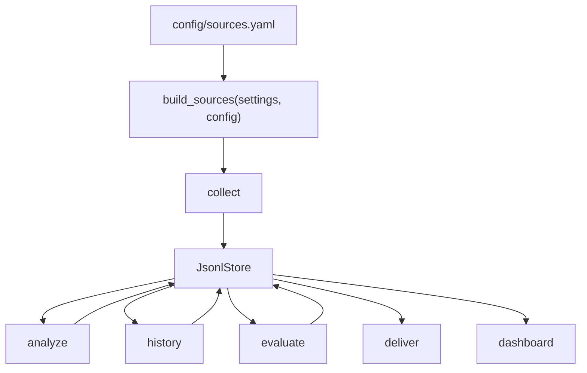

# Mimir 확장성 아키텍처 가이드

> **상태**: 현재 구현 기준
> **최종 업데이트**: 2026-06-16
> **대상 독자**: 새 데이터 소스, 새 분석 시그널, 새 리포트 섹션을 추가하려는 개발자

---

## 1. 한눈에 보기

Mimir는 공개 데이터를 수집하고, 저장된 데이터로 인사이트를 만들고, 그 인사이트를 다시 평가한 뒤 리포트로 보여준다. 확장은 세 지점에서 일어난다.

| 확장 지점 | 사용자가 바꾸는 것 | 코드 진입점 | 현재 상태 |
|---|---|---|---|
| 수집 소스 | `config/sources.yaml` 또는 새 `Source` 구현 | `mimir/core/builder.py` | FRED/ECOS/RSS는 설정으로 확장 가능. 새 내장 소스는 `SourceSpec` 한 줄로 등록 |
| 분석 시그널 | `build_signals()`에 시그널 추가 | `mimir/analysis/builder.py` | LLM 시그널은 off-by-default gate로 배선됨 |
| 출력 표면 | `daily_report`, `dashboard`, `digest` | `mimir/report/` | 일일 리포트와 대시보드가 인사이트·과거사례·평가를 표시 |

---

## 2. 데이터 흐름



`mimir.run`은 daily pipeline에서 `collect -> analyze -> history -> evaluate -> deliver` 순서로 실행한다. `evaluate`는 주문이나 외부 API를 호출하지 않는다. 저장된 `insights`와 `prices`만 읽어 시그널 성적표를 만든다.

---

## 3. 소스 확장

### 3.1 설정만으로 가능한 확장

FRED, ECOS, RSS는 이미 생성자가 설정 값을 받는다. `mimir/sources/config.py`가 `sources.yaml`의 `sources:` 블록을 검증하고, `mimir/core/builder.py`가 검증된 값을 소스 생성자에 넘긴다.

```yaml
sources:
  fred:
    series: ["DGS10", "FEDFUNDS", "CPIAUCSL", "T10Y2Y"]
  ecos:
    series:
      - { stat_code: "722Y001", cycle: "M", item_code: "0101000" }
  rss:
    feeds:
      - { url: "https://www.sec.gov/news/pressreleases.rss", publisher: "SEC", market: "US" }
```

이 경로는 파이썬 코드를 고치지 않는다. 설정이 없으면 기존 기본값을 그대로 쓴다. 설정 키가 틀리면 조용히 무시하지 않고 `ValidationError`로 실패한다.

### 3.2 새 내장 소스 추가

새 내장 소스는 생성 조건을 `SourceSpec`으로 등록한다. 오늘 기준으로는 아래 세 가지를 해야 한다.

1. `mimir/sources/<source>.py`에 `Source` 프로토콜을 만족하는 클래스를 만든다.
2. `SourceMeta`에 `id`, `market`, `dataset`, `cadence`, `legal_status`, `rate_limit`를 넣는다.
3. `mimir/core/builder.py`의 `BUILTIN_SOURCE_SPECS`에 `SourceSpec` 한 줄을 추가한다.

`SourceSpec`은 secret gate, optional package gate, 생성자 인자를 한 곳에 묶는다. `build_sources()`는 이 테이블을 순회해 만들 수 있는 소스만 생성한다. 생성된 뒤의 cadence 선택, GRAY 소스 토글, `disabled_ids` 필터링은 기존 `Registry`가 계속 담당한다.

외부 Python package가 Mimir 밖에서 source를 제공하는 entry-point 플러그인은 아직 구현하지 않았다. 현재 A3 구현은 내장 소스 등록을 선언적으로 만드는 범위다.

---

## 4. 분석 시그널 확장

시그널은 `Signal` 프로토콜을 만족해야 한다.

```python
def evaluate(
    self, symbol: str, market: Market, as_of: date, reader: DataReader
) -> SignalResult | None:
    ...
```

`SignalResult.strength`와 `SignalResult.confidence`는 0..1 범위로 검증된다. 새 시그널이 이 범위를 벗어난 값을 내면 pydantic 검증에서 실패한다. 이 제한은 스코어러가 한 시그널의 잘못된 값 때문에 전체 별점을 왜곡하지 않도록 둔 안전장치다.

유료 또는 외부 호출 시그널은 기본으로 켜면 안 된다. LLM 뉴스 감성 시그널은 `llm_sentiment_enabled`, `ANTHROPIC_API_KEY`, optional package 설치가 모두 맞을 때만 등록된다. 새 유료 시그널도 같은 방식으로 off-by-default gate를 가져야 한다.

### 4.1 Macro regime 시리즈

거시 경제 시리즈 메타데이터는 `mimir/core/macro_series.py`가 관리한다. 이 모듈은 기본 FRED 시리즈, 기본 ECOS 시리즈, doctor freshness cadence, macro-regime rate-series 기본값을 함께 제공한다.

`sources.fred.series`와 `sources.ecos.series`는 무엇을 수집할지 정한다. `analysis.macro_regime.rate_series`는 수집된 macro 데이터 중 어떤 시리즈를 정책금리나 벤치마크 금리로 해석할지 정한다. 이 둘을 분리해야 CPI 같은 물가지표를 수집하면서도 rate-regime 시그널에는 넣지 않을 수 있다.

---

## 5. 저장소 정책

원천 데이터와 재생성 데이터는 저장 정책이 다르다.

| 데이터셋 | 성격 | 저장 정책 |
|---|---|---|
| `prices`, `filings`, `macro`, `news` | 원천 수집 결과 | append-only, first-write-wins |
| `insights`, `historical`, `evaluation` | 매 실행마다 다시 계산되는 결과 | 당일 파티션 전체 교체 |

재생성 데이터셋은 `JsonlStore.replace_partition(dataset, day, records)`를 써야 한다. 새 실행 결과가 0건이면 기존 파티션 파일을 삭제한다. 그래야 watchlist에서 빠진 종목이나 표본 부족으로 사라진 평가 버킷이 다음 리포트에 남지 않는다.

---

## 6. 리포트 확장

일일 리포트는 `mimir/report/daily_report.py`가 만든다. 대시보드는 `mimir/report/dashboard.py`가 만든다. 두 렌더러는 사용자나 설정에서 온 문자열을 HTML에 넣기 전에 escape하거나 허용 값으로 정규화해야 한다.

현재 `lang`은 `en`, `ko`, `zh`만 허용된다. 다른 값은 `en`으로 정규화된다. 이 처리는 `<html lang="...">` 속성에 설정 문자열이 직접 들어가며 생길 수 있는 HTML attribute injection을 막는다.

---

## 7. 남은 확장성 부채

| 항목 | 왜 남았나 | 다음 행동 |
|---|---|---|
| 외부 source plugin entry-point | 내장 소스는 `SourceSpec`으로 정리됐지만, 외부 package가 source를 주입하는 구조는 아직 없다 | `importlib.metadata` entry-point 설계 |
| `news_volume` 실데이터 한계 | 공식 피드 제목에 티커가 잘 안 나온다 | alias 맵, 종목별 피드, 또는 LLM 시그널 승격 |

이 문서는 현재 구현을 설명한다. 미래 설계가 확정되면 새 ADR 또는 증분 스펙에서 이 문서를 갱신한다.
