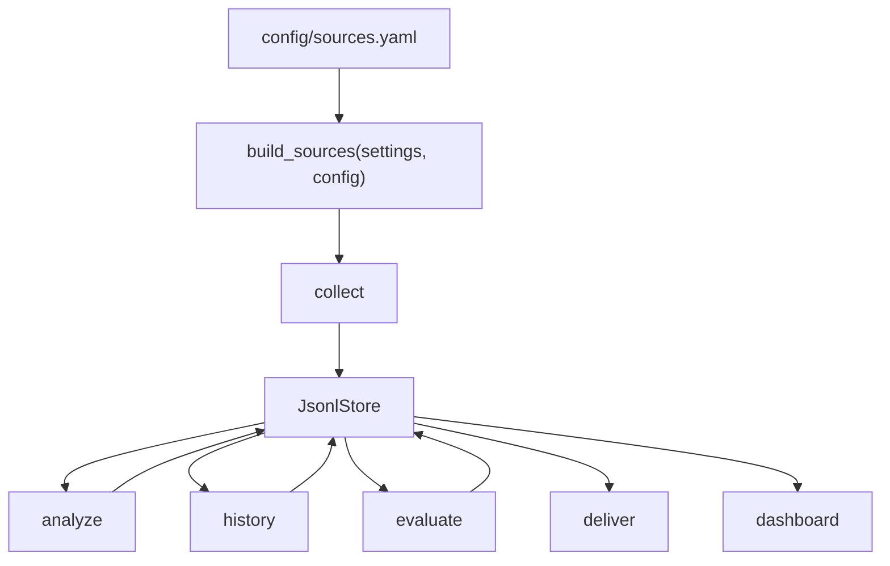

# Mimir 확장성 아키텍처 가이드

> **상태**: 현재 구현 기준
> **최종 업데이트**: 2026-06-18
> **대상 독자**: 새 데이터 소스, 새 분석 시그널, 새 리포트 섹션을 추가하려는 개발자

---

## 1. 한눈에 보기

Mimir는 공개 데이터를 수집하고, 저장된 데이터로 인사이트를 만들고, 그 인사이트를 다시 평가한 뒤 리포트로 보여준다. 확장은 세 지점에서 일어난다.

| 확장 지점 | 사용자가 바꾸는 것 | 코드 진입점 | 현재 상태 |
|---|---|---|---|
| 수집 소스 | `config/sources.yaml`, 새 `Source` 구현, 또는 `mimir.sources` plugin | `mimir/core/builder.py` | FRED/ECOS/RSS는 설정으로 확장 가능. RSS는 정적 feed catalog, SEC EDGAR company filing Atom feed 조립, optional `symbol`로 공식 feed와 종목 전용 feed를 표현한다. 새 내장 소스는 `SourceSpec` 한 줄로 등록. 외부 package는 entry point와 `sources.plugins.<source_id>` 설정 namespace로 source를 추가 |
| 분석 시그널 | `config/sources.yaml`의 `analysis:` 또는 `build_signals()`에 시그널 추가 | `mimir/analysis/builder.py` | 기본 뉴스 alias, 사용자 alias, symbol-tagged RSS, macro rate-series는 설정으로 제어 가능. LLM 시그널은 off-by-default gate로 배선됨 |
| 출력 표면 | `daily_report`, `dashboard`, `digest` | `mimir/report/` | 일일 리포트와 대시보드가 인사이트·과거사례·평가를 표시한다. Scheduled workflow는 pipeline 성공 뒤 dashboard CLI를 실행해 `reports/dashboard.html`을 최신 운영 표면으로 publish한다 |

---

## 2. 데이터 흐름



`mimir.run`은 scheduled pipeline에서 `collect -> analyze -> history -> evaluate -> deliver` 순서로 실행한다. `evaluate`는 주문이나 외부 API를 호출하지 않는다. 저장된 `insights`와 `prices`만 읽어 시그널 성적표를 만든다. Reusable scheduled workflow는 `mimir.run` 성공 뒤 `mimir.dashboard`를 실행해 같은 commit에 최신 `reports/dashboard.html`을 포함한다.

---

## 3. 소스 확장

### 3.1 설정만으로 가능한 확장

FRED, ECOS, RSS는 이미 생성자가 설정 값을 받는다. `mimir/sources/config.py`가 `sources.yaml`의 `sources:` 블록을 검증하고, `mimir/core/builder.py`가 검증된 값을 소스 생성자에 넘긴다.

```yaml
sources:
  fred:
    series: ["DGS10", "FEDFUNDS", "CPIAUCSL", "T10Y2Y"]
  ecos:
    series:
      - { stat_code: "722Y001", cycle: "M", item_code: "0101000" }
  rss:
    catalogs:
      - { id: "sec_press_releases" }
      - { id: "sec_structured_usgaap" }
      - { id: "sec_structured_risk_return" }
      - { id: "sec_structured_inline_xbrl" }
      - { id: "sec_structured_all_xbrl" }
    sec:
      company_filings:
        - { ticker: "AAPL", symbol: "AAPL", forms: ["10-K", "10-Q", "8-K"] }
    feeds:
      - { url: "https://www.sec.gov/news/pressreleases.rss", publisher: "SEC", market: "US" }
      - { url: "https://example.com/aapl.rss", publisher: "Example", market: "US", symbol: "AAPL" }
```

이 경로는 파이썬 코드를 고치지 않는다. 설정이 없으면 기존 기본값을 그대로 쓴다. 설정 키가 틀리면 조용히 무시하지 않고 `ValidationError`로 실패한다.

RSS 확장은 세 경로를 가진다. `sources.rss.catalogs`는 검증된 정적 feed를 id로 고른다. `sources.rss.sec.company_filings`는 사용자가 명시한 CIK 또는 ticker와 form type에서 SEC EDGAR Atom feed URL을 조립한다. `sources.rss.feeds`는 운영자가 직접 아는 URL을 그대로 추가한다.

RSS resolver는 이 설정을 해석하는 동안 네트워크를 호출하지 않는다. `sources.rss.sec.ticker_cik_map_path`가 있으면 사용자가 내려받아 둔 SEC `company_tickers.json` 로컬 파일만 읽는다. Provider live discovery, HTML scraping, URL pattern 추측은 source plugin이나 별도 증분 설계 대상이지 현재 resolver의 책임이 아니다.

### 3.2 RSS feed catalog

RSS feed catalog는 반복해서 쓰는 공식 feed URL을 설정 id로 선택하게 해준다. 운영자는 feed URL을 매번 복사하지 않고 아래처럼 쓴다.

```yaml
sources:
  rss:
    catalogs:
      - { id: "sec_press_releases" }
      - { id: "sec_structured_usgaap" }
      - { id: "sec_structured_risk_return" }
      - { id: "sec_structured_inline_xbrl" }
      - { id: "sec_structured_all_xbrl" }
```

Builder는 catalog selection을 기존 `RssFeed` 목록으로 확장한 뒤 manual `sources.rss.feeds` 뒤에 붙이지 않고 앞에 둔다. 같은 `(url, symbol)` 쌍이 catalog와 manual feed 양쪽에 있으면 실패한다. 같은 URL이라도 symbol이 다르면 서로 다른 종목 관계이므로 허용한다.

SEC structured disclosure catalog id는 정적 공식 feed다. `sec_structured_usgaap`, `sec_structured_risk_return`, `sec_structured_inline_xbrl`, `sec_structured_all_xbrl`은 SEC가 공개한 broad SEC/XBRL feed를 그대로 가리킨다. 이 feed들은 특정 ticker나 watchlist symbol 전용 feed가 아니며, catalog resolver가 ticker→CIK lookup을 수행하지 않는다.

`sources.rss.sec.company_filings[].ticker`는 SEC Company Search RSS의 ticker token을 쓰는 편의 입력이다. `sources.rss.sec.ticker_cik_map_path`를 설정하면 같은 ticker를 로컬 SEC mapping file에서 찾아 10자리 CIK로 바꾼다. 이 경로는 live download를 하지 않으며, 같은 ticker가 다른 CIK로 중복되면 실패한다.

SEC mapping file live download/cache, watchlist 기반 SEC feed 자동 생성, HTML RSS link crawling, vendor URL pattern inference는 아직 deferred item이다. 이 작업들은 provider 정책과 SEC fair-access 경계가 필요하므로 정적 catalog와 로컬 mapping file lookup과 분리한다.

이 기능은 외부 source plugin을 대체하지 않는다. Catalog는 built-in RSS source의 입력 목록을 편하게 만드는 장치다. 새 protocol, 새 인증 방식, 내부 feed client가 필요하면 `mimir.sources` plugin 또는 새 내장 source를 추가해야 한다.

### 3.3 새 내장 소스 추가

새 내장 소스는 생성 조건을 `SourceSpec`으로 등록한다. 오늘 기준으로는 아래 세 가지를 해야 한다.

1. `mimir/sources/<source>.py`에 `Source` 프로토콜을 만족하는 클래스를 만든다.
2. `SourceMeta`에 `id`, `market`, `dataset`, `cadence`, `legal_status`, `rate_limit`를 넣는다.
3. `mimir/core/builder.py`의 `BUILTIN_SOURCE_SPECS`에 `SourceSpec` 한 줄을 추가한다.

`SourceSpec`은 secret gate, optional package gate, 생성자 인자를 한 곳에 묶는다. `build_sources()`는 이 테이블을 순회해 만들 수 있는 소스만 생성한다. 생성된 뒤의 cadence 선택, GRAY 소스 토글, `disabled_ids` 필터링은 기존 `Registry`가 계속 담당한다.

### 3.4 외부 source plugin 추가

Mimir 밖의 Python package는 `mimir.sources` entry point로 source를 추가할 수 있다. 이 방식은 Mimir repo를 fork하지 않고 내부 feed나 실험 adapter를 배포할 때 쓴다.

```toml
[project.entry-points."mimir.sources"]
acme_feed = "acme_mimir.sources:ACME_FEED_SPEC"
```

```python
from mimir.core.builder import SourceSpec

ACME_FEED_SPEC = SourceSpec("acme_feed", lambda settings, cfg: AcmeSource())
```

Plugin package는 Mimir 프로세스 안에서 실행된다. `SourceSpec.factory`는 `Settings`와 `SourcesConfig`를 받으므로, plugin 코드는 설정된 API key와 로컬 설정을 읽을 수 있다. 따라서 신뢰한 package만 설치해야 하며, Mimir는 plugin을 sandbox하지 않는다.

entry point가 단일 `SourceSpec`을 직접 로드하면 entry point 이름과 `SourceSpec.id`가 같아야 한다. 한 package가 여러 source를 제공할 때는 `tuple[SourceSpec, ...]`를 로드할 수 있다. Mimir는 built-in source를 먼저 만들고 plugin source를 이름순으로 뒤에 붙인다.

Plugin import가 실패하면 warning을 남기고 해당 plugin만 건너뛴다. 잘못된 object type, source id 중복, `SourceSpec.id`와 실제 `source.meta.id` 불일치는 `ValueError`로 실패한다. source id는 backfill과 manifest에서 식별자로 쓰이기 때문에 충돌을 조용히 넘기지 않는다.

### 3.5 외부 source plugin 설정

외부 plugin이 설정을 필요로 하면 `sources.plugins.<source_id>` 아래에 둔다. 이 namespace는 built-in source 설정과 분리된다.

```yaml
sources:
  plugins:
    acme_news:
      base_url: "https://internal.example.com/rss"
      symbols: ["AAPL", "MSFT"]
      timeout_seconds: 5
```

`source_id`는 `SourceSpec.id`와 같아야 한다. 한 package가 여러 source를 제공하면 각 source id 아래에 별도 설정을 둔다.

Core parser는 plugin block이 mapping인지까지만 검증한다. Plugin factory는 자신이 소유한 pydantic 모델로 설정을 검증한다.

```python
class AcmeNewsConfig(BaseModel):
    model_config = ConfigDict(extra="forbid")
    base_url: str
    symbols: list[str] = []


def build_acme_news(settings, cfg):
    plugin_cfg = cfg.parse_plugin_config("acme_news", AcmeNewsConfig)
    return AcmeNewsSource(base_url=plugin_cfg.base_url, symbols=plugin_cfg.symbols)
```

`sources.plugins.acme_news`가 있는데 matching `SourceSpec.id`가 없으면 builder는 warning을 남긴다. `sources.plugins.rss`처럼 built-in source id를 쓰면 builder가 warning을 남긴다. Built-in RSS 설정은 `sources.rss.feeds`를 써야 한다.

Secret은 plugin 설정 block에 두지 않는다. API key와 token은 환경변수나 GitHub Secrets에 두고, plugin factory가 `Settings` 또는 직접 환경변수로 읽어야 한다.

---

## 4. 분석 시그널 확장

시그널은 `Signal` 프로토콜을 만족해야 한다.

```python
def evaluate(
    self, symbol: str, market: Market, as_of: date, reader: DataReader
) -> SignalResult | None:
    ...
```

`SignalResult.strength`와 `SignalResult.confidence`는 0..1 범위로 검증된다. 새 시그널이 이 범위를 벗어난 값을 내면 pydantic 검증에서 실패한다. 이 제한은 스코어러가 한 시그널의 잘못된 값 때문에 전체 별점을 왜곡하지 않도록 둔 안전장치다.

유료 또는 외부 호출 시그널은 기본으로 켜면 안 된다. LLM 뉴스 감성 시그널은 `llm_sentiment_enabled`, `ANTHROPIC_API_KEY`, optional package 설치가 모두 맞을 때만 등록된다. 새 유료 시그널도 같은 방식으로 off-by-default gate를 가져야 한다.

### 4.1 News mention alias

공식 RSS feed는 제목에 티커를 잘 싣지 않는다. `analysis.news.aliases`는 저장된 뉴스 제목과 요약을 watchlist symbol에 연결하기 위한 회사명 표기 목록이다.

```yaml
analysis:
  news:
    use_default_aliases: true
    aliases:
      AAPL: ["Apple", "Apple Inc."]
      "005930": ["Samsung Electronics", "삼성전자"]
```

기본 watchlist의 `AAPL`, `MSFT`, `NVDA`, `"005930"`은 보수적인 내장 alias를 기본으로 쓴다. `analysis.news.aliases`는 이 기본값에 사용자 alias를 추가하고, `use_default_aliases: false`는 내장 alias를 끈다.

이 설정은 수집을 늘리지 않는다. RSS는 계속 공식 제목과 요약 metadata만 저장한다. `NewsVolumeSignal`과 opt-in `LlmSentimentSignal`이 같은 matcher를 사용해 `Apple` 같은 alias를 `AAPL` mention으로 해석한다. Alias만 설정해도 LLM 호출은 생기지 않는다.

뉴스 시그널의 날짜 윈도우는 `captured_at` 기준이다. `ts`는 기사 발행일로 남기고, `captured_at`은 Mimir가 그 기사를 관측한 실행일을 뜻한다. 그래서 어제 발행됐지만 오늘 수집된 뉴스는 오늘 `news_volume`과 opt-in `llm_sentiment` 입력에 들어간다.

### 4.2 Symbol-tagged RSS feeds

종목별 RSS feed를 이미 알고 있으면 `sources.rss.feeds[].symbol`을 쓴다.

```yaml
sources:
  rss:
    feeds:
      - url: "https://example.com/aapl.rss"
        publisher: "Example"
        market: "US"
        symbol: "AAPL"
```

이 설정은 feed에서 온 record의 top-level symbol을 `AAPL`로 저장한다. `NewsVolumeSignal`과 opt-in `LlmSentimentSignal`은 같은 matcher를 쓰며, matcher는 제목·요약을 보기 전에 record symbol을 먼저 확인한다. 그래서 제목에 `AAPL`이나 `Apple`이 없어도 해당 feed에서 온 뉴스는 `AAPL` 뉴스로 계산된다.

Symbol이 없는 RSS feed는 기존 key 형식인 `rss:{link}`를 유지한다. Symbol이 있는 feed는 `rss:{symbol}:{link}`를 쓴다. 같은 기사 URL이 여러 종목 feed에 나타나도 symbol 관계가 dedup으로 사라지지 않게 하기 위한 정책이다.

### 4.3 Macro regime 시리즈

거시 경제 시리즈 메타데이터는 `mimir/core/macro_series.py`가 관리한다. 이 모듈은 기본 FRED 시리즈, 기본 ECOS 시리즈, doctor freshness cadence, macro-regime rate-series 기본값을 함께 제공한다.

`sources.fred.series`와 `sources.ecos.series`는 무엇을 수집할지 정한다. `analysis.macro_regime.rate_series`는 수집된 macro 데이터 중 어떤 시리즈를 정책금리나 벤치마크 금리로 해석할지 정한다. 이 둘을 분리해야 CPI 같은 물가지표를 수집하면서도 rate-regime 시그널에는 넣지 않을 수 있다.

---

## 5. 저장소 정책

원천 데이터와 재생성 데이터는 저장 정책이 다르다.

| 데이터셋 | 성격 | 저장 정책 |
|---|---|---|
| `prices`, `filings`, `news` | 원천 수집 결과 | append-only, first-write-wins |
| `macro` | 공식 거시 관측값(FRED/ECOS) | 같은 관측 key는 last-write-wins. 공식 개정값이 오면 최신 payload를 남긴다. |
| `insights`, `historical`, `evaluation` | 매 실행마다 다시 계산되는 결과 | 당일 파티션 전체 교체 |

source 수집과 backfill은 `append_overwrite_enabled(dataset)`로 같은 저장 정책을 고른다. 현재 overwrite append 대상은 `macro`뿐이다. 가격, 공시, 뉴스는 같은 key가 다시 들어와도 첫 레코드를 유지한다.

재생성 데이터셋은 `JsonlStore.replace_partition(dataset, day, records)`를 써야 한다. 새 실행 결과가 0건이면 기존 파티션 파일을 삭제한다. 그래야 watchlist에서 빠진 종목이나 표본 부족으로 사라진 평가 버킷이 다음 리포트에 남지 않는다.

NEWS 파티션은 다른 원천 데이터처럼 `ts.date()` 기준으로 저장된다. 다만 뉴스 분석 시그널은 `DataReader.read_captured_window()`를 통해 `captured_at.date()` 기준으로 today와 baseline을 읽는다. 이 reader는 파티션 프루닝을 쓰지 않고 NEWS 전체를 읽은 뒤 필터링한다. `captured_at` 기준으로 `read_window()`를 호출하면, 발행일이 오래된 late-captured 뉴스가 파티션 단계에서 빠질 수 있기 때문이다.

---

## 6. 리포트 확장

일일 리포트는 `mimir/report/daily_report.py`가 만든다. 대시보드는 `mimir/report/dashboard.py`가 만든다. 두 렌더러는 사용자나 설정에서 온 문자열을 HTML에 넣기 전에 escape하거나 허용 값으로 정규화해야 한다.

현재 `lang`은 `en`, `ko`, `zh`만 허용된다. 다른 값은 `en`으로 정규화된다. 이 처리는 `<html lang="...">` 속성에 설정 문자열이 직접 들어가며 생길 수 있는 HTML attribute injection을 막는다.

---

## 7. 남은 확장성 부채

| 항목 | 왜 남았나 | 다음 행동 |
|---|---|---|
| Provider별 RSS live discovery | 정적 catalog는 검증된 feed id만 제공한다. Mimir가 vendor별 endpoint를 자동 탐색하거나 URL pattern을 추측하지는 않는다 | 필요하면 provider별 공식 문서, rate limit, ToS를 검토한 뒤 별도 discovery 설계 |
| SEC mapping file live cache | 로컬 `company_tickers.json` lookup은 지원하지만 파일 다운로드, freshness 검증, cache 갱신은 하지 않는다 | 운영 정책과 SEC fair-access 기준을 정한 뒤 별도 cache 설계 |

이 문서는 현재 구현을 설명한다. 미래 설계가 확정되면 새 ADR 또는 증분 스펙에서 이 문서를 갱신한다.
