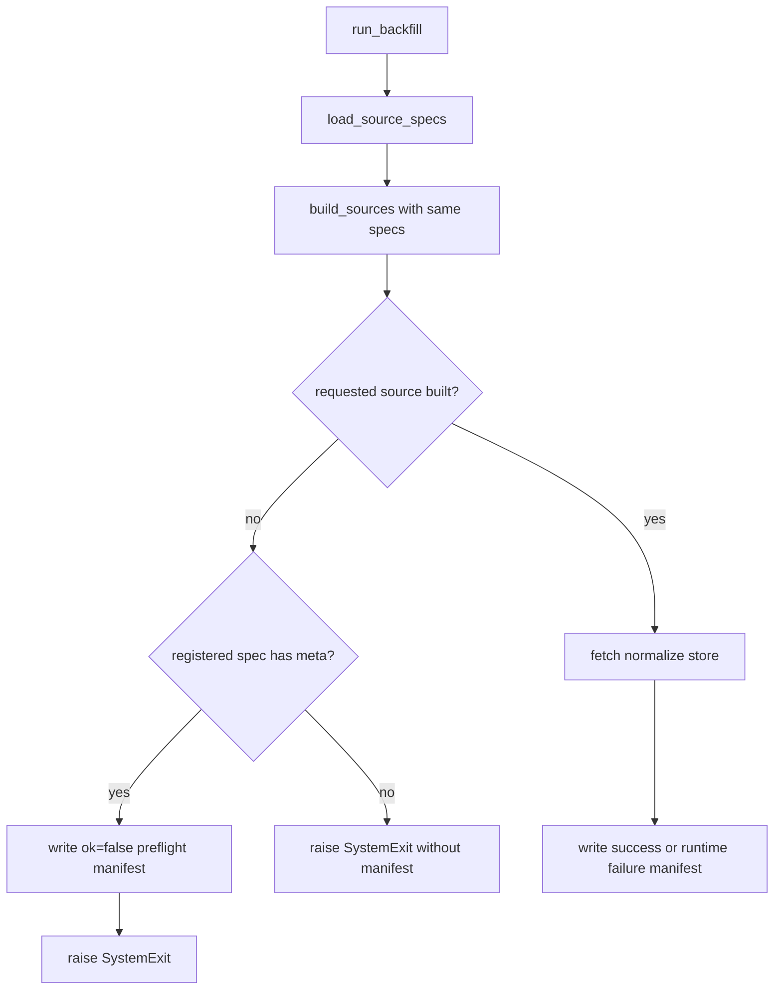

# BF-PREFLIGHT backfill preflight failure manifest Tech Spec

## 한눈에 보기

`backfill`은 등록된 source가 API key나 optional package 때문에 fetch 전에 제외되어도 실행 실패를 `_manifest`에 남겨야 합니다. 이번 변경은 built-in `SourceSpec`에 static metadata를 연결하고, registered-unavailable source를 zero-count `ok=false` manifest로 기록합니다. 진짜 unknown source id는 cadence를 알 수 없으므로 manifest 없이 기존 argument error로 유지합니다.

## 요약

기존 `backfill`은 fetch, normalize, store 단계에서 실패하면 `ok=false` manifest를 남겼습니다. 하지만 source를 만들기 전 preflight 단계에서 실패하면 아직 manifest 객체가 없어서 기록을 남기지 못했습니다.

이번 변경은 source 등록 정보와 source build 결과를 분리해 봅니다. `SourceSpec.meta`는 fetch 전에도 source id와 cadence를 제공합니다. `run_backfill()`은 같은 spec 목록으로 source를 build하고, 요청 source가 build 결과에는 없지만 spec에는 있으면 unavailable source로 판단합니다.

| 결정 | 이유 | 결과 |
| ---- | ---- | ---- |
| `SourceSpec.meta` 추가 | fetch 전에 cadence를 알아야 manifest를 쓸 수 있음 | built-in source는 preflight failure manifest 지원 |
| `load_source_specs()` 추가 | backfill이 build 결과와 raw spec 목록을 함께 봐야 함 | entry point spec도 한 번만 로드 |
| `build_sources(..., specs=...)` 추가 | 같은 spec 목록으로 build와 lookup을 맞춰야 함 | 기존 caller는 인자 없이 그대로 동작 |
| unknown source는 manifest 제외 | `RunRecord.cadence`가 필수라 임의값을 넣으면 로그가 거짓이 됨 | argument error boundary 유지 |

## 목표

- registered source가 secret gate 때문에 fetch 전에 제외되어도 `ok=false` manifest를 남긴다.
- optional package가 없어 제외된 source도 `ok=false` manifest를 남긴다.
- manifest의 `source`, `cadence`, `error`는 static metadata와 gate reason에서 온다.
- `fetched`, `stored`, `invalid`는 preflight failure에서 모두 0이다.
- unknown source id는 manifest를 쓰지 않는다.
- 기존 runtime failure manifest 동작을 유지한다.
- plugin source가 기존처럼 `SourceSpec(id, factory)`를 만들 수 있게 한다.

## 목표가 아닌 것

| 항목 | 제외 이유 |
| ---- | --------- |
| Manifest schema 확장 | 기존 dashboard/status 소비자가 같은 schema를 읽어야 합니다. |
| unknown source cadence 추정 | 등록 정보가 없으면 정확한 cadence를 알 수 없습니다. |
| 여러 source 동시 backfill | orchestration 범위가 달라 별도 설계가 필요합니다. |
| `collect` skipped source 정책 변경 | 이번 변경은 단일 source backfill 경계만 다룹니다. |
| secret 값 기록 | manifest와 log에는 secret name만 남깁니다. |

## 현재 문제와 제약

`run_backfill()`은 기존에 아래 순서로 동작했습니다.

1. 환경 변수와 `sources.yaml`을 읽는다.
2. `build_sources()`로 사용 가능한 source만 만든다.
3. 요청한 source id가 없으면 `SystemExit`를 발생시킨다.
4. source를 찾은 뒤 `Manifest`를 만든다.

이 순서에서는 `stooq`처럼 `STOOQ_API_KEY`가 필요한 source가 key 누락으로 제외될 때 manifest를 쓸 수 없습니다.

| 실패 종류 | source 등록 정보 | manifest 가능 여부 | 처리 |
| --------- | ---------------- | ------------------ | ---- |
| missing secret | `SourceSpec`에 id와 static metadata가 있음 | 가능 | zero-count `ok=false` 기록 |
| missing optional module | `SourceSpec`에 id와 static metadata가 있음 | 가능 | zero-count `ok=false` 기록 |
| unknown source id | 등록 정보가 없음 | 불가능 | 기존 argument error 유지 |
| runtime fetch failure | source instance가 있음 | 가능 | 기존 failure manifest 유지 |

## 설계

### 구조



### SourceSpec metadata

`SourceSpec`는 source factory와 gating 정보를 담는 dataclass입니다. 이번 변경은 dataclass 끝에 `meta: SourceMeta | None = None`을 추가합니다.

```python
@dataclass(frozen=True)
class SourceSpec:
    id: str
    factory: Callable[[Settings, SourcesConfig], Source]
    required_secret_attr: str | None = None
    required_secret_name: str | None = None
    required_module: str | None = None
    missing_module_hint: str | None = None
    meta: SourceMeta | None = None
```

새 필드를 끝에 둔 이유는 plugin이 `SourceSpec(id, factory)` 형태로 생성하던 코드를 깨지 않기 위해서입니다.

| Built-in spec | Static metadata |
| ------------- | --------------- |
| `sec_edgar` | `SecEdgarSource.meta` |
| `rss` | `RssSource.meta` |
| `stooq` | `StooqSource.meta` |
| `dart` | `DartSource.meta` |
| `fred` | `FredSource.meta` |
| `ecos` | `EcosSource.meta` |
| `pykrx` | `PykrxSource.meta` |

### Spec loading helper

`load_source_specs()`는 built-in spec과 entry point spec을 같은 tuple로 반환합니다.

```python
def load_source_specs(
    group: str = SOURCE_ENTRY_POINT_GROUP,
) -> tuple[SourceSpec, ...]:
    return (*BUILTIN_SOURCE_SPECS, *_load_entry_point_source_specs(group))
```

`build_sources()`는 선택 인자 `specs`를 받습니다. 기존 caller가 이 인자를 넘기지 않으면 helper를 내부에서 호출하므로 동작은 같습니다.

### Backfill preflight branch

`run_backfill()`은 `Manifest`를 source lookup 전에 만들고, spec 목록을 한 번만 로드합니다.

```python
manifest = Manifest(root=data_root)
specs = load_source_specs()
sources = {s.meta.id: s for s in build_sources(settings, config, specs=specs)}
```

요청 source가 build 결과에 없으면 `_source_spec_for_id()`로 등록 여부를 확인합니다.

| 조건 | 처리 |
| ---- | ---- |
| spec 있음, meta 있음 | preflight failure manifest 작성 후 기존 `SystemExit` 발생 |
| spec 없음 | manifest 없이 기존 `SystemExit` 발생 |
| spec 있음, meta 없음 | cadence를 알 수 없으므로 manifest 없이 기존 `SystemExit` 발생 |

### Failure manifest helper

Runtime failure와 preflight failure는 같은 schema를 사용합니다. `_write_failure_manifest()`가 `SourceResult(ok=False)`를 만들고 `manifest.write()`를 호출합니다.

이 helper는 `stored`를 직접 넘기지 않습니다. `SourceResult` 기본값이 0이므로 preflight failure와 runtime failure 모두 실패 시 저장 건수를 0으로 기록합니다.

### Error message contract

CLI 경계는 기존 문구를 유지합니다.

```text
unknown or unavailable source: <id>
```

Manifest의 `error`는 운영자가 원인을 찾을 수 있게 gate reason을 담습니다.

| 원인 | Manifest error |
| ---- | -------------- |
| Secret 누락 | `<SECRET_NAME> is not set` |
| Optional package 누락 | `missing_module_hint` |
| 명확한 gate reason 없음 | `unknown or unavailable source: <id>` |

Secret 값은 기록하지 않습니다. Secret name만 남기므로 운영자는 어떤 환경 변수를 확인해야 하는지 알 수 있습니다.

## 운영 영향

정상 backfill 성공 경로는 바뀌지 않습니다. Runtime failure도 기존처럼 실패 manifest를 남긴 뒤 원래 예외를 다시 올립니다.

| 항목 | 영향 |
| ---- | ---- |
| CLI argument | 변경 없음 |
| CLI failure message | 변경 없음 |
| Manifest schema | 변경 없음 |
| Data storage format | 변경 없음 |
| Observability | registered-unavailable source failure가 새로 보임 |
| Plugin compatibility | `SourceSpec(id, factory)` 생성 방식 유지 |

## 보안 / 권한 영향

권한 모델은 바뀌지 않습니다. 보안상 중요한 지점은 secret 노출 방지입니다.

| 위험 | 대응 |
| ---- | ---- |
| API key 값이 manifest에 남는 위험 | 값은 읽지 않고 secret name만 기록 |
| Optional package hint가 과하게 노출되는 위험 | 기존 설치 안내 문자열만 사용 |
| Unknown id에 거짓 cadence를 쓰는 위험 | manifest를 쓰지 않고 argument error 유지 |

## 롤아웃 / 마이그레이션

별도 migration은 없습니다.

1. 코드 배포.
2. `uv run pytest -q`와 coverage gate 확인.
3. staging에서 `stooq` API key를 비운 상태로 backfill smoke test 수행.
4. `_manifest`에 `ok=false`, zero counts, `STOOQ_API_KEY is not set`이 남는지 확인.
5. unknown source id smoke test에서는 `_manifest`가 새로 생기지 않는지 확인.

Rollback은 구현 커밋 revert로 충분합니다. Rollback하면 preflight unavailable source는 다시 manifest 없이 기존 `SystemExit`만 남습니다.

## 테스트 전략

| 테스트 | 고정하는 계약 |
| ------ | ------------- |
| `test_backfill_records_unavailable_registered_source_manifest_before_system_exit` | `stooq` API key 누락 시 zero-count `ok=false` manifest 작성 |
| `test_backfill_records_missing_optional_package_manifest_before_system_exit` | `pykrx` package 누락 시 package hint manifest 작성 |
| `test_backfill_unknown_source_remains_argument_error_without_manifest` | unknown source id는 manifest 미작성 |
| `test_builtin_source_specs_expose_static_metadata_for_preflight_manifest` | built-in `SourceSpec.meta`가 cadence와 id를 제공 |
| 기존 runtime failure tests | fetch/normalize/store 실패 manifest 계약 유지 |

검증 명령:

```bash
uv run ruff check .
uv run mypy mimir
uv run pytest -q
uv run coverage run -m pytest
uv run coverage report --fail-under=80
git diff --check
```

## 검증 결과

구현 브랜치에서 아래 결과를 확인했습니다.

| 명령 | 결과 |
| ---- | ---- |
| `uv run ruff check .` | pass |
| `uv run mypy mimir` | pass, 81 files |
| `uv run pytest -q` | 499 passed |
| `uv run coverage run -m pytest` | 499 passed |
| `uv run coverage report --fail-under=80` | TOTAL 98% |
| `git diff --check` | pass |

## 부록: 코드 근거

| 근거 | 위치 |
| ---- | ---- |
| Static metadata field | `mimir/core/builder.py`의 `SourceSpec.meta` |
| Built-in metadata wiring | `mimir/core/builder.py`의 `BUILTIN_SOURCE_SPECS` |
| Shared spec loader | `mimir/core/builder.py`의 `load_source_specs()` |
| Optional build override | `mimir/core/builder.py`의 `build_sources(..., specs=...)` |
| Preflight lookup | `mimir/backfill.py`의 `_source_spec_for_id()` |
| Gate reason 생성 | `mimir/backfill.py`의 `_preflight_unavailable_error()` |
| Failure manifest helper | `mimir/backfill.py`의 `_write_failure_manifest()` |
| Unknown source boundary | `tests/test_backfill.py`의 unknown source test |

---

**버전**: v1.0
**작성일**: 2026-06-18
**상태**: Implemented
