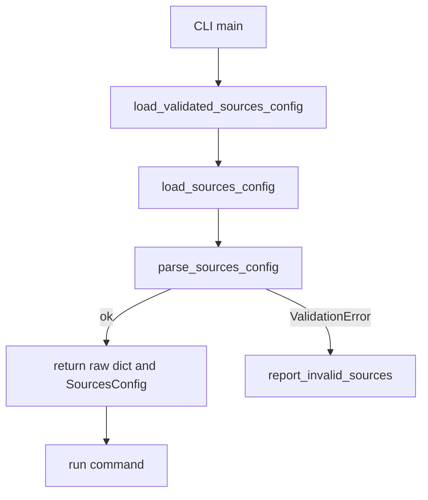

# CFG1 sources.yaml CLI 검증 일관화 Tech Spec

## 한눈에 보기

`sources.yaml`에 오타가 있으면 모든 관련 CLI가 같은 friendly message로 실패해야 합니다. 이번 변경은 `load_validated_sources_config()`를 추가해 그 검증 경로를 하나로 모읍니다. 리포트 생성과 분석 실행은 설정 검증이 끝난 뒤에만 시작됩니다.

## 요약

`collect`, `run`, `backfill`은 malformed `sources.yaml`을 `[mimir] invalid sources.yaml:`로 보고했습니다. 하지만 `analyze`는 pydantic(파이썬 데이터 검증 라이브러리) 오류를 그대로 보여줄 수 있었고, `deliver`와 `dashboard`는 `lang`만 raw dict에서 읽어서 오타를 지나칠 수 있었습니다.

새 helper는 raw config와 parsed config를 함께 반환합니다. CLI `main()`은 helper 호출만 `try/except ValidationError`로 감쌉니다. runtime 함수 호출은 catch 밖에 남겨서 downstream data/model 오류를 설정 오류로 오분류하지 않습니다.

| 결정 | 이유 | 결과 |
| ---- | ---- | ---- |
| `mimir.config`에 helper 추가 | CLI마다 load와 parse를 반복하지 않기 위해 | `sources.yaml` 검증 경로가 하나로 모임 |
| `try/except` 범위를 helper 호출로 제한 | 실행 중 검증 오류를 설정 오류로 바꾸지 않기 위해 | bug 신호가 숨지 않음 |
| `deliver`/`dashboard`도 먼저 full parse | `lang` 조회가 schema typo를 숨기지 않게 하기 위해 | 출력 파일을 만들기 전에 실패 |

## 목표

- `mimir analyze`, `mimir deliver`, `mimir dashboard`가 malformed `sources.yaml`에서 exit code 1을 반환한다.
- 모든 관련 CLI가 stderr에 `[mimir] invalid sources.yaml:`로 시작하는 메시지를 출력한다.
- `deliver`와 `dashboard`는 설정 오류가 있으면 report/dashboard 파일을 쓰지 않는다.
- 기존 `collect`, `run`, `backfill`의 friendly message 동작을 유지한다.
- downstream `ValidationError`는 설정 오류로 오분류하지 않는다.

## 목표가 아닌 것

| 항목 | 제외 이유 |
| ---- | --------- |
| `sources.yaml` schema 확장 | 이번 변경은 검증 표면을 통일하는 작업입니다. |
| `watchlist.yaml` 검증 추가 | 문제 범위가 다른 설정 파일입니다. |
| renderer의 language fallback 제거 | HTML 렌더링 방어는 별도 안전장치입니다. |
| plugin 내부 설정 검증 변경 | plugin-owned schema는 각 plugin factory가 다룹니다. |

## 현재 문제와 제약

사용자가 아래처럼 오타가 있는 설정을 저장할 수 있습니다.

```yaml
analysys:
  news:
    use_default_aliases: false
```

기존 동작은 명령마다 달랐습니다.

| CLI | 기존 문제 | 기대 동작 |
| --- | --------- | --------- |
| `analyze` | `parse_sources_config(load_sources_config(...))`가 raw traceback을 드러낼 수 있음 | friendly message로 실패 |
| `deliver` | raw dict에서 `lang`만 읽어 schema typo를 놓칠 수 있음 | report 작성 전에 full parse |
| `dashboard` | raw dict에서 `lang`만 읽어 schema typo를 놓칠 수 있음 | dashboard 작성 전에 full parse |
| `collect`, `run`, `backfill` | 이미 friendly message를 사용 | helper로 중복만 제거 |

제약은 `ValidationError` catch 범위입니다. CLI가 `run_*` 전체를 감싸면, 실행 중 데이터 모델 검증 오류까지 `sources.yaml` 오류처럼 보일 수 있습니다.

## 설계

### 구조



### helper 계약

`load_validated_sources_config(config_dir)`는 두 값을 반환합니다.

| 반환값 | 사용처 | 이유 |
| ------ | ------ | ---- |
| raw dict | `collect`, `run`, `backfill`, `deliver`, `dashboard` | 기존 runtime 함수가 raw config를 받거나 `lang`을 직접 읽음 |
| `SourcesConfig` | `analyze` | `run_analyze()`가 parsed config를 받아 signal builder에 넘김 |

### Before / After

| 경로 | Before | After |
| ---- | ------ | ----- |
| `analyze.main()` | load 후 parse를 직접 호출 | helper로 검증하고 parsed config를 전달 |
| `deliver.main()` | raw dict에서 `lang`만 조회 | helper로 full parse 후 `lang` 조회 |
| `dashboard.main()` | raw dict에서 `lang`만 조회 | helper로 full parse 후 `lang` 조회 |
| `collect/run/backfill.main()` | 각 파일에서 load 후 parse | helper 호출로 중복 제거 |

### 예외 처리

각 CLI는 아래 형태를 따릅니다.

1. `config_dir`를 계산한다.
2. `load_validated_sources_config(config_dir)`만 `try` 안에서 호출한다.
3. `ValidationError`가 나면 `report_invalid_sources(exc)`를 반환한다.
4. runtime 함수는 `try` 바깥에서 호출한다.

이 구조는 두 실패를 분리합니다.

| 실패 종류 | 처리 |
| --------- | ---- |
| malformed `sources.yaml` | friendly message + exit code 1 |
| runtime data/model validation failure | 원래 오류로 노출 |

## 파일별 변경

| 파일 | 변경 |
| ---- | ---- |
| `mimir/config.py` | `load_validated_sources_config()` 추가 |
| `mimir/analyze.py` | parsed `SourcesConfig`를 helper에서 받아 사용 |
| `mimir/deliver.py` | report 생성 전 full config 검증 |
| `mimir/dashboard.py` | dashboard 생성 전 full config 검증 |
| `mimir/collect.py` | 기존 동작 유지하며 helper 사용 |
| `mimir/run.py` | 기존 동작 유지하며 helper 사용 |
| `mimir/backfill.py` | 기존 동작 유지하며 helper 사용 |

## 운영 영향

정상 설정에서는 사용자-visible 동작이 바뀌지 않습니다. 잘못된 설정에서는 `deliver`와 `dashboard`가 더 빨리 실패하므로, 잘못된 설정으로 빈 리포트나 오래된 리포트를 만들 가능성이 줄어듭니다.

| 항목 | 영향 |
| ---- | ---- |
| DB migration | 없음 |
| CLI argument | 변경 없음 |
| data file format | 변경 없음 |
| report format | 변경 없음 |
| failure timing | 설정 오류를 runtime 시작 전에 잡음 |

## 보안 / 권한 영향

권한 모델은 바뀌지 않습니다. 다만 설정 오타를 조용히 무시하지 않으므로, 운영자가 의도하지 않은 source alias 또는 language fallback을 더 빨리 발견할 수 있습니다.

## 롤아웃 / 마이그레이션

별도 migration은 없습니다.

1. 코드 배포.
2. 기존 CI gate 실행.
3. 배포 후 malformed `sources.yaml` smoke test를 한 번 수행.
4. 정기 pipeline에서 유효한 config가 기존처럼 실행되는지 확인.

Rollback은 해당 커밋 revert로 충분합니다.

## 테스트 전략

| 테스트 | 고정하는 계약 |
| ------ | ------------- |
| `tests/test_analyze.py::test_main_reports_invalid_sources_yaml` | analyze가 friendly message로 실패 |
| `tests/test_deliver.py::test_main_reports_invalid_sources_yaml_without_writing_report` | deliver가 report를 쓰기 전에 실패 |
| `tests/test_dashboard_cli.py::test_main_reports_invalid_sources_yaml_without_writing_dashboard` | dashboard가 출력 파일을 쓰기 전에 실패 |
| 기존 `collect/run/backfill` 테스트 | 기존 friendly message 계약 유지 |
| 기존 downstream validation 테스트 | catch 범위가 넓어지지 않음 |

검증 명령:

```bash
uv run ruff check .
uv run mypy mimir
uv run pytest -q
uv run coverage run -m pytest
uv run coverage report --fail-under=80
git diff --check
```

## 검증 결과

구현 브랜치에서 아래 결과를 확인했습니다.

| 명령 | 결과 |
| ---- | ---- |
| `uv run ruff check .` | pass |
| `uv run mypy mimir` | pass, 81 files |
| `uv run pytest -q` | 495 passed |
| `uv run coverage run -m pytest` | 495 passed |
| `uv run coverage report --fail-under=80` | TOTAL 98% |
| `git diff --check` | pass |

## 부록: 코드 근거

| 근거 | 위치 |
| ---- | ---- |
| helper 추가 | `mimir/config.py`의 `load_validated_sources_config()` |
| analyze 적용 | `mimir/analyze.py`의 `main()` |
| deliver 적용 | `mimir/deliver.py`의 `main()` |
| dashboard 적용 | `mimir/dashboard.py`의 `main()` |
| no-output 회귀 테스트 | `tests/test_deliver.py`, `tests/test_dashboard_cli.py` |

---

**버전**: v1.0
**작성일**: 2026-06-18
**상태**: Implemented
