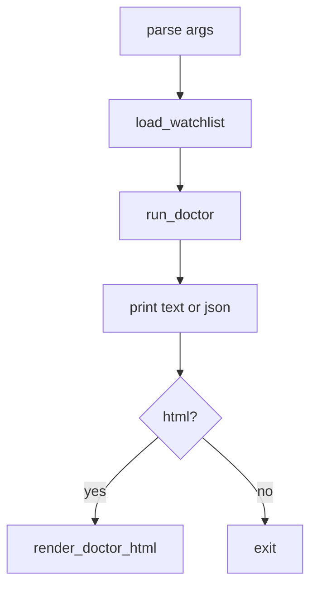
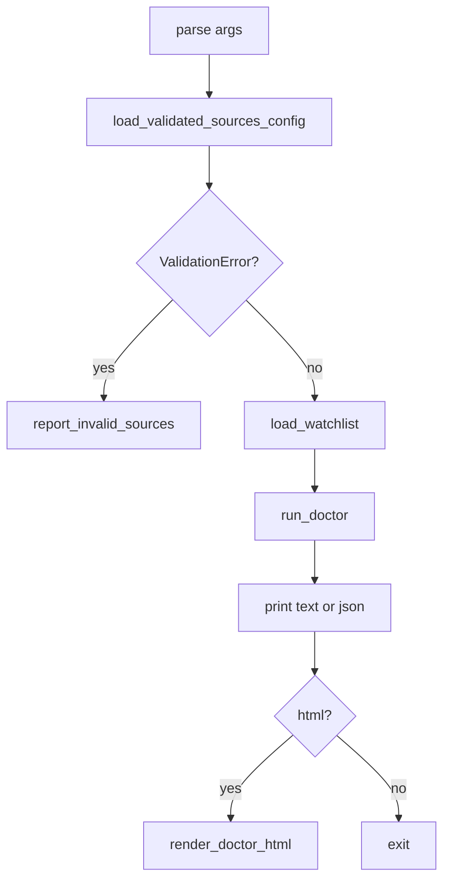

# CFG2 Doctor sources.yaml 검증 Tech Spec

## 한눈에 보기

`mimir doctor`는 운영 점검 명령입니다. 이번 변경은 doctor가 데이터 점검이나 HTML 파일 쓰기 전에 `sources.yaml` schema 오류를 먼저 보고하게 합니다.

## 요약

CFG1은 `sources.yaml` schema 오류를 CLI에서 같은 메시지로 보여주도록 만들었습니다. 하지만 doctor는 `--config-dir`을 받으면서도 `sources.yaml`을 검증하지 않았습니다.

| 결정 | 이유 | 결과 |
| ---- | ---- | ---- |
| doctor도 `load_validated_sources_config()` 호출 | 운영 점검 전에 설정 오류를 놓치지 않기 위해 | malformed config에서 exit code 1 |
| HTML 쓰기 전에 검증 | 잘못된 설정에서 정상처럼 보이는 HTML을 만들지 않기 위해 | `--html` 파일 미생성 |
| source build는 하지 않음 | doctor는 read-only 데이터 점검 명령이기 때문 | 네트워크 호출과 SEC mapping download 없음 |

## 목표

- `mimir doctor`가 malformed `sources.yaml`을 `[mimir] invalid sources.yaml:`로 보고한다.
- 설정 오류가 있으면 `run_doctor()`를 실행하지 않는다.
- 설정 오류가 있으면 `--html` 출력 파일을 만들지 않는다.
- 정상 설정의 text, JSON, HTML, `--strict` 동작은 유지한다.

## 목표가 아닌 것

| 항목 | 제외 이유 |
| ---- | --------- |
| source registry build | doctor는 source fetch 가능성 점검이 아니라 저장 데이터 점검 명령입니다. |
| SEC mapping file live download/cache | provider 정책과 freshness 판단이 필요한 별도 설계입니다. |
| `watchlist.yaml` schema 검증 | 이번 변경은 CFG1의 `sources.yaml` schema 검증 후속입니다. |
| scheduled workflow doctor hard gate | OPS1에서 dashboard 표시와 hard gate는 분리하기로 했습니다. |

## 현재 문제와 제약

변경 전 doctor 경로는 아래 순서였습니다.

이 순서에서는 `sources.yaml`에 오타가 있어도 doctor가 그 파일을 읽지 않습니다. 운영자는 doctor HTML을 보고 데이터 상태가 정상이라고 판단할 수 있지만, 실제 pipeline은 같은 config로 나중에 실패할 수 있습니다.

## 설계

변경 후 doctor 경로는 검증 단계를 하나 앞에 둡니다.

`load_validated_sources_config()`는 absent `sources.yaml`을 `{}`로 읽고 기본 config로 검증합니다. 그래서 기존처럼 `sources.yaml` 없이 doctor를 실행하는 환경은 계속 동작합니다.

## 실패 / 예외 처리

| 실패 | 처리 |
| ---- | ---- |
| malformed `sources.yaml` | `report_invalid_sources()`로 stderr 출력 후 exit code 1 |
| absent `sources.yaml` | 기본 config로 간주하고 doctor 계속 실행 |
| data freshness CRITICAL | 기존처럼 doctor report 출력 후 exit code 1 |
| WARN + `--strict` | 기존처럼 exit code 1 |
| HTML path parent 없음 | 기존 renderer가 parent directory를 만든다 |

## 운영 영향

| 항목 | 영향 |
| ---- | ---- |
| 정상 config | 변경 없음 |
| 잘못된 `sources.yaml` | doctor가 데이터 점검 전에 실패 |
| HTML 산출물 | 잘못된 config에서는 생성하지 않음 |
| 네트워크 요청 | 추가 없음 |
| scheduled pipeline | 기존 workflow hard gate 정책 변경 없음 |

## 보안 / 권한 영향

새 secret이나 권한은 없습니다. 오류 메시지는 기존 config reporting helper를 재사용합니다. `sources.yaml` 내용 전체를 출력하지 않고 pydantic 오류 요약만 보여줍니다.

## 테스트 전략

| 테스트 | 고정하는 계약 |
| ------ | ------------- |
| `test_cli_reports_invalid_sources_yaml_without_writing_html` | doctor가 malformed config를 friendly message로 보고하고 HTML을 쓰지 않음 |
| `test_load_validated_sources_config_rejects_non_mapping_top_level_yaml` | non-mapping `sources.yaml` 최상위를 path resolution crash 없이 pydantic `ValidationError`로 거부 |
| 기존 doctor HTML 테스트 | 정상 config의 stdout, HTML, lang, exit code 유지 |
| `test_readme_test_badges_match_collected_pytest_count` | README 테스트 수치 drift 방지 |
| `test_improvement_catalog_summary_mentions_latest_completed_ids` | CFG2 completion tracking |

## 검증 결과

| 명령 | 결과 |
| ---- | ---- |
| `UV_FROZEN=1 uv run pytest tests/doctor/test_cli.py -q` | 10 passed |
| `UV_FROZEN=1 uv run ruff check mimir/doctor/doctor_cli.py tests/doctor/test_cli.py` | pass |
| `UV_FROZEN=1 uv run mypy mimir` | pass, 82 files |
| `UV_FROZEN=1 uv run pytest tests/test_config.py tests/doctor/test_cli.py tests/test_readme_docs.py -q` | 19 passed |
| `UV_FROZEN=1 uv run pytest tests/doctor/test_cli.py tests/test_readme_docs.py -q` | 12 passed |
| `UV_FROZEN=1 uv run ruff check .` | pass |
| `UV_FROZEN=1 uv run pytest -q` | 537 passed |
| `UV_FROZEN=1 uv run coverage run -m pytest` | 537 passed |
| `UV_FROZEN=1 uv run coverage report --fail-under=80` | TOTAL 98% |
| `git diff --check` | pass |

---
**버전:** v1.0
**작성일:** 2026-06-18
**상태:** 구현 완료
**관련 문서:** `docs/_internal/skill-outputs/jira-ticket/CFG2-doctor-sources-config-validation.md`
