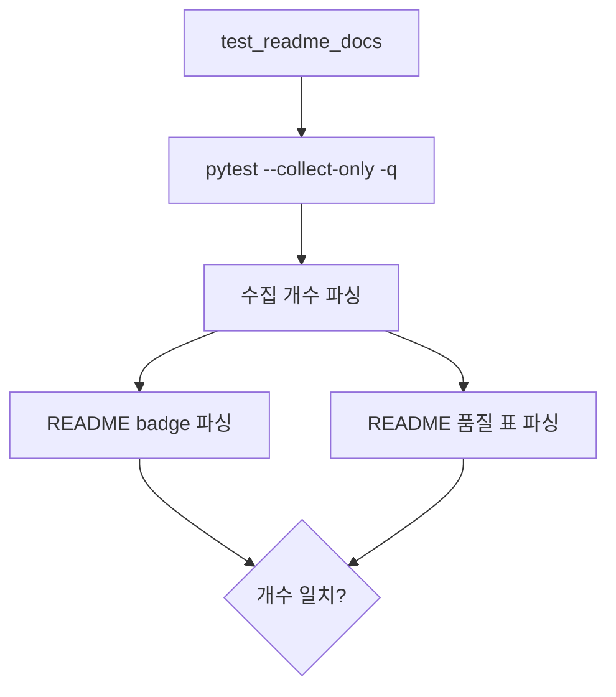

# DOCHEALTH README Doc Health Tech Spec

## 한눈에 보기

README 3종은 tests badge와 품질 표에 테스트 개수를 수동으로 적습니다. 테스트가 늘어난 뒤 이 수치가 갱신되지 않으면 첫 화면이 실제 품질 상태를 잘못 보여줍니다. 이번 변경은 README 수치를 현재 pytest 수집 개수와 맞추고, 같은 문제가 다시 생기면 테스트가 실패하도록 합니다.

## 목표

- README 3종의 tests badge를 현재 테스트 수와 동기화한다.
- README 3종의 품질 표도 같은 테스트 수를 표시한다.
- `pytest --collect-only` 결과를 기준으로 README 수치 drift를 탐지한다.
- 개선 카탈로그의 최신 완료 ID 누락을 테스트로 고정한다.
- 이번 증분을 `DOCHEALTH`로 개선 백로그와 카탈로그에 기록한다.

## 목표가 아닌 것

| 항목 | 제외 이유 |
| ---- | --------- |
| README badge 자동 생성 | 현재 문서는 정적 badge URL을 쓰고 있어, 최소 변경으로 drift를 막는 편이 안전합니다. |
| 테스트 수 badge 제거 | 저장소가 이미 테스트 수를 품질 지표로 노출하고 있어, 정책 변경 없이 정확성을 보강합니다. |
| CI workflow 변경 | 기존 CI가 pytest를 실행하므로 새 회귀 테스트가 그대로 포함됩니다. |

## 설계

### README 수치 검증

`tests/test_readme_docs.py`는 subprocess로 `pytest --collect-only -q`를 실행합니다. 이 명령은 테스트를 실행하지 않고 수집 개수만 출력하므로, README 검증 테스트 안에서 호출해도 재귀 실행이 발생하지 않습니다.

| 파서 | 대상 |
| ---- | ---- |
| `BADGE_RE` | shields.io tests badge의 `tests-{N}%20passing` |
| `TABLE_RE` | README 품질 표의 tests row |
| `COLLECTED_RE` | pytest collect-only의 collected count |

### 개선 카탈로그 검증

최신 완료 ID는 `LATEST_COMPLETED_IDS`에 둡니다. 테스트는 `docs/architecture/improvement-catalog.md`의 상단 상태 줄과 결론 문단을 검사합니다.

| 완료 ID | 의미 |
| ------- | ---- |
| `R1h-SEC-TICKER` | SEC RSS ticker token 입력 개선 |
| `DCHTML` | doctor HTML report 출력 |
| `DOCHEALTH` | README와 개선 문서 상태값 회귀 방지 |

## 운영 영향

| 항목 | 영향 |
| ---- | ---- |
| 런타임 코드 | 변경 없음 |
| CI 시간 | collect-only subprocess가 추가되어 소폭 증가 |
| 문서 유지보수 | 테스트 추가 시 README 수치도 함께 갱신해야 함 |
| 실패 모드 | README가 실제 테스트 수와 다르면 CI가 실패 |

## 테스트 전략

| 테스트 | 고정하는 계약 |
| ------ | ------------- |
| `test_readme_test_badges_match_collected_pytest_count` | README 3종의 badge/table 테스트 수가 실제 pytest 수집 개수와 일치 |
| `test_improvement_catalog_summary_mentions_latest_completed_ids` | 개선 카탈로그 요약이 최신 완료 ID를 빠뜨리지 않음 |

## 검증 결과

| 명령 | 결과 |
| ---- | ---- |
| `uv run pytest tests/test_readme_docs.py -q` | 2 passed |
| `uv run ruff check .` | pass |
| `uv run mypy mimir` | pass, 82 files |
| `uv run pytest -q` | 511 passed |
| `uv run coverage run -m pytest` | 511 passed |
| `uv run coverage report --fail-under=80` | TOTAL 98% |

## 부록: 변경 근거

| 근거 | 위치 |
| ---- | ---- |
| README badge/table 갱신 | `README.md`, `README.ko.md`, `README.zh.md` |
| README drift 회귀 테스트 | `tests/test_readme_docs.py` |
| 개선 백로그 기록 | `docs/IMPROVEMENTS.md` |
| 개선 카탈로그 상태 기록 | `docs/architecture/improvement-catalog.md` |

---
**버전:** v1.0
**작성일:** 2026-06-18
**상태:** 구현 완료
