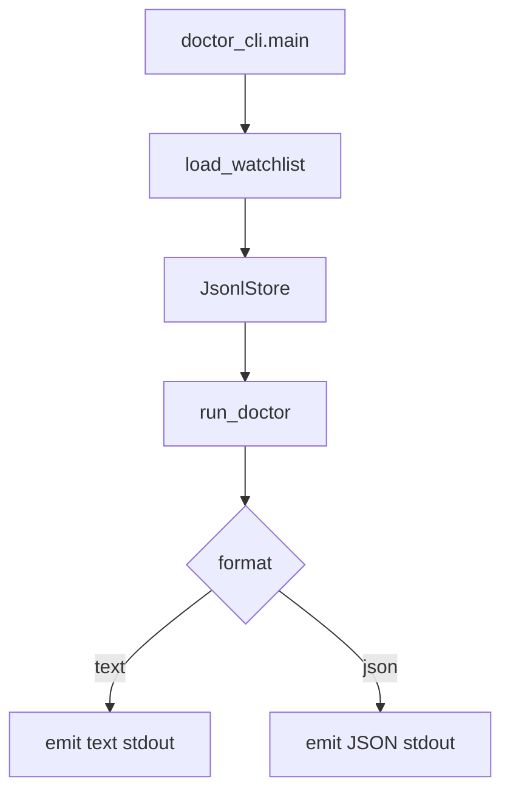
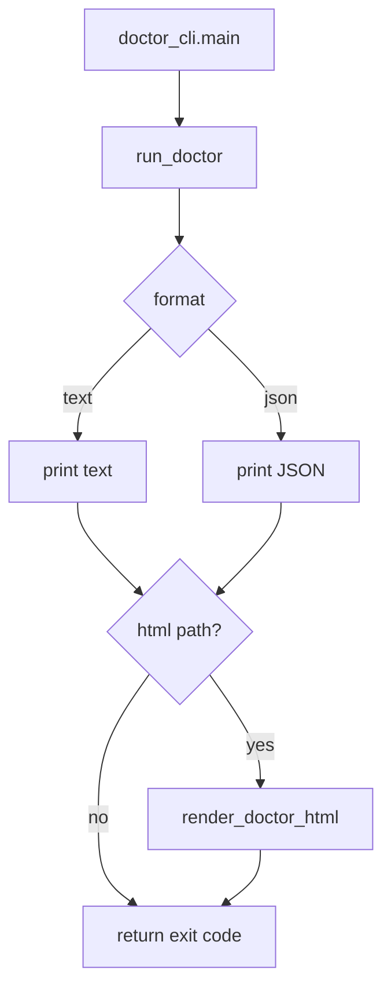

# DCHTML doctor HTML report Tech Spec

## 한눈에 보기

`mimir doctor`는 text/JSON만 출력해서 사람이 공유하기 좋은 산출물이 없었습니다. 이번 변경은 `--html <path>`와 `--lang en|ko|zh`를 추가해 같은 `DoctorReport`를 standalone HTML로 저장합니다. 기존 stdout 형식과 exit code는 그대로 유지합니다.

## 요약

doctor는 data root를 읽고 `DoctorReport`를 만듭니다. HTML renderer는 이 report를 다시 계산하지 않습니다. 그래서 CLI, JSON, HTML이 같은 진단 결과를 공유합니다.

| 결정 | 이유 | 결과 |
| ---- | ---- | ---- |
| 독립 renderer 추가 | CLI와 HTML 조립을 분리해야 테스트가 쉬움 | `mimir/report/doctor_html.py` 생성 |
| `--html`은 보조 출력 | 기존 자동화가 stdout을 읽고 있음 | text/JSON stdout 보존 |
| `--lang`은 CLI choices 사용 | 잘못된 언어 값을 초기에 거부 | CLI는 `en|ko|zh`만 허용 |
| renderer도 lang 정규화 | library caller가 잘못된 값을 줄 수 있음 | invalid lang은 `en` fallback |
| OK/info finding은 all-clear | doctor의 `worst`가 OK면 운영상 문제 없음 | sync hint가 HTML 문제 표로 보이지 않음 |

## 목표

- `mimir doctor --html <path>`가 standalone HTML report를 저장한다.
- HTML 저장은 기존 text/JSON stdout을 대체하지 않는다.
- `--lang en|ko|zh`가 HTML 라벨 언어를 제어한다.
- report-controlled 문자열은 HTML escape한다.
- CRITICAL finding은 WARN보다 먼저 표시한다.
- WARN/CRITICAL이 없으면 all-clear 상태를 보여준다.
- README 3종과 개선 카탈로그가 새 CLI 표면을 설명한다.

## 목표가 아닌 것

| 항목 | 제외 이유 |
| ---- | --------- |
| scheduled workflow doctor hard gate | WARN을 배포 차단으로 볼지는 운영 정책 문제입니다. |
| `Finding.message` 번역 | message는 진단 사실 문자열이라 자동화와 사람이 같은 내용을 봐야 합니다. |
| JSON schema 변경 | HTML은 보조 출력이므로 `DoctorReport` schema를 바꾸지 않습니다. |
| dashboard와 renderer 통합 | dashboard는 여러 섹션을 묶는 페이지이고 doctor HTML은 단일 진단 페이지입니다. |

## 현재 구조

`doctor_cli.main()`은 watchlist와 data root를 읽고 `run_doctor()`를 호출합니다. 이후 `--format`에 따라 text나 JSON을 stdout에 출력합니다.



이 구조에서는 사람이 공유할 파일이 없습니다.

## 설계

### CLI flow



HTML 쓰기는 stdout 출력 뒤에 실행됩니다. 그래서 사용자는 기존 stdout 결과를 계속 받을 수 있습니다.

### Renderer contract

`render_doctor_html()`는 파일 쓰기 외에는 side effect가 없습니다.

```python
def render_doctor_html(
    report: DoctorReport,
    out_path: Path,
    lang: str = DEFAULT_LANG,
) -> None:
    ...
```

| 입력 | 의미 |
| ---- | ---- |
| `report` | 이미 계산된 doctor 결과 |
| `out_path` | HTML 파일을 쓸 경로 |
| `lang` | HTML 라벨 언어 |

함수는 `out_path.parent.mkdir(parents=True, exist_ok=True)`를 호출한 뒤 UTF-8 HTML을 씁니다.

### Finding 표시 정책

Doctor severity는 `DoctorReport.worst`가 운영 상태를 대표합니다.

| 상태 | HTML 표시 |
| ---- | --------- |
| `worst == Severity.OK` | all-clear 문구 |
| WARN 있음 | finding table |
| CRITICAL 있음 | finding table, CRITICAL 먼저 |

OK/info finding은 sync hint입니다. 운영자가 문제로 읽지 않도록 all-clear 상태에서는 세부 표를 숨깁니다.

### i18n key

`mimir/report/i18n.py`에 doctor 전용 key를 세 언어에 추가합니다.

| key | 용도 |
| --- | ---- |
| `doctor_page_title` | HTML title |
| `doctor_heading` | h1 |
| `doctor_checked_at` | 점검 시각 label |
| `doctor_data_root` | data root label |
| `doctor_worst` | worst severity label |
| `doctor_col_dataset` | table header |
| `doctor_col_scope` | table header |
| `doctor_col_severity` | table header |
| `doctor_col_detail` | table header |
| `doctor_sev_ok` | severity label |
| `doctor_sev_warn` | severity label |
| `doctor_sev_critical` | severity label |
| `doctor_all_clear` | empty state |

`Finding.message`는 번역하지 않습니다.

## 보안 / 안전

HTML renderer는 저장 데이터에서 온 문자열을 모두 escape합니다.

| 값 | 처리 |
| -- | ---- |
| `finding.dataset.value` | escape |
| `finding.scope` | escape |
| severity label | escape |
| `finding.message` | escape |
| `report.data_root` | escape |
| `report.checked_at` | ISO 문자열 변환 후 escape |
| `<html lang>` | `normalize_lang()`으로 allowlist 적용 |

CLI는 `argparse` choices로 `--lang`을 제한합니다. renderer는 library 호출자를 위해 같은 정규화를 다시 수행합니다.

## 운영 영향

| 항목 | 영향 |
| ---- | ---- |
| CLI stdout | 기존 text/JSON 유지 |
| Exit code | 기존 CRITICAL/WARN/strict 정책 유지 |
| Data storage | 변경 없음 |
| Report artifact | 새 HTML 파일 선택 생성 |
| Scheduled workflow | 변경 없음 |

## 테스트 전략

| 테스트 | 고정하는 계약 |
| ------ | ------------- |
| `test_render_doctor_html_orders_findings_and_escapes_content` | severity 정렬과 HTML escape |
| `test_render_doctor_html_all_clear_state` | all-clear와 disclaimer |
| `test_render_doctor_html_treats_ok_findings_as_all_clear` | OK/info finding 표시 정책 |
| `test_render_doctor_html_translated_labels` | ko/zh label |
| `test_render_doctor_html_sanitizes_lang_attribute` | invalid lang fallback |
| `test_cli_html_writes_file_and_preserves_text_stdout` | HTML 파일 생성과 stdout 보존 |
| `test_cli_html_respects_lang` | CLI `--lang` forwarding |
| `test_cli_json_html_preserves_json_stdout` | JSON stdout과 HTML 파일 생성 동시 보존 |
| `test_cli_html_preserves_critical_exit_code` | CRITICAL exit code 보존 |
| `test_cli_html_preserves_strict_warn_exit_code` | WARN strict exit code 보존 |

## 검증 결과

구현 브랜치에서 아래 결과를 확인했습니다.

| 명령 | 결과 |
| ---- | ---- |
| `uv run pytest tests/report/test_doctor_html.py tests/doctor/test_cli.py -q` | 14 passed |
| `uv run ruff check .` | pass |
| `uv run mypy mimir` | pass, 82 files |
| `uv run pytest -q` | 509 passed |
| `uv run coverage run -m pytest` | 509 passed |
| `uv run coverage report --fail-under=80` | TOTAL 98% |
| `git diff --check` | pass |

## 부록: 코드 근거

| 근거 | 위치 |
| ---- | ---- |
| CLI 옵션 추가 | `mimir/doctor/doctor_cli.py` |
| HTML renderer | `mimir/report/doctor_html.py` |
| Doctor i18n key | `mimir/report/i18n.py` |
| Renderer tests | `tests/report/test_doctor_html.py` |
| CLI tests | `tests/doctor/test_cli.py` |
| 사용자 CLI 문서 | README 3종 |
| 개선 추적 | `docs/IMPROVEMENTS.md`, `docs/architecture/improvement-catalog.md` |

---
**버전:** v1.0
**작성일:** 2026-06-18
**상태:** 구현 완료
**관련 문서:** `docs/superpowers/specs/2026-06-18-doctor-html-report-design.md`
