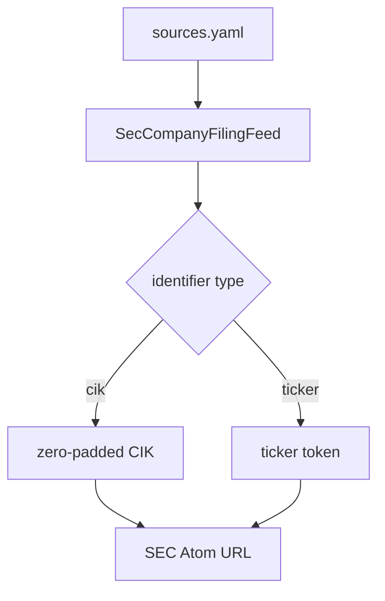
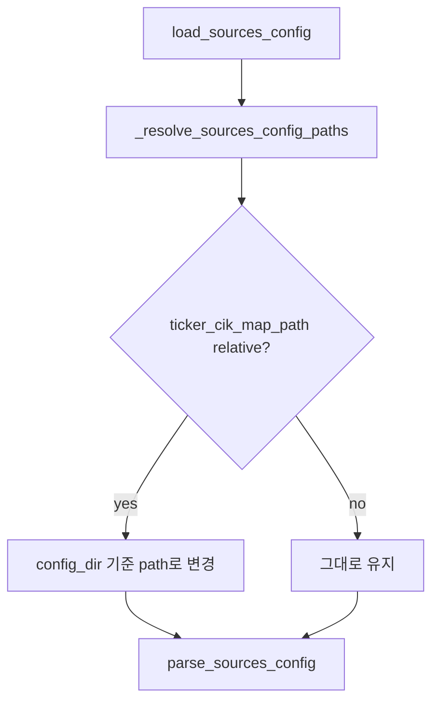
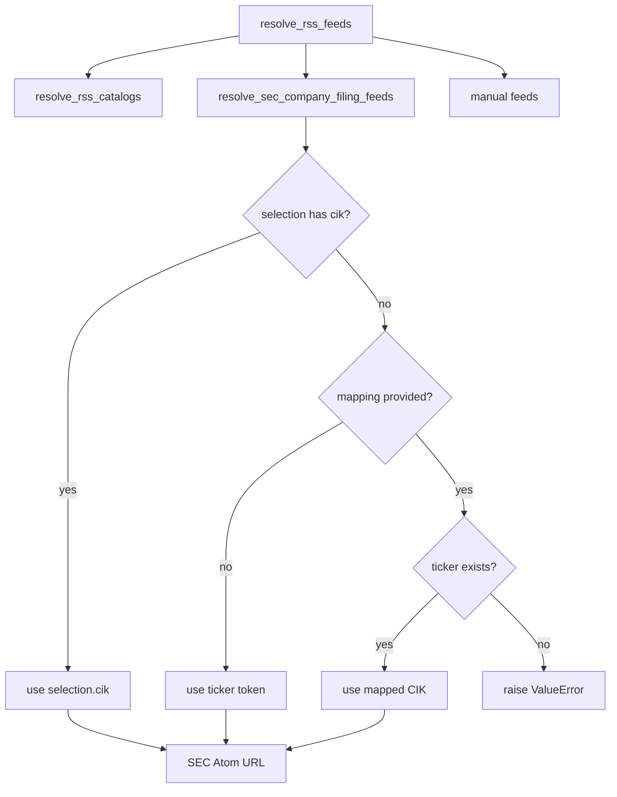

# R1i-SEC-CIK SEC ticker CIK map Tech Spec

## 한눈에 보기

SEC filing RSS 설정에서 ticker를 쓰면 기존에는 ticker token이 URL에 그대로 들어갔습니다. R1i 변경은 운영자가 제공한 로컬 `company_tickers.json` 파일을 읽어 ticker를 10자리 CIK로 바꿉니다. R1i 자체는 resolver-time network call 없이 로컬 파일 lookup만 추가했습니다.

현재 구현 기준으로는 이후 증분에서 `sources.rss.sec.ticker_cik_map_refresh`가 `build_sources()` 준비 단계에 off-by-default로 추가됐습니다. `enabled: false`가 기본값이므로 기본 설정은 SEC mapping download 요청을 0회 보냅니다. refresh를 켜도 resolver는 계속 로컬 파일만 읽습니다.

## 요약

SEC는 ticker, CIK, 회사명 mapping 파일을 제공합니다. 다만 SEC 문서는 이 파일의 정확성과 범위를 보장하지 않는다고 설명합니다. 그래서 R1i는 mapping file 획득과 갱신을 운영자가 관리하는 로컬 파일 경로로 제한했고, resolver가 네트워크를 호출하지 않는 경계를 지켰습니다.

운영자가 `sources.rss.sec.ticker_cik_map_path`를 설정한 경우에만 로컬 파일을 읽습니다. mapping file에 ticker가 있으면 `company_filings[].ticker`를 10자리 CIK로 바꿉니다. mapping file에 ticker가 없거나 같은 ticker가 다른 CIK로 중복되면 실패합니다.

이후 구현은 `sources.rss.sec.ticker_cik_map_refresh` opt-in을 추가했습니다. `enabled: true`일 때만 `build_sources()`가 resolver 실행 전에 `max_age_hours` TTL과 ETag conditional GET으로 로컬 mapping file을 best-effort 갱신합니다. refresh 설정이 없거나 `enabled: false`이면 SEC mapping download 요청은 0회입니다.

| 결정 | 이유 | 결과 |
| ---- | ---- | ---- |
| opt-in local file만 지원 | SEC fair-access와 mapping 정확성 문제를 피하기 위해 | R1i resolver 네트워크 조회 없음 |
| refresh/cache는 후속 opt-in | 자동 요청은 운영 정책이므로 명시적 설정이 필요 | 기본 `enabled: false`라서 mapping download 0회 |
| ticker 누락은 실패 | fallback하면 운영자가 잘못된 mapping을 모름 | 조용한 오분석 방지 |
| duplicate ticker는 실패 | 같은 ticker가 다른 CIK를 가리키면 자동 판단이 위험 | ambiguity policy 명확화 |
| 상대 경로는 config directory 기준 | CLI 사용자가 `--config-dir`와 함께 이해하기 쉬움 | 실행 위치에 덜 의존 |

## 목표

- SEC `company_tickers.json` 형태를 읽어 ticker를 10자리 CIK로 정규화한다.
- `sources.rss.sec.ticker_cik_map_path`가 있으면 ticker 기반 company filing feed URL에 CIK를 사용한다.
- mapping file이 없으면 기존 ticker token 입력 경로를 유지한다.
- mapping file에 ticker가 없으면 실패한다.
- 같은 ticker가 다른 CIK로 중복되면 실패한다.
- 상대 mapping path는 `sources.yaml`이 있는 config directory 기준으로 해석한다.
- 사용자 문서와 개선 카탈로그가 완료 범위와 보류 범위를 분리해서 설명한다.
- 후속 refresh/cache 구현 상태를 문서에 반영하되, resolver의 no-network 경계와 기본 네트워크 0 계약을 분리해서 설명한다.

## 목표가 아닌 것

| 항목 | 제외 이유 |
| ---- | --------- |
| resolver 단계 SEC mapping file 다운로드 | URL 조립 단계에 network dependency를 만들면 no-network 경계가 깨집니다. 후속 refresh는 `build_sources()` 준비 단계에서만 opt-in으로 실행됩니다. |
| resolver 단계 snapshot age 판단 | 파일 age 정책은 후속 `ticker_cik_map_refresh.max_age_hours`가 준비 단계에서 다룹니다. |
| watchlist-wide SEC feed 자동 생성 | 어떤 symbol을 filing feed로 볼지 제품 정책이 필요합니다. |
| SEC 외 provider discovery | provider별 ToS와 endpoint 안정성을 따로 검토해야 합니다. |
| ticker ambiguity 자동 해소 | SEC mapping 정확성이 보장되지 않으므로 자동 선택하지 않습니다. |

## 현재 문제와 제약

R1h 이후 `SecCompanyFilingFeed`는 `cik` 또는 `ticker` 중 하나를 받습니다. `cik`는 10자리로 zero-pad됩니다. `ticker`는 공백 제거와 대문자 정규화만 거친 뒤 URL에 들어갑니다.



이 구조는 네트워크 없이 안전하지만, ticker 입력을 canonical CIK URL로 바꾸지 못합니다. SEC가 제공하는 `company_tickers.json` 파일은 도움이 되지만, 정확성과 범위가 보장되지 않습니다. 그래서 R1i는 로컬 파일 lookup과 fail-loud ambiguity policy를 먼저 추가했고, 자동 갱신은 후속 build 준비 단계 기능으로 분리했습니다.

## 설계

### Config schema

`sources.rss.sec` 아래에 `ticker_cik_map_path`를 추가합니다.

```yaml
sources:
  rss:
    sec:
      ticker_cik_map_path: "company_tickers.json"
      ticker_cik_map_refresh:
        enabled: false
        max_age_hours: 168
      company_filings:
        - ticker: "AAPL"
          symbol: "AAPL"
          forms: ["10-K", "10-Q", "8-K"]
```

| 필드 | 타입 | 기본값 | 의미 |
| ---- | ---- | ------ | ---- |
| `ticker_cik_map_path` | path | 없음 | R1i가 추가한 SEC `company_tickers.json` 로컬 파일 경로 |
| `ticker_cik_map_refresh.enabled` | bool | `false` | R1i 이후 추가된 build 준비 단계 refresh opt-in. 기본값은 SEC mapping download 0회 |
| `ticker_cik_map_refresh.max_age_hours` | int | `168` | refresh가 켜졌을 때 로컬 파일 age가 이 값보다 오래된 경우에만 갱신 시도 |
| `company_filings[].ticker` | string | 없음 | mapping file에서 찾을 ticker |
| `company_filings[].cik` | string 또는 number | 없음 | 직접 CIK 입력. mapping file보다 우선 |

### Path resolution

CLI는 `load_validated_sources_config(config_dir)`를 통해 `sources.yaml`을 읽습니다. 이 helper가 relative path를 config directory 기준으로 바꿉니다.



programmatic API가 `SourcesConfig(rss_sec_ticker_cik_map_path=Path(...))`를 직접 넘기면, 그 path는 그대로 사용합니다.

### Mapping loader

`load_sec_ticker_cik_map(path)`는 SEC의 official JSON shape를 읽습니다.

```json
{
  "0": {"cik_str": 320193, "ticker": "AAPL", "title": "Apple Inc."}
}
```

| 입력 | 처리 |
| ---- | ---- |
| `ticker` | `SecCompanyFilingFeed`의 ticker validator를 재사용해 대문자 token으로 정규화 |
| `cik_str` | `SecCompanyFilingFeed`의 CIK validator를 재사용해 10자리로 zero-pad |
| duplicate ticker + same CIK | 같은 mapping으로 유지 |
| duplicate ticker + different CIK | ambiguous mapping 오류 |

### Resolver flow



Direct `cik` always wins. Mapping file only affects `ticker` selections.

`ticker_cik_map_refresh`가 켜진 경우에도 위 resolver flow는 바뀌지 않습니다. refresh는 `build_sources()`가 resolver를 호출하기 전 로컬 파일을 준비하는 단계이며, resolver는 다운로드 URL이나 HTTP client를 알지 못합니다.

## 실패 / 예외 처리

| 실패 | 처리 | 이유 |
| ---- | ---- | ---- |
| mapping file path 없음 | 기존 ticker token 경로 유지 | 호환성 유지 |
| mapping file이 JSON object가 아님 | `ValueError` | SEC file shape와 맞지 않음 |
| entry가 object가 아님 | `ValueError` | 잘못된 mapping file |
| `ticker` 누락 또는 invalid token | `ValidationError` 기반 실패 | 기존 ticker validation 재사용 |
| `cik_str` 누락 또는 invalid CIK | `ValidationError` 기반 실패 | 기존 CIK validation 재사용 |
| ticker가 mapping에 없음 | `ValueError` | 조용한 fallback 방지 |
| duplicate ticker가 다른 CIK로 매핑 | `ValueError` | 자동 선택 금지 |

## 운영 영향

| 항목 | 영향 |
| ---- | ---- |
| 기존 `ticker` 설정 | `ticker_cik_map_path`가 없으면 기존 URL 유지 |
| 기존 `cik` 설정 | 변경 없음 |
| 네트워크 요청 | R1i local lookup만 쓰거나 refresh 기본값을 유지하면 SEC mapping download 0회. `ticker_cik_map_refresh.enabled: true`일 때만 build 준비 단계에서 best-effort 갱신 |
| 배포 설정 | local lookup만 쓰는 환경은 mapping file 배치 필요. refresh를 켜는 환경은 cache 위치와 SEC User-Agent 운영 필요 |
| 에러 표면 | 누락 ticker와 ambiguous mapping이 source build 단계에서 실패 |

## 보안 / 권한 영향

권한 모델은 바뀌지 않습니다. mapping file은 로컬 파일이므로 secret을 담지 않아야 합니다. SEC 요청에는 기존처럼 `MIMIR_SEC_USER_AGENT`가 적용됩니다. R1i local lookup 경로와 refresh 기본값은 SEC mapping download 요청을 보내지 않습니다. 후속 refresh를 명시적으로 켠 경우에만 fair-access User-Agent와 TTL/ETag 정책으로 요청량을 제한합니다.

## 롤아웃 / 마이그레이션

DB migration은 없습니다.

1. 코드 배포.
2. 운영자가 원하면 SEC `company_tickers.json` 파일을 config directory에 둔다.
3. `sources.rss.sec.ticker_cik_map_path`를 설정한다.
4. `mimir collect --config-dir <dir>` dry run 또는 scheduled run에서 RSS source 생성 실패가 없는지 확인한다.

후속 refresh/cache를 쓰려는 환경은 `ticker_cik_map_refresh.enabled: true`와 `max_age_hours`를 별도로 설정한다. 이 설정을 생략하거나 `enabled: false`로 두면 기본 경로는 SEC mapping download 요청을 보내지 않는다.

Rollback은 설정에서 `ticker_cik_map_path`를 제거하거나 커밋을 revert하면 됩니다. 설정만 제거하면 기존 ticker token URL 경로로 돌아갑니다. refresh만 끄려면 `ticker_cik_map_refresh.enabled`를 `false`로 되돌립니다.

## 테스트 전략

| 테스트 | 고정하는 계약 |
| ------ | ------------- |
| `test_load_sec_ticker_cik_map_reads_official_json_shape` | SEC JSON shape를 ticker→CIK map으로 읽음 |
| `test_load_sec_ticker_cik_map_rejects_ambiguous_duplicate_ticker` | 중복 ticker ambiguity failure |
| `test_resolve_sec_company_filing_feed_maps_ticker_to_cik` | mapping file이 있으면 URL에 CIK 사용 |
| `test_resolve_sec_company_filing_feed_missing_ticker_mapping_raises` | 누락 ticker는 실패 |
| `test_rss_sec_ticker_cik_map_path_parses_from_config` | schema가 path를 받음 |
| `test_load_validated_sources_config_resolves_relative_sec_map_path` | relative path는 config directory 기준 |
| `test_build_sources_resolves_sec_company_filing_ticker_with_map` | builder가 mapping loader와 resolver를 연결 |
| `test_sec_ticker_cik_refresh_docs_match_implemented_state` | R1i 문서가 후속 `ticker_cik_map_refresh`와 기본 네트워크 0 계약을 현재 구현과 맞게 설명 |
| `test_readme_test_badges_match_collected_pytest_count` | README 테스트 수치 drift 방지 |

## 검증 결과

| 명령 | 결과 |
| ---- | ---- |
| `uv run pytest tests/sources/test_rss_catalog.py tests/sources/test_config.py tests/core/test_builder.py tests/test_config.py tests/test_readme_docs.py -q` | 132 passed |
| `uv run ruff check .` | pass |
| `uv run mypy mimir` | pass, 82 files |
| `uv run pytest -q` | 520 passed |
| `uv run coverage run -m pytest` | 520 passed |
| `uv run coverage report --fail-under=80` | TOTAL 98% |
| `git diff --check` | pass |

## 부록: 코드 근거

| 근거 | 위치 |
| ---- | ---- |
| SEC mapping loader | `mimir/sources/rss_catalog.py`의 `load_sec_ticker_cik_map()` |
| ticker→CIK resolver | `mimir/sources/rss_catalog.py`의 `_sec_company_filing_identifier()` |
| SEC mapping refresh/cache | `mimir/sources/sec_ticker_cik_refresh.py`의 `refresh_sec_ticker_cik_map()` |
| config schema | `mimir/sources/config.py`의 `_RssSecBlock` |
| CLI relative path 처리 | `mimir/config.py`의 `_resolve_sources_config_paths()` |
| builder wiring | `mimir/core/builder.py`의 refresh prep step과 RSS `SourceSpec` |
| 사용자 config 예시 | `config/sources.yaml` |
| 사용자 reference | `docs/reference/config/sources.md` |

---
**버전:** v1.0
**작성일:** 2026-06-18
**상태:** 구현 완료
**관련 문서:** `docs/_internal/skill-outputs/jira-ticket/R1i-SEC-CIK-sec-ticker-cik-map.md`
