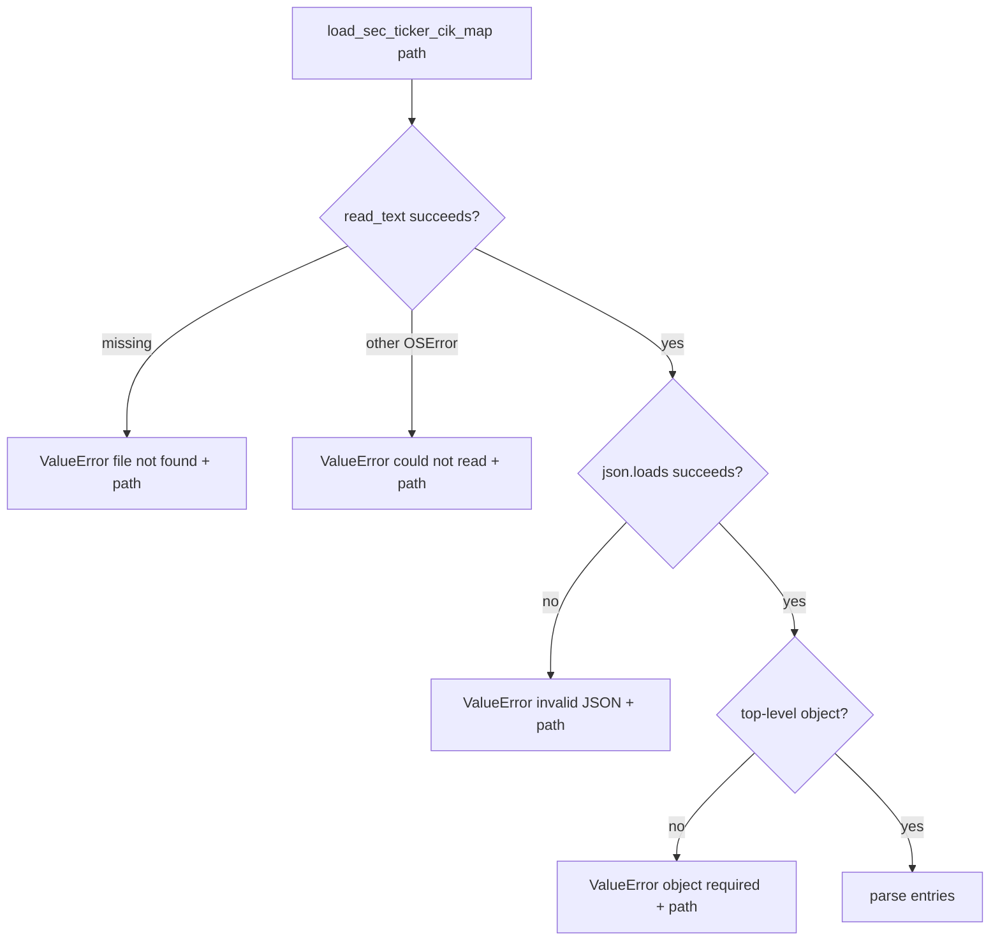

# R1j-SEC-CIK-ERRORS SEC ticker CIK map error surface Tech Spec

## 한눈에 보기

R1i의 SEC ticker CIK local mapping은 운영자가 제공한 `company_tickers.json` 파일을 읽습니다. 이번 변경은 그 파일이 없거나 깨졌을 때 low-level Python 예외 대신 path가 포함된 설정 오류로 실패하게 만듭니다.

## 목표

- Missing mapping file을 path가 포함된 `ValueError`로 정규화한다.
- 읽기 실패를 path가 포함된 `ValueError`로 정규화한다.
- Invalid JSON을 path가 포함된 `ValueError`로 정규화한다.
- 최상위 JSON이 object가 아니면 path가 포함된 `ValueError`로 실패한다.
- R1i의 opt-in local file lookup, no live download, no stale check 경계를 유지한다.

## 목표가 아닌 것

| 항목 | 제외 이유 |
| ---- | --------- |
| SEC mapping file 자동 다운로드 | SEC fair-access와 운영 cache 정책이 필요합니다. |
| stale mapping file 판단 | 파일 갱신 주기는 운영 정책입니다. |
| ticker missing fallback | R1i가 조용한 fallback을 금지했습니다. |
| entry-level validation 재설계 | R1j에서는 파일 읽기와 JSON shape까지만 다룹니다. R1k가 개별 entry의 path/key 오류 context를 별도 후속으로 처리합니다. |

## 설계

`load_sec_ticker_cik_map(path)`에서 파일 읽기와 JSON 파싱 경계를 명시적으로 나눕니다.

Mapping entry validation은 R1j 범위에서는 그대로 둡니다. R1k 후속은 같은 validator를 계속 재사용하면서 오류 메시지에 파일 path와 entry key를 덧붙입니다.

## 실패 / 예외 처리

| 실패 | 처리 |
| ---- | ---- |
| `FileNotFoundError` | `ValueError("SEC ticker CIK map file not found: <path>")` |
| other `OSError` | `ValueError("SEC ticker CIK map file could not be read: <path>")` |
| `JSONDecodeError` | `ValueError("SEC ticker CIK map file is not valid JSON: <path>")` |
| non-object JSON | `ValueError("SEC ticker CIK map must be a JSON object: <path>")` |

## 운영 영향

| 항목 | 영향 |
| ---- | ---- |
| 정상 mapping file | 변경 없음 |
| `ticker_cik_map_path` 미사용 | 변경 없음 |
| 잘못된 파일 경로 | 설정 오류 메시지가 더 명확해짐 |
| 네트워크 요청 | 추가 없음 |

## 테스트 전략

| 테스트 | 고정하는 계약 |
| ------ | ------------- |
| `test_load_sec_ticker_cik_map_missing_file_raises_clear_error` | missing file은 path 포함 오류 |
| `test_load_sec_ticker_cik_map_unreadable_file_raises_clear_error` | unreadable file은 path 포함 오류 |
| `test_load_sec_ticker_cik_map_invalid_json_raises_clear_error` | invalid JSON은 path 포함 오류 |
| `test_load_sec_ticker_cik_map_rejects_non_object_json` | non-object JSON은 path 포함 오류 |
| `test_readme_test_badges_match_collected_pytest_count` | README 테스트 수치 drift 방지 |
| `test_improvement_catalog_summary_mentions_latest_completed_ids` | R1j completion tracking |

## 검증 결과

| 명령 | 결과 |
| ---- | ---- |
| `uv run pytest tests/sources/test_rss_catalog.py tests/test_readme_docs.py -q` | 45 passed |
| `uv run ruff check .` | pass |
| `uv run mypy mimir` | pass, 82 files |
| `uv run pytest -q` | 524 passed |
| `uv run coverage run -m pytest` | 524 passed |
| `uv run coverage report --fail-under=80` | TOTAL 98% |
| `git diff --check` | pass |

---
**버전:** v1.0
**작성일:** 2026-06-18
**상태:** 구현 완료
**관련 문서:** `docs/_internal/skill-outputs/jira-ticket/R1j-SEC-CIK-ERRORS-sec-ticker-cik-map-errors.md`
