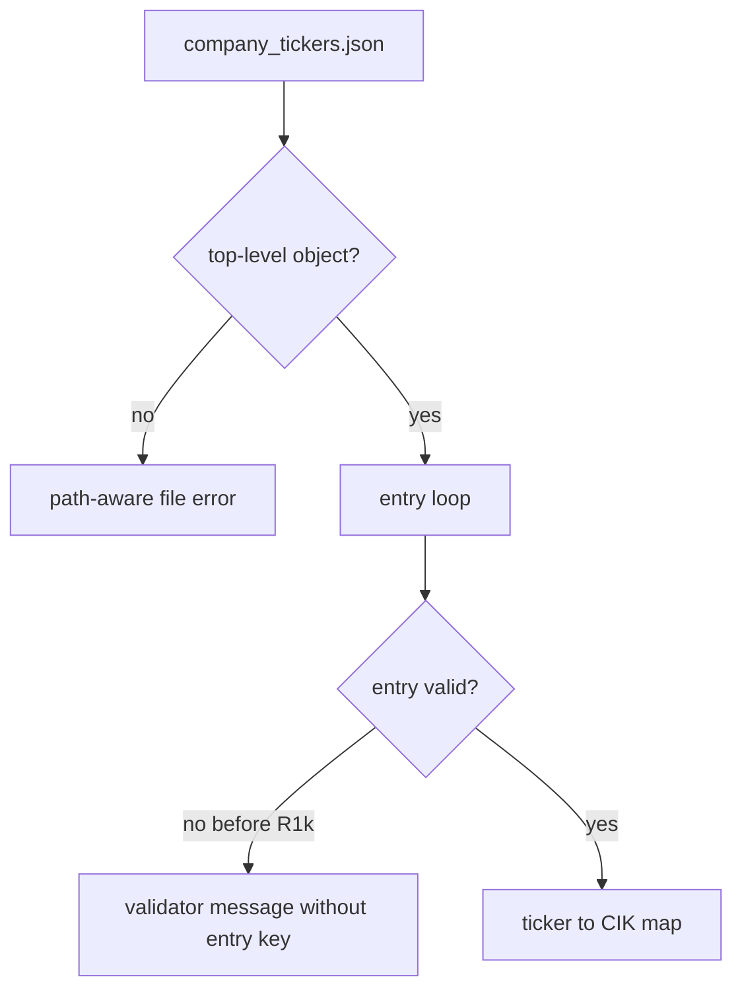
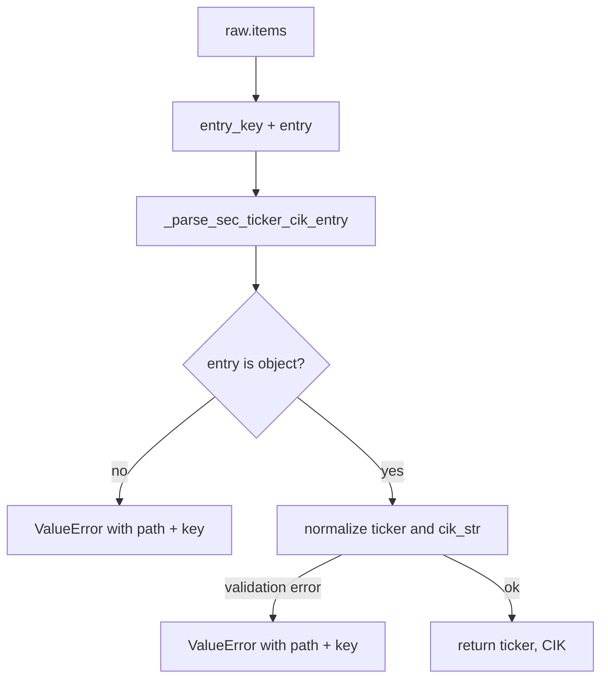

# R1k-SEC-CIK-ENTRY-ERRORS SEC ticker CIK map entry error Tech Spec

## 한눈에 보기

SEC ticker CIK mapping file은 수천 개 entry를 담을 수 있습니다. 이번 변경은 파일 안의 특정 entry가 잘못됐을 때 오류 메시지에 파일 path와 entry key를 넣어 운영자가 고칠 위치를 바로 찾게 합니다.

## 요약

R1i는 로컬 `company_tickers.json` lookup을 추가했고, R1j는 파일 읽기와 JSON 파싱 오류를 정리했습니다. R1k는 한 단계 더 내려가 개별 entry 오류를 정리합니다.

| 결정 | 이유 | 결과 |
| ---- | ---- | ---- |
| entry key를 loader loop에서 보존 | SEC JSON은 key가 entry 위치 역할을 한다 | `"0"` 같은 key가 오류 메시지에 들어간다 |
| 기존 validator 재사용 | config 입력과 mapping file 입력의 규칙을 분리하지 않기 위해 | ticker와 CIK 정규화 규칙이 하나로 유지된다 |
| low-level validation message를 감싸기 | pydantic 오류만으로는 어느 파일 entry인지 알기 어렵다 | path와 entry key가 항상 먼저 보인다 |
| 자동 복구 없음 | 잘못된 mapping을 추측하면 잘못된 filing feed를 만들 수 있다 | 오류를 고치거나 직접 CIK를 입력해야 한다 |

## 목표

- Non-object mapping entry에 파일 path와 entry key를 포함한다.
- Invalid ticker entry에 파일 path와 entry key를 포함한다.
- Missing 또는 invalid `cik_str` entry에 파일 path와 entry key를 포함한다.
- Duplicate ticker ambiguity 오류에도 path와 entry key를 덧붙인다.
- R1i의 no live download, no stale check, no silent fallback 경계를 유지한다.

## 목표가 아닌 것

| 항목 | 제외 이유 |
| ---- | --------- |
| SEC mapping file 자동 수정 | 외부 공식 파일을 임의로 고치면 신뢰 경계가 흐려집니다. |
| invalid entry skip | 일부 entry를 건너뛰면 mapping coverage를 운영자가 착각할 수 있습니다. |
| ticker ambiguity 자동 선택 | 같은 ticker가 다른 CIK를 가리키면 자동 판단이 위험합니다. |
| SEC live lookup | resolver-time network call과 fair-access 정책 검토가 필요합니다. |

## 현재 문제와 제약

R1j 이후 파일 단위 오류는 path를 포함합니다. 하지만 JSON object 안의 entry 오류는 기존 validator 메시지만 노출될 수 있습니다.

이 구조에서는 파일이 큰 경우 운영자가 어느 entry를 고쳐야 하는지 바로 알기 어렵습니다.

## 설계

### Entry key propagation

`load_sec_ticker_cik_map(path)`가 `raw.items()`를 순회합니다. 기존 `raw.values()` 순회는 entry value만 전달했기 때문에 오류 메시지에 key를 넣을 수 없었습니다.

### Validator reuse

`_normalize_ticker_value()`와 `_normalize_cik_value()`는 계속 `SecCompanyFilingFeed`를 사용합니다. 이 모델은 ticker token과 CIK 값을 이미 검증합니다.

| 값 | 규칙 |
| ---- | ---- |
| `ticker` | 공백 제거 후 대문자. letters/digits/dot/hyphen만 허용 |
| `cik_str` | 숫자 1~10자리. URL에는 10자리로 zero-pad |

R1k는 validator를 바꾸지 않습니다. Validator가 던진 오류에 파일 path와 entry key를 덧붙입니다.

### Ambiguity context

같은 ticker가 서로 다른 CIK로 나타나면 기존처럼 실패합니다. R1k는 메시지에 path와 현재 entry key를 추가해, 어떤 entry에서 ambiguity가 발견됐는지 알려줍니다.

## 실패 / 예외 처리

| 실패 | 처리 |
| ---- | ---- |
| entry가 object가 아님 | `ValueError("SEC ticker CIK map entry '<key>' must be a JSON object: <path>")` |
| invalid ticker | `ValueError("invalid SEC ticker CIK map entry '<key>' in <path>: ...")` |
| missing/invalid `cik_str` | `ValueError("invalid SEC ticker CIK map entry '<key>' in <path>: ...")` |
| duplicate ticker + different CIK | `ValueError("ambiguous SEC ticker mapping for <ticker> in <path> at entry '<key>'")` |

## 운영 영향

| 항목 | 영향 |
| ---- | ---- |
| 정상 mapping file | 변경 없음 |
| 잘못된 entry | 고칠 파일과 entry key가 메시지에 표시됨 |
| 네트워크 요청 | 추가 없음 |
| 배포 설정 | 추가 설정 없음 |

## 보안 / 권한 영향

권한 모델은 바뀌지 않습니다. 이 변경은 로컬 파일 오류 메시지를 자세히 만들지만, secret 값을 읽거나 외부로 전송하지 않습니다. 운영자가 mapping file path를 민감한 경로로 설정하면 그 path가 오류에 표시될 수 있으므로, mapping file은 config directory 같은 운영 파일 위치에 두는 것이 좋습니다.

## 테스트 전략

| 테스트 | 고정하는 계약 |
| ------ | ------------- |
| `test_load_sec_ticker_cik_map_rejects_non_object_entry_with_context` | non-object entry는 path와 key 포함 오류 |
| `test_load_sec_ticker_cik_map_rejects_invalid_entry_ticker_with_context` | invalid ticker는 path와 key 포함 오류 |
| `test_load_sec_ticker_cik_map_rejects_missing_entry_cik_with_context` | missing `cik_str`는 path와 key 포함 오류 |
| `test_load_sec_ticker_cik_map_rejects_invalid_entry_cik_with_context` | invalid `cik_str`는 path와 key 포함 오류 |
| `test_load_sec_ticker_cik_map_rejects_ambiguous_duplicate_ticker` | duplicate ambiguity failure 유지 |
| `test_readme_test_badges_match_collected_pytest_count` | README 테스트 수치 drift 방지 |
| `test_improvement_catalog_summary_mentions_latest_completed_ids` | R1k completion tracking |

## 검증 결과

| 명령 | 결과 |
| ---- | ---- |
| `uv run pytest tests/sources/test_rss_catalog.py tests/test_readme_docs.py -q` | 49 passed |
| `uv run ruff check .` | pass |
| `uv run mypy mimir` | pass, 82 files |
| `uv run pytest -q` | 528 passed |
| `uv run coverage run -m pytest` | 528 passed |
| `uv run coverage report --fail-under=80` | TOTAL 98% |
| `git diff --check` | pass |

---
**버전:** v1.0
**작성일:** 2026-06-18
**상태:** 구현 완료
**관련 문서:** `docs/_internal/skill-outputs/jira-ticket/R1k-SEC-CIK-ENTRY-ERRORS-sec-ticker-cik-entry-errors.md`
