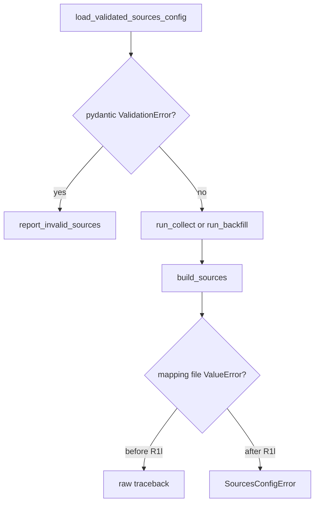
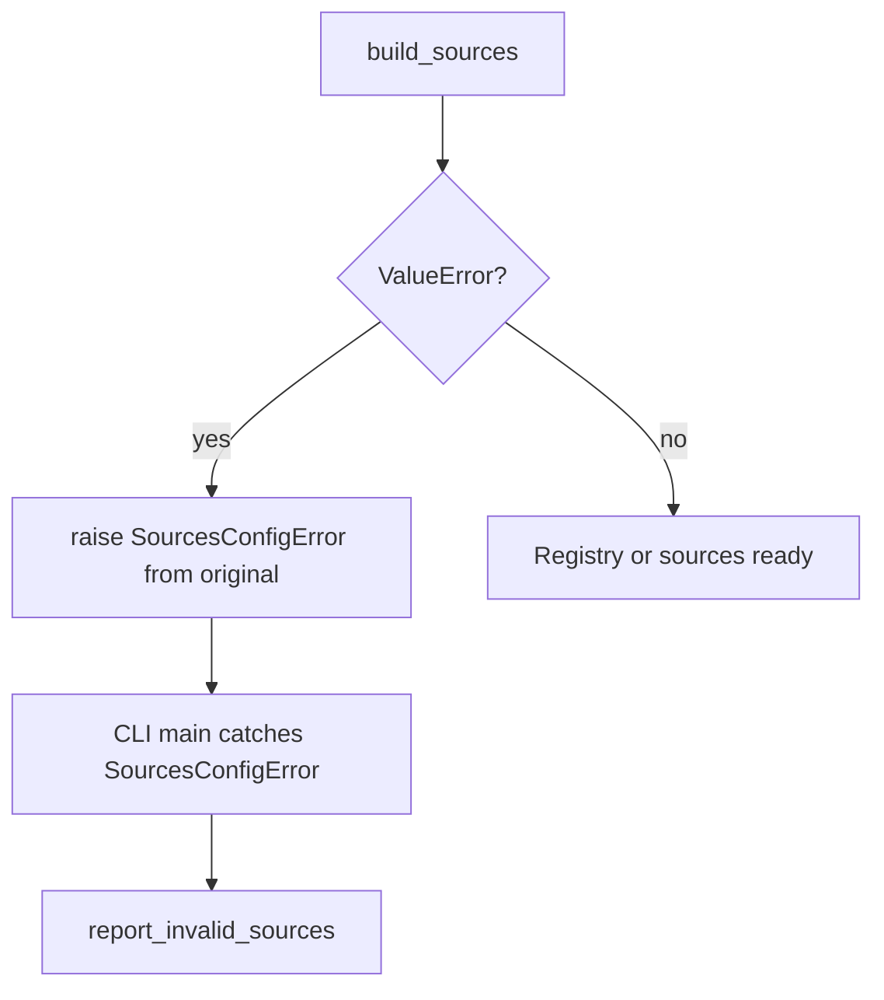

# R1l-SEC-CIK-CLI-ERRORS SEC ticker CIK map CLI error Tech Spec

## 한눈에 보기

SEC ticker CIK mapping file 오류는 설정 문제입니다. 이번 변경은 `collect`, `run`, `backfill` CLI가 이 오류를 traceback이 아니라 `[mimir] invalid sources.yaml:` 메시지로 보여주게 합니다.

## 요약

R1j/R1k는 loader가 만드는 오류 메시지를 정리했습니다. 하지만 loader는 `build_sources()` 안에서 실행됩니다. 기존 CLI는 `load_validated_sources_config()`의 pydantic 오류만 잡았기 때문에, source build 단계의 `ValueError`는 raw traceback으로 보일 수 있었습니다.

| 결정 | 이유 | 결과 |
| ---- | ---- | ---- |
| `SourcesConfigError` 추가 | build-time config 오류와 downstream 오류를 구분하기 위해 | CLI가 좁은 타입만 friendly 출력한다 |
| build 단계 `ValueError`만 감싸기 | fetch/analysis 런타임 오류를 설정 오류로 오분류하지 않기 위해 | 기존 downstream 오류 전파 정책 유지 |
| `report_invalid_sources()` 재사용 | 사용자에게 이미 익숙한 CLI 오류 형식을 유지하기 위해 | `[mimir] invalid sources.yaml:` prefix 유지 |

## 목표

- `collect` CLI가 SEC mapping file build 오류를 friendly message로 보고한다.
- `run` CLI가 collect 단계의 SEC mapping file build 오류를 friendly message로 보고한다.
- `backfill` CLI가 source registry build 오류를 friendly message로 보고한다.
- Downstream `ValidationError`나 fetch/runtime 오류를 설정 오류로 오분류하지 않는다.

## 목표가 아닌 것

| 항목 | 제외 이유 |
| ---- | --------- |
| 모든 runtime `ValueError`를 CLI에서 잡기 | 실제 버그를 설정 오류로 숨길 수 있습니다. |
| `analyze`/`deliver`/`dashboard` 변경 | 이 CLI들은 SEC mapping file을 읽는 source build 경로를 타지 않습니다. |
| loader 오류 메시지 재설계 | R1j/R1k가 이미 파일 path와 entry key를 정리했습니다. |
| SEC mapping file 자동 복구 | 잘못된 mapping을 추측하면 잘못된 feed를 만들 수 있습니다. |

## 현재 문제와 제약

CLI는 두 단계로 설정을 다룹니다.

R1l은 `E -> F` 경계만 바꿉니다. Fetch 이후 생기는 오류는 여전히 orchestrator나 caller의 기존 정책을 따릅니다.

## 설계

### SourcesConfigError

`mimir.config.SourcesConfigError`는 valid-looking `sources.yaml`이 source construction 단계에서 실패했음을 나타냅니다.

### CLI 적용 범위

| CLI | 적용 위치 |
| ---- | ---- |
| `collect` | `run_collect()`가 source registry를 만들 때 감싸고, `main()`이 `SourcesConfigError`를 보고한다 |
| `run` | `run_pipeline()` 내부 `run_collect()`에서 올라온 `SourcesConfigError`를 `main()`이 보고한다 |
| `backfill` | `run_backfill()`이 source registry를 만들 때 감싸고, `main()`이 `SourcesConfigError`를 보고한다 |

### 오분류 방지

`main()`은 `SourcesConfigError`만 catch합니다. 기존 `run` 테스트는 downstream `ValidationError`가 `[mimir] invalid sources.yaml:`로 바뀌지 않고 그대로 전파되는지 계속 확인합니다.

## 실패 / 예외 처리

| 실패 | 처리 |
| ---- | ---- |
| `load_validated_sources_config()` pydantic 오류 | 기존처럼 `report_invalid_sources()` |
| `build_sources()` 중 SEC mapping file `ValueError` | `SourcesConfigError`로 감싼 뒤 `report_invalid_sources()` |
| fetch 중 source failure | 기존 manifest/orchestrator 정책 |
| downstream model `ValidationError` | 기존처럼 전파 |

## 운영 영향

| 항목 | 영향 |
| ---- | ---- |
| 정상 config | 변경 없음 |
| 잘못된 SEC mapping file | CLI가 exit code 1과 friendly message를 출력 |
| 로그/manifest | source build 전에 실패하므로 manifest는 생성하지 않음 |
| 네트워크 요청 | 추가 없음 |

## 보안 / 권한 영향

새 권한이나 secret은 없습니다. 오류 메시지는 loader가 이미 만들던 path-aware 메시지를 CLI로 전달합니다. 운영자는 mapping file을 secret 경로가 아닌 config directory 같은 운영 파일 위치에 둬야 합니다.

## 테스트 전략

| 테스트 | 고정하는 계약 |
| ------ | ------------- |
| `test_collect_cli_reports_sec_ticker_map_build_error` | collect CLI friendly source build 오류 |
| `test_collect_cli_reports_missing_sec_ticker_mapping` | collect CLI missing ticker mapping 오류 |
| `test_main_reports_sec_ticker_map_build_error` in `tests/test_run.py` | run CLI friendly source build 오류 |
| `test_main_reports_missing_sec_ticker_mapping` in `tests/test_run.py` | run CLI missing ticker mapping 오류 |
| `test_main_reports_sec_ticker_map_build_error` in `tests/test_backfill.py` | backfill CLI friendly source build 오류 |
| `test_main_reports_missing_sec_ticker_mapping` in `tests/test_backfill.py` | backfill CLI missing ticker mapping 오류 |
| `test_main_does_not_mask_downstream_validation_error` | downstream 오류 오분류 방지 |
| `test_main_does_not_mask_non_config_value_error` | 일반 runtime `ValueError` 오분류 방지 |
| `test_readme_test_badges_match_collected_pytest_count` | README 테스트 수치 drift 방지 |
| `test_improvement_catalog_summary_mentions_latest_completed_ids` | R1l completion tracking |

## 검증 결과

| 명령 | 결과 |
| ---- | ---- |
| `uv run pytest tests/test_collect.py::test_collect_cli_reports_sec_ticker_map_build_error tests/test_collect.py::test_collect_cli_reports_missing_sec_ticker_mapping tests/test_run.py::test_main_reports_sec_ticker_map_build_error tests/test_run.py::test_main_reports_missing_sec_ticker_mapping tests/test_run.py::test_main_does_not_mask_downstream_validation_error tests/test_run.py::test_main_does_not_mask_non_config_value_error tests/test_backfill.py::test_main_reports_sec_ticker_map_build_error tests/test_backfill.py::test_main_reports_missing_sec_ticker_mapping tests/test_readme_docs.py -q` | 10 passed |
| `uv run ruff check .` | pass |
| `uv run mypy mimir` | pass, 82 files |
| `uv run pytest -q` | 535 passed |
| `uv run coverage run -m pytest` | 535 passed |
| `uv run coverage report --fail-under=80` | TOTAL 98% |
| `git diff --check` | pass |

---
**버전:** v1.0
**작성일:** 2026-06-18
**상태:** 구현 완료
**관련 문서:** `docs/_internal/skill-outputs/jira-ticket/R1l-SEC-CIK-CLI-ERRORS-sec-ticker-cik-cli-errors.md`
