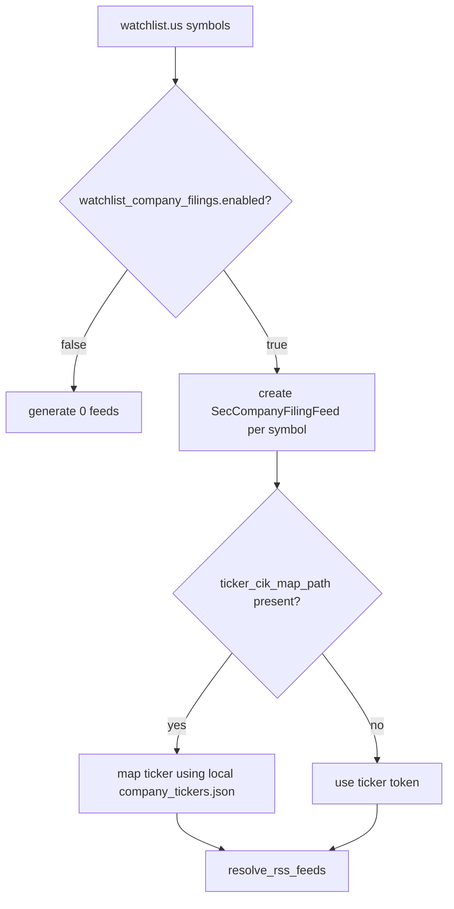

# R1o-SEC-WATCHLIST-FILING-FEEDS SEC watchlist filing feeds Tech Spec

**상태**: Draft
**작성일**: 2026-06-28
**범위**: SEC 공식 Company Search RSS만 대상으로, watchlist의 US symbols에서 company filing feeds를 opt-in으로 생성하는 다음 증분을 정의한다.

## 한눈에 보기

Generic provider RSS discovery는 여전히 보류한다. SEC 외 provider discovery,
HTML RSS link crawling, vendor URL pattern inference는 provider 정책과 ToS
검토 없이는 Mimir의 무료·합법·공식 소스 우선 원칙을 깨뜨릴 수 있다.

다만 SEC official-source 범위에는 하나의 좁은 후속이 남아 있다.
이미 구현된 `sources.rss.sec.company_filings`, `ticker_cik_map_path`, 그리고
off-by-default `ticker_cik_map_refresh`를 재사용해, 사용자가 원할 때만
watchlist `us` symbols에서 SEC company filing feeds를 만든다.

제안 설정은 `sources.rss.sec.watchlist_company_filings`다. default false라서
기존 설정은 새 feed를 만들지 않는다.

## 근거

SEC RSS Feeds 문서는 EDGAR Company Search 결과를 RSS로 구독할 수 있고, Filing
Type으로 필터링할 수 있다고 설명한다. SEC Developer Resources와 Webmaster FAQ는
자동화 접근에서 필요한 것만 다운로드하고, request rate를 제한하며, request
header에 선언된 User-Agent를 넣으라고 설명한다. SEC Webmaster FAQ는
`company_tickers.json`을 제공하지만 accuracy와 scope를 보장하지 않는다고도
설명한다.

따라서 이 spec은 SEC-only, opt-in, bounded request count, declared
`MIMIR_SEC_USER_AGENT`를 기본 제약으로 둔다.

## 목표

- `sources.rss.sec.watchlist_company_filings` draft setting을 정의한다.
- 기본값은 default false다.
- watchlist의 `us` symbols만 입력으로 쓴다.
- 생성되는 feed는 기존 `SecCompanyFilingFeed`와 `resolve_rss_feeds()` 흐름을
  재사용한다.
- `ticker_cik_map_path`가 있으면 기존 `company_tickers.json` local lookup을
  사용한다.
- `ticker_cik_map_refresh.enabled: true`일 때만 기존 refresh prep step을
  사용한다.
- generated feeds는 explicit SEC RSS requests로 계산 가능해야 한다.
- SEC fetch 환경은 `MIMIR_SEC_USER_AGENT`를 요구한다.

## 목표가 아닌 것

| 항목 | 제외 이유 |
|---|---|
| SEC 외 provider discovery | provider별 정책과 ToS 검토가 필요하다 |
| HTML RSS link crawling | crawler가 provider 페이지 구조와 정책에 묶인다 |
| vendor URL pattern inference | 안정성과 허가 범위를 추측하게 된다 |
| CIK ambiguity 자동 해소 | `company_tickers.json` accuracy/scope가 보장되지 않는다 |
| default-on watchlist feed generation | 기존 사용자의 RSS 요청 수와 data shape를 바꾼다 |
| SEC full-text search query expansion | request surface가 커지고 제품 정책이 필요하다 |

Boundary phrases for guards: no HTML RSS link crawling, no vendor URL pattern inference.

## 설정 초안

```yaml
sources:
  rss:
    sec:
      ticker_cik_map_path: "cache/company_tickers.json"
      ticker_cik_map_refresh:
        enabled: false
      watchlist_company_filings:
        enabled: true
        forms: ["10-K", "10-Q", "8-K"]
        count: 40
        owner: "exclude"
```

| 필드 | 기본값 | 의미 |
|---|---|---|
| `enabled` | `false` | 켜진 경우에만 watchlist `us` symbols에서 SEC filing feeds를 만든다 |
| `forms` | `["10-K", "10-Q", "8-K"]` | 각 symbol에 대해 만들 SEC filing form feeds |
| `count` | `40` | 기존 `SecCompanyFilingFeed.count` 범위(10~100)를 재사용 |
| `owner` | `"exclude"` | 기존 SEC owner filter를 재사용 |

`sources.rss.sec.watchlist_company_filings`를 생략하거나 `enabled: false`로 두면
generated SEC filing feed는 0개다.

## Resolver 설계 초안



이 흐름은 새 RSS crawler가 아니다. 기존 SEC company filing feed URL builder를
반복 호출하는 thin layer다.

## 실패 / 예외 처리

| 실패 | 처리 |
|---|---|
| `watchlist.yaml`에 `us` symbols가 없음 | generated feeds 0개 |
| local `company_tickers.json`에 symbol이 없음 | 기존 missing ticker error를 그대로 노출 |
| duplicate generated/manual feed | 기존 `duplicate RSS feed` 오류 |
| invalid form/count/owner | 기존 `SecCompanyFilingFeed` validation 재사용 |
| missing `MIMIR_SEC_USER_AGENT` quality | 기존 SEC User-Agent warning/policy를 유지 |

## 테스트 전략

| 테스트 | 고정하는 계약 |
|---|---|
| config parsing | `watchlist_company_filings.enabled` default false |
| builder disabled path | generated feeds 0개 |
| builder enabled path | watchlist `us` symbols가 `SecCompanyFilingFeed(ticker=symbol, symbol=symbol)`로 변환 |
| local CIK map path | `company_tickers.json` mapping이 기존 resolver에서 적용 |
| duplicate detection | generated/manual duplicate이 실패 |
| docs guard | generic provider discovery는 계속 deferred, R1o는 Draft spec |

## 추적 출처

- SEC RSS Feeds: `https://www.sec.gov/about/rss-feeds` (Last Reviewed or Updated: June 24, 2026)
- SEC Developer Resources: `https://www.sec.gov/about/developer-resources` (Last Reviewed or Updated: March 10, 2025)
- SEC Webmaster FAQ: `https://www.sec.gov/about/webmaster-frequently-asked-questions` (Last Reviewed or Updated: Aug. 23, 2024)
- SEC `company_tickers.json`: `https://www.sec.gov/files/company_tickers.json`

