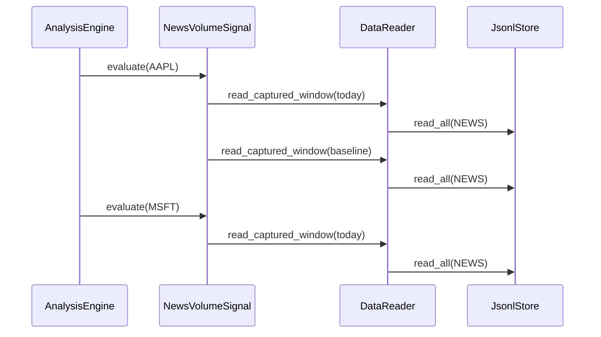
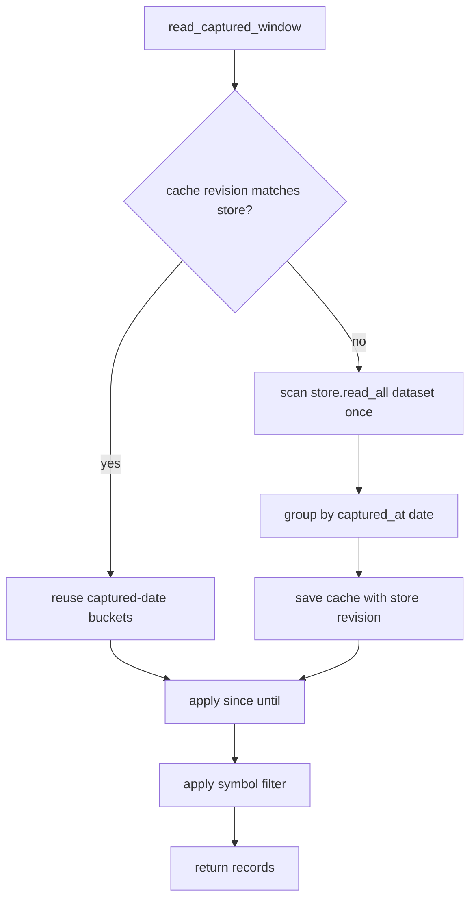

# C2a captured news window cache Tech Spec

## 한눈에 보기

뉴스 분석은 `captured_at`(Mimir가 뉴스를 실제로 수집한 시각) 기준으로 today와 baseline을 읽습니다. 이전 구현은 같은 분석 실행에서도 NEWS 전체를 여러 번 다시 읽었습니다. 이번 변경은 `DataReader` 안에 captured-date 인메모리 cache를 두어 같은 실행의 반복 scan을 한 번으로 줄입니다.

## 요약

R1b는 뉴스 날짜 의미를 바로잡았습니다. `ts`는 기사 발행일로 남기고, `captured_at`은 Mimir가 기사를 관측한 실행일로 사용합니다. 그래서 어제 발행됐지만 오늘 처음 수집된 뉴스는 오늘 분석에 들어갑니다.

그 정확성 때문에 `read_window()`의 파티션 프루닝을 그대로 쓸 수 없습니다. NEWS 파일은 `ts.date()` 기준으로 저장됩니다. `captured_at` 기준으로 파티션을 자르면 늦게 수집된 오래된 기사를 읽기 전에 놓칩니다.

이번 변경은 저장 구조를 바꾸지 않습니다. 대신 `DataReader.read_captured_window()`가 첫 호출에서 NEWS를 한 번 읽고, `captured_at.date()`별 메모리 index를 만듭니다. 같은 `DataReader`의 다음 호출은 이 index를 재사용합니다.

| 결정 | 이유 | 결과 |
| ---- | ---- | ---- |
| 인메모리 cache 선택 | 저장 형식과 migration을 만들지 않고 반복 scan만 줄이기 위해 | 한 분석 실행 안에서 NEWS 전체 scan이 1회로 줄어듦 |
| `JsonlStore.revision`으로 무효화 | 같은 store에 append가 생기면 오래된 cache를 쓰면 안 됨 | 저장 내용이 바뀐 뒤 다음 read에서 index를 다시 만듦 |
| persistent index 보류 | on-disk schema, rebuild, stale-index 정책이 아직 필요하지 않음 | C2 broad partition index는 별도 부채로 유지 |

## 목표

- `DataReader.read_captured_window()`가 같은 dataset에 대해 반복 호출될 때 NEWS 전체 scan을 재사용한다.
- `captured_at.date()` 기준 inclusive bounds를 유지한다.
- `symbol` 필터를 유지한다.
- 늦게 수집된 오래된 발행 기사를 계속 포함한다.
- `JsonlStore.append()`와 `replace_partition()`이 실제 저장 변경을 만들 때 cache를 무효화할 수 있게 한다.

## 목표가 아닌 것

| 항목 | 제외 이유 |
| ---- | --------- |
| on-disk captured-date index | rebuild command와 stale-index fallback이 필요하므로 별도 설계가 맞다 |
| NEWS 파티션 기준 변경 | 기존 git-as-DB 레이아웃과 idempotency를 건드리면 migration 범위가 된다 |
| provider RSS discovery | provider 정책과 ToS 검토가 필요한 별도 문제다 |
| LLM 기본 활성화 | 무료 기본 경로와 off-by-default 정책을 유지해야 한다 |

## 현재 문제와 제약

`NewsVolumeSignal`은 한 symbol마다 today window와 baseline window를 읽습니다. 기본 watchlist가 커지면 `read_captured_window()` 호출 수가 symbol 수에 비례합니다. LLM 감성 시그널을 켜면 오늘 뉴스 선택을 위해 같은 captured window를 한 번 더 읽습니다.

변경 전 흐름은 아래와 같습니다.



이 구조는 정확하지만 반복 비용이 큽니다. 특히 `captured_at` 기준 읽기는 일반 `read_window()`처럼 날짜 파티션으로 바로 줄일 수 없습니다.

## 설계

### `JsonlStore.revision`

`JsonlStore`는 private integer revision을 가집니다.

| 변경 지점 | revision 변경 여부 |
| --------- | ------------------ |
| `append()`가 새 record를 쓴 경우 | 증가 |
| `append(overwrite=True)`가 payload 변경을 쓴 경우 | 증가 |
| `append()`가 dedup으로 아무것도 쓰지 않은 경우 | 유지 |
| `replace_partition()`이 파일을 새 내용으로 쓴 경우 | 증가 |
| `replace_partition()`이 기존 파일을 삭제한 경우 | 증가 |
| `replace_partition()`이 같은 내용을 다시 받은 경우 | 유지 |

`DataReader`는 이 revision을 읽어 cache가 현재 store 상태와 맞는지 판단합니다.

### `DataReader` captured-date index

`DataReader`는 dataset별로 아래 형태의 cache를 가집니다.

```python
dict[Dataset, tuple[int, dict[date, tuple[Record, ...]]]]
```

첫 번째 값은 `JsonlStore.revision`입니다. 두 번째 값은 `captured_at.date()`를 key로 하는 record bucket입니다.

읽기 흐름은 아래와 같습니다.



이 index는 `DataReader` 객체 안에서만 살아 있습니다. CLI 실행이나 pipeline 실행이 끝나면 사라집니다.

## 실패 / 예외 처리

| 상황 | 처리 |
| ---- | ---- |
| 같은 분석 실행에서 today와 baseline을 연속 조회 | 첫 조회만 `read_all()`을 호출하고 다음 조회는 cache 재사용 |
| 같은 store에 새 NEWS record append | `JsonlStore.revision` 증가 후 다음 조회에서 index 재생성 |
| 빈 NEWS dataset | 빈 index를 cache하고 빈 list 반환 |
| 오래된 발행일이지만 오늘 수집된 뉴스 | `captured_at.date()` bucket에 들어가므로 오늘 window에 포함 |
| LLM sentiment 비활성 상태 | cache는 호출되지 않거나 `news_volume`에서만 사용됨 |

## 운영 영향

| 항목 | 영향 |
| ---- | ---- |
| 저장 형식 | 변경 없음 |
| migration | 없음 |
| 분석 결과 | 의미 변경 없음 |
| 성능 | 같은 `DataReader` 안의 captured-window 반복 scan 감소 |
| 메모리 | NEWS record bucket을 `DataReader` 생명주기 동안 보관 |
| 롤백 | 구현 커밋 revert로 충분 |

## 보안 / 권한 영향

네트워크 호출, secret 처리, provider 정책은 바뀌지 않습니다. Cache는 이미 로컬 저장소에 있는 `Record` 객체만 보관합니다. LLM 감성 시그널은 계속 명시 설정과 API key가 있을 때만 켜집니다.

## 테스트 전략

| 테스트 | 고정하는 계약 |
| ------ | ------------- |
| `test_read_captured_window_reuses_one_dataset_scan_for_multiple_windows` | today, baseline, symbol-specific read가 같은 dataset scan을 재사용 |
| `test_read_captured_window_cache_invalidates_after_store_append` | store append 뒤 cache가 새 record를 놓치지 않음 |
| `test_read_captured_window_cache_invalidates_after_replace_partition` | regenerated partition 교체 뒤 cache가 새 partition 내용을 다시 읽음 |
| 기존 captured-window reader tests | `captured_at` bounds와 symbol filter 유지 |
| 기존 news volume / LLM sentiment tests | 늦게 수집된 뉴스가 분석 입력에 남음 |

## 검증 결과

| 명령 | 결과 |
| ---- | ---- |
| `uv run pytest tests/analysis/test_reader.py::test_read_captured_window_reuses_one_dataset_scan_for_multiple_windows -q` | RED: 구현 전 `read_all_calls == 3`으로 실패 |
| `uv run pytest tests/analysis/test_reader.py -q` | GREEN: 8 passed |
| `uv run pytest tests/storage/test_jsonl_store.py -q` | 12 passed |
| `uv run pytest -q` | 541 passed |
| Task review | spec compliant, no critical/important/minor findings |

## 남은 한계

Persistent captured-date index는 아직 없습니다. 현재 cache는 한 `DataReader` 생명주기 안에서만 반복 scan을 줄입니다. 데이터가 수년치로 커지고, 첫 cache build가 병목이라는 측정이 나오면 다음 설계에서 아래를 다룹니다.

1. index file schema
2. rebuild command
3. stale-index detection
4. rollback and fallback scan policy

---

**버전:** v1.0
**작성일:** 2026-06-18
**상태:** 구현 완료
**관련 문서:** `docs/_internal/skill-outputs/jira-ticket/C2a-captured-news-window-cache.md`
