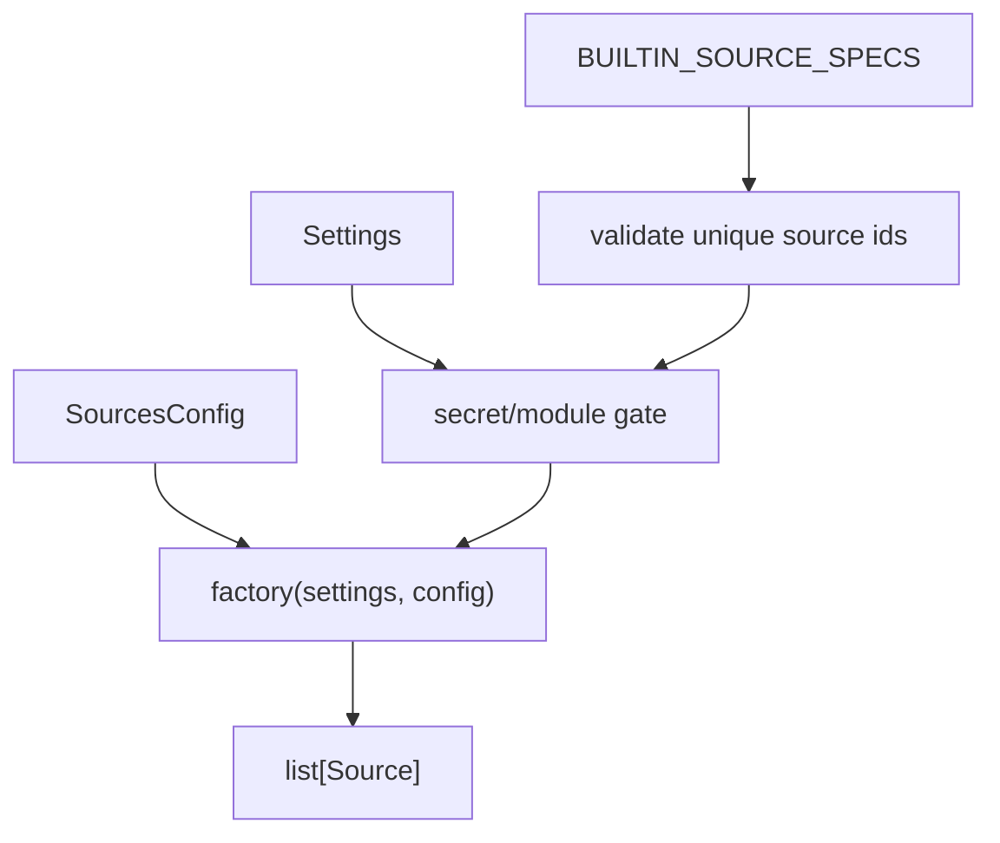

# A3. Declarative Source Registration — 설계

> **스펙 ID**: A3
> **작성일**: 2026-06-16
> **상태**: ✅ 구현 완료 (`SourceSpec` built-in source table). 현재 364 테스트 · ruff · mypy · coverage gate 클린.
> **선행**: [설정 기반 소스 확장성](2026-06-13-config-driven-extensibility-design.md) · [A2 macro series registry](2026-06-16-macro-series-registry-design.md) · [확장성 카탈로그](../../architecture/improvement-catalog.md)

---

## 1. 한눈에 보기

새 데이터 소스를 추가할 때 `mimir/core/builder.py`의 if 분기를 직접 늘려야 한다. 이 파일은 설정, secret gate, optional package gate, 생성자 인자를 한 함수 안에서 모두 처리한다.

A3는 이 분기를 내장 소스 등록 테이블로 옮긴다. `build_sources(settings, config)`라는 공개 진입점은 그대로 두고, 각 소스의 생성 조건과 생성 인자를 `SourceSpec` 데이터로 선언한다.

이번 증분은 Python package entry-point를 구현하지 않는다. entry-point는 외부 플러그인을 받을 때 필요하지만, 지금은 기존 내장 소스 7개를 안전하게 데이터화하는 것이 더 작은 변경이다.

---

## 2. 문제

### 2.1 소스 추가 절차가 중앙 분기에 묶여 있다

현재 `build_sources()`는 아래 책임을 한 함수에 모아 둔다.

| 책임 | 현재 위치 | 문제 |
|---|---|---|
| 항상 생성할 소스 | `SecEdgarSource`, `RssSource` 직접 append | 새 keyless 소스가 생기면 함수 본문 수정 |
| secret gate | `settings.fred_api_key` 같은 if 분기 | gate와 생성자 인자가 흩어짐 |
| optional package gate | `importlib.util.find_spec("pykrx")` | keyless와 optional package를 구분하기 어렵다 |
| 생성자 kwargs | `user_agent`, `series`, `feeds` 직접 전달 | 설정 배선이 분기 코드 안에 묻힘 |
| skip warning | 각 분기의 `logger.warning(...)` | 소스가 늘수록 반복 증가 |

이 구조는 README의 "소스 추가는 작고 명확해야 한다"는 약속과 맞지 않는다.

### 2.2 기존 `Registry`와 역할이 다르다

`mimir/core/registry.py`의 `Registry`는 이미 생성된 소스를 cadence, GRAY 정책, disabled id로 필터링한다. A3가 다루는 것은 "무슨 소스를 만들 것인가"다.

두 책임을 섞으면 doctor나 backfill의 의미가 흐려진다. 따라서 A3의 등록 테이블은 construction registry이고, 기존 `Registry`는 runtime selection registry로 유지한다.

### 2.3 doctor expected coverage는 절대 파생하면 안 된다

doctor는 secret이 없거나 optional package가 없어도 "원래 기대되는 데이터셋이 비었는가"를 말해야 한다. 그래서 `EXPECTED_DATASETS`는 `build_sources()`나 등록 테이블에서 파생하면 안 된다.

이 불변식은 A3에서도 그대로 유지한다.

---

## 3. 목표와 비목표

### 목표

- 내장 소스 생성 조건을 `SourceSpec` 테이블로 선언한다.
- `build_sources(settings, config=None)`의 시그니처와 반환 순서를 유지한다.
- keyless, secret-gated, optional-package-gated 소스를 서로 다른 gate로 표현한다.
- FRED/ECOS/RSS 설정 인자가 기존처럼 생성자에 전달된다.
- missing secret, missing optional package, SEC User-Agent warning 로그를 유지한다.
- 중복 source id는 즉시 실패시킨다.

### 비목표

- Python package entry-point 기반 외부 플러그인 로딩은 하지 않는다.
- `mimir/core/registry.py`의 runtime filtering 책임을 바꾸지 않는다.
- doctor expected coverage를 등록 테이블에서 파생하지 않는다.
- pykrx timeout/retry 개선은 하지 않는다.
- source class의 `SourceMeta` 또는 idempotency key 형식을 바꾸지 않는다.

---

## 4. 설계

### 4.1 `SourceSpec`

`mimir/core/builder.py`에 작은 frozen dataclass를 둔다. 별도 파일을 만들 수도 있지만, 이번 slice에서는 composition root 근처에 두는 편이 읽기 쉽다.

```python
@dataclass(frozen=True)
class SourceSpec:
    id: str
    factory: Callable[[Settings, SourcesConfig], Source]
    required_secret_attr: str | None = None
    required_secret_name: str | None = None
    required_module: str | None = None
    missing_module_hint: str | None = None
```

각 spec은 "이 소스를 만들 수 있는지"와 "어떻게 만들지"를 함께 가진다.

| 필드 | 의미 |
|---|---|
| `id` | operator log와 중복 검증에 쓰는 source id |
| `factory` | `Settings`와 `SourcesConfig`를 받아 실제 `Source`를 만든다 |
| `required_secret_attr` | `Settings`의 snake_case secret 속성. 없으면 secret gate 없음 |
| `required_secret_name` | 로그에 표시할 환경변수 이름 |
| `required_module` | optional dependency module. 없으면 package gate 없음 |
| `missing_module_hint` | optional package가 없을 때 보여줄 설치 힌트 |

### 4.2 내장 소스 테이블

등록 테이블은 기존 반환 순서를 유지한다.

```python
BUILTIN_SOURCE_SPECS = (
    SourceSpec("sec_edgar", lambda settings, cfg: SecEdgarSource(user_agent=settings.sec_user_agent)),
    SourceSpec("rss", lambda settings, cfg: RssSource(feeds=cfg.rss_feeds)),
    SourceSpec("stooq", lambda settings, cfg: StooqSource(api_key=settings.stooq_api_key), ...),
    SourceSpec("dart", lambda settings, cfg: DartSource(api_key=settings.dart_api_key), ...),
    SourceSpec("fred", lambda settings, cfg: FredSource(api_key=settings.fred_api_key, series=cfg.fred_series), ...),
    SourceSpec("ecos", lambda settings, cfg: EcosSource(api_key=settings.ecos_api_key, series=cfg.ecos_series), ...),
    SourceSpec("pykrx", lambda settings, cfg: PykrxSource(), required_module="pykrx", ...),
)
```

`pykrx`는 source module import와 optional package import가 다르다. `mimir.sources.pykrx_source`를 import해도 `pykrx` package는 import되지 않는다. 실제 optional package 존재 여부만 `find_spec("pykrx")`로 확인한다.

### 4.3 build flow



`build_sources()`는 아래 순서로 동작한다.

1. SEC User-Agent에 `@`가 없으면 기존 warning을 남긴다.
2. `SourcesConfig()` 기본값을 만든다.
3. 등록 테이블의 source id 중복을 검증한다.
4. 각 spec에 대해 secret gate를 확인한다.
5. optional package gate를 확인한다.
6. gate를 통과한 spec만 factory로 생성한다.
7. 생성된 source의 `source.meta.id`가 `SourceSpec.id`와 같은지 확인한다.

### 4.4 duplicate id guard

중복 source id는 backfill에서 `{s.meta.id: s}` 딕셔너리로 덮어써질 수 있다. 따라서 build 단계에서 바로 `ValueError`로 실패시킨다.

테스트는 내부 helper를 직접 호출해 같은 id 두 개가 실패하는지 확인한다. 사용자 설정 오류가 아니라 개발자 등록 오류이므로 `pydantic.ValidationError`가 아니라 `ValueError`가 맞다.

---

## 5. 실패와 예외 처리

| 상황 | 처리 |
|---|---|
| secret이 없음 | 기존처럼 source를 만들지 않고 warning 로그 |
| optional package 없음 | 기존처럼 source를 만들지 않고 설치 힌트 warning 로그 |
| SEC User-Agent에 이메일 없음 | source는 만들되 기존 warning 로그 |
| duplicate source id | `ValueError` |
| `SourceSpec.id`와 실제 `source.meta.id` 불일치 | `ValueError` |
| FRED/ECOS/RSS 설정 누락 | 기존 기본값 유지 |
| doctor 실행 | A3 등록 테이블을 보지 않고 `EXPECTED_DATASETS` 사용 |

---

## 6. 테스트 전략

### 6.1 TDD RED

`tests/core/test_builder.py`에 먼저 실패 테스트를 추가한다.

- `BUILTIN_SOURCE_SPECS`의 id 순서가 기존 builder 반환 순서와 같아야 한다.
- duplicate source id는 실패해야 한다.
- `pykrx` package가 없으면 `pykrx` source는 생성되지 않고 warning이 남아야 한다.
- `pykrx` package가 있다고 probe되면 `pykrx` source가 생성되어야 한다.
- SEC User-Agent warning은 유지되어야 한다.
- `SourceSpec.id`와 실제 `source.meta.id`가 다르면 실패해야 한다.

### 6.2 GREEN

`builder.py`를 `SourceSpec` 테이블 기반으로 바꾼다. 기존 테스트가 이미 secret gate, default config, FRED/RSS config 전달을 고정하고 있으므로 모두 유지한다.

### 6.3 회귀 범위

아래 focused suite를 반드시 돌린다.

```bash
.venv/bin/pytest tests/core/test_builder.py tests/core/test_registry.py tests/doctor/test_engine_matrix.py tests/sources/test_pykrx_source.py tests/test_collect.py tests/test_backfill.py
```

마지막에는 전체 품질 게이트를 돌린다.

```bash
.venv/bin/ruff check .
.venv/bin/mypy mimir
.venv/bin/coverage run -m pytest
.venv/bin/coverage report --fail-under=80
```

---

## 7. 문서 영향

필수 업데이트:

- `docs/architecture/improvement-catalog.md`: A3를 구현 완료로 이동한다.
- `docs/architecture/extensibility/README.md`: 새 소스 추가 절차를 `SourceSpec` 등록 중심으로 바꾼다.
- `README.md`, `README.ko.md`, `README.zh.md`: "builder 분기 수정" 표현을 "source spec 등록"으로 바꾼다.
- `docs/superpowers/specs/2026-06-13-config-driven-extensibility-design.md`: §8을 새 A3 스펙 링크로 바꾼다.
- `docs/superpowers/specs/2026-06-16-macro-series-registry-design.md`: A3 비목표 문구를 historical context로 바꾼다.

불필요한 업데이트:

- `docs/reference/config/sources.md`: 이번 작업은 새 YAML 키를 만들지 않는다.
- `.env.example`: secret 이름을 바꾸지 않는다.
- data migration 문서: 온디스크 JSONL 계약을 바꾸지 않는다.

---

## 8. 수용 기준

- [x] `build_sources()`가 `SourceSpec` 테이블을 순회해 소스를 만든다.
- [x] 반환 순서와 가용성은 기존과 같다.
- [x] missing secret warning과 missing pykrx package warning이 유지된다.
- [x] `pykrx` package probe를 monkeypatch하면 `pykrx` source 포함/제외가 테스트된다.
- [x] duplicate source id가 `ValueError`로 실패한다.
- [x] `SourceSpec.id`와 실제 `source.meta.id` 불일치가 `ValueError`로 실패한다.
- [x] FRED/ECOS/RSS 설정 인자가 기존처럼 생성자에 전달된다.
- [x] doctor expected coverage는 A3 테이블에서 파생하지 않는다.
- [x] README ×3, architecture guide, improvement catalog, 관련 specs가 현재 구현 기준으로 갱신된다.
- [x] focused suite, ruff, mypy, 전체 coverage가 통과한다.
