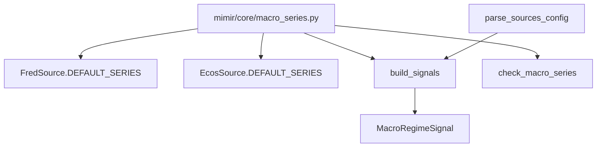

# A2. Macro Economic Series Metadata Registry — 설계

> **스펙 ID**: A2
> **작성일**: 2026-06-16
> **상태**: ✅ 구현 완료 (`mimir/core/macro_series.py` + `analysis.macro_regime.rate_series`). 최신 검증은 README 테스트 배지와 docs health guard가 추적한다.
> **선행**: [설정 기반 소스 확장성](2026-06-13-config-driven-extensibility-design.md) · [데이터 닥터](2026-06-13-data-doctor-design.md) · [확장성 카탈로그](../../architecture/improvement-catalog.md)

---

## 1. 한눈에 보기

거시 경제 시리즈는 세 곳에서 따로 관리되고 있다. FRED/ECOS 수집 기본값, `MacroRegimeSignal`의 rate-series 필터, doctor의 macro freshness cadence가 서로 다른 상수로 존재한다.

A2는 이 세 출처를 `mimir/core/macro_series.py`로 모은다. 수집은 기존 `sources:` 설정을 유지하고, 분석은 새 `analysis.macro_regime.rate_series` 설정으로 명시한다.

이 변경은 당시 A3 선언적 소스 등록을 구현하지 않았다. A2는 거시 시리즈 메타데이터만 단일 진실원으로 이동했고, `build_sources()` 정리는 후속 A3 증분으로 분리했다.

---

## 2. 문제

### 2.1 수집 기본값과 분석 필터가 분리되어 있다

`FredSource`는 `DGS10`, `FEDFUNDS`, `CPIAUCSL`를 기본 수집한다. `EcosSource`는 한국은행 기준금리(`722Y001.0101000`)를 기본 수집한다.

분석 시그널은 별도 상수 `RATE_SERIES`로 `DGS10`, `FEDFUNDS`, `722Y001.0101000`만 본다. 사용자가 `sources.fred.series`에 `T10Y2Y`를 추가해도, 이 시리즈가 거시 regime에 영향을 주려면 파이썬 코드를 다시 고쳐야 한다.

### 2.2 doctor도 별도 cadence 표를 가진다

Macro freshness는 시리즈별 cadence가 필요하다. `DGS10`은 daily이고 `FEDFUNDS`, `CPIAUCSL`, ECOS 기준금리는 monthly다.

현재 doctor는 `MACRO_SERIES_CADENCE`를 직접 들고 있다. 이 표는 수집 기본값과 분석 rate-series 목록을 다시 반복한다. 시리즈 하나를 추가할 때 수집, 분석, doctor를 각각 고치면 누락 가능성이 높아진다.

### 2.3 소스 cadence는 충분하지 않다

`FredSource.meta.cadence`는 daily다. 그러나 FRED 한 소스 안에는 daily 시리즈와 monthly 시리즈가 함께 있다. 따라서 doctor는 소스 단위 cadence를 macro freshness의 근거로 쓰면 안 된다.

---

## 3. 목표와 비목표

### 목표

- 기본 FRED 시리즈, 기본 ECOS 시리즈, macro doctor cadence를 한 모듈에서 파생한다.
- `MacroRegimeSignal`은 생성자 인자로 rate-series 목록을 받는다.
- `SourcesConfig`는 `analysis.macro_regime.rate_series`를 검증한다.
- 기존 `sources.fred.series`와 `sources.ecos.series` 설정 형식은 유지한다.
- 기존 저장 symbol과 idempotency key는 바꾸지 않는다.

### 비목표

- A3 선언적 소스 등록은 이 증분에서 하지 않는다. 2026-06-16 후속 A3에서 `SourceSpec` built-in table로 구현 완료됐다.
- `build_sources()`의 if 분기를 entry-point 구조로 바꾸지 않는다.
- 거시 시리즈별 의미론 전체를 모델링하지 않는다. v1은 rate-series 여부와 freshness cadence만 다룬다.
- 이미 저장된 JSONL을 마이그레이션하지 않는다.

---

## 4. 설계

### 4.1 단일 메타데이터 모듈

새 모듈 `mimir/core/macro_series.py`는 source layer를 import하지 않는다. core가 source model을 알면 순환 의존이 생길 수 있으므로, ECOS 기본값은 작은 frozen dataclass로 표현한다.

```python
@dataclass(frozen=True)
class EcosSeriesSpec:
    stat_code: str
    cycle: str
    item_code: str


@dataclass(frozen=True)
class MacroSeriesMeta:
    symbol: str
    cadence: Cadence
    is_rate_series: bool = False
```

이 모듈은 네 가지 view를 제공한다.

| 함수 | 소비자 | 의미 |
|---|---|---|
| `default_fred_series()` | `FredSource.DEFAULT_SERIES` | 기본 FRED 수집 목록 |
| `default_ecos_series_specs()` | `EcosSource.DEFAULT_SERIES` | 기본 ECOS 수집 목록 |
| `default_macro_rate_series()` | `MacroRegimeSignal` 기본값 | macro regime에 영향을 줄 rate-series |
| `macro_series_cadences()` | doctor | 시리즈별 freshness cadence |

### 4.2 수집 설정은 그대로 둔다

기존 설정은 계속 동작한다.

```yaml
sources:
  fred:
    series: ["DGS10", "FEDFUNDS", "CPIAUCSL", "T10Y2Y"]
  ecos:
    series:
      - { stat_code: "722Y001", cycle: "M", item_code: "0101000" }
```

이 설정은 무엇을 수집할지만 정한다. 새 시리즈가 macro regime에 영향을 줄지 여부는 분석 설정에서 따로 명시한다.

### 4.3 분석 설정을 명시한다

분석 설정은 수집 설정과 분리한다.

```yaml
analysis:
  macro_regime:
    rate_series: ["DGS10", "FEDFUNDS", "722Y001.0101000"]
```

이 분리가 중요한 이유는 CPI 같은 macro series를 수집할 수는 있지만, CPI를 정책금리 변화와 같은 방식으로 해석하면 안 되기 때문이다. 수집 대상과 시그널 해석 대상은 같은 목록이 아니다.

### 4.4 빌더 배선

`parse_sources_config()`는 `analysis.macro_regime.rate_series`를 `SourcesConfig.macro_regime_rate_series`로 검증한다.

`build_signals(config, settings)`는 `MacroRegimeSignal(rate_series=cfg.macro_regime_rate_series)`를 만든다. 설정이 없으면 `default_macro_rate_series()`를 쓴다.

### 4.5 doctor 배선

doctor는 계속 explicit expected dataset 원칙을 지킨다. `EXPECTED_DATASETS`는 `build_sources()`에서 파생하지 않는다.

변경되는 부분은 macro series cadence 표뿐이다. `MACRO_SERIES_CADENCE`는 직접 dict literal을 갖지 않고 `macro_series_cadences()` 결과를 사용한다.

---

## 5. 데이터 흐름



이 흐름에서 수집 기본값과 분석 기본값은 같은 registry에서 나온다. 사용자가 분석 설정을 명시하면 `MacroRegimeSignal`만 그 설정을 사용한다.

---

## 6. 실패와 예외 처리

| 상황 | 처리 |
|---|---|
| `analysis.macro_regime.rate_series`가 문자열 하나임 | pydantic `ValidationError`로 실패 |
| `analysis.macro_regime.rate_seriez` 같은 오타 | `extra="forbid"`로 실패 |
| 설정이 없음 | 기존 기본 rate-series 사용 |
| 수집된 macro series가 doctor cadence 표에 없음 | 기존처럼 INFO를 내고 monthly fallback 적용 |
| rate-series에 해당하는 저장 데이터가 2개 미만 | `MacroRegimeSignal.evaluate()`가 `None` 반환 |

---

## 7. 테스트 전략

### 7.1 단일 진실원 회귀 테스트

`tests/core/test_macro_series.py`는 source defaults와 doctor cadence가 registry에서 파생되는지 확인한다.

### 7.2 설정 검증 테스트

`tests/sources/test_config.py`는 `analysis.macro_regime.rate_series`를 검증한다. 오타와 잘못된 타입은 조용히 무시하지 않고 실패해야 한다.

### 7.3 분석 시그널 테스트

`tests/analysis/signals/test_signals.py`는 기본 시그널이 임의의 새 rate series를 보지 않는다는 점과, 설정된 `MacroRegimeSignal(rate_series=[...])`은 그 시리즈를 사용한다는 점을 고정한다.

### 7.4 빌더 테스트

`tests/analysis/test_builder.py`는 `build_signals()`가 설정을 `MacroRegimeSignal` 생성자로 넘기는지 확인한다.

---

## 8. 수용 기준

- [x] `FredSource.DEFAULT_SERIES`와 `EcosSource.DEFAULT_SERIES`가 `mimir/core/macro_series.py`에서 파생된다.
- [x] doctor의 `MACRO_SERIES_CADENCE`가 registry에서 파생된다.
- [x] `MacroRegimeSignal`이 생성자 인자로 rate-series를 받는다.
- [x] `analysis.macro_regime.rate_series` 설정이 검증되고 빌더까지 전달된다.
- [x] 기존 수집 설정과 저장 key 형식은 바뀌지 않는다.
- [x] 최신 전체 검증 상태는 README 테스트 배지와 docs health guard가 추적한다.

---

## 9. A3와의 경계

A2는 macro series metadata만 다뤘다. 새 소스를 추가할 때 `mimir/core/builder.py`에 분기를 추가해야 하는 문제는 이 증분 밖으로 분리했다.

이 남은 문제는 A3에서 `BUILTIN_SOURCE_SPECS`와 `SourceSpec`으로 구현 완료됐다. Python entry-point 기반 외부 source plugin은 이후 A3b에서 `mimir.sources` entry point로 구현됐다.

현재 구현에서는 A2의 registry가 `DEFAULT_MACRO_RATE_SERIES`, `default_fred_series()`, `default_ecos_series_specs()`, `default_macro_rate_series()`, `macro_series_cadences()`를 제공한다. A3는 `BUILTIN_SOURCE_SPECS`와 `SourceSpec`으로 built-in source 생성을 정리했고, A3b는 `mimir.sources` entry point로 외부 source plugin을 붙였다. 따라서 이 문서는 A2의 registry 경계를 설명하고, source construction/plugin 확장은 후속 A3/A3b 문서가 담당한다.
