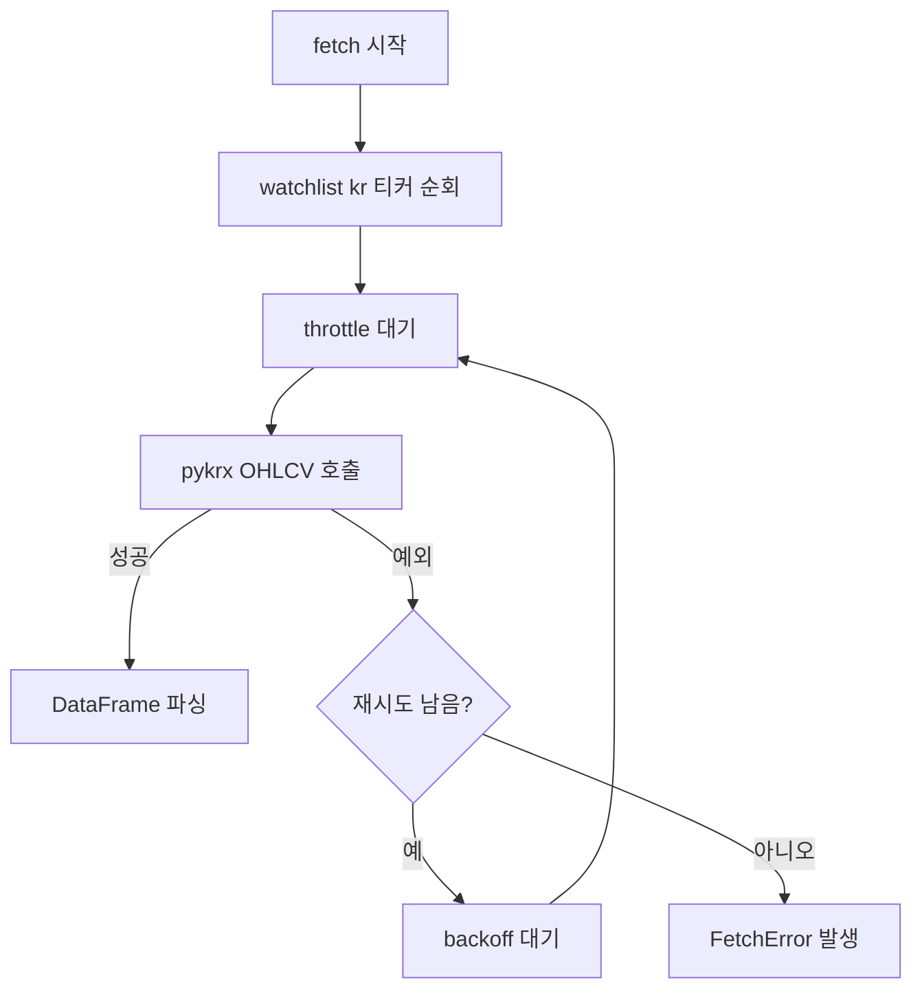

# C3. pykrx Retry Policy — 설계

> **스펙 ID**: C3
> **작성일**: 2026-06-16
> **상태**: ✅ 구현 완료 (`pykrx` retry/backoff + `FetchError` manifest surface). 368 테스트 · ruff · mypy · coverage gate 클린.
> **선행**: [Collector 설계](2026-05-31-collector-design.md) · [확장성 카탈로그](../../architecture/improvement-catalog.md)

---

## 1. 한눈에 보기

`pykrx`는 한국 주가를 가져오는 선택적 GRAY(공식 API가 아닌 스크래핑 계열) 소스다. 현재는 티커 하나의 네트워크 호출이 한 번 실패하면 바로 소스 전체가 실패한다.

C3는 `pykrx` 호출 경계에 짧은 재시도와 backoff(재시도 전 대기)를 추가한다. 그래도 실패하면 `FetchError`로 감싸서 manifest와 status 문서에 원인을 남긴다.

---

## 2. 문제

### 2.1 `pykrx`는 공통 HTTP helper를 쓰지 않는다

대부분의 HTTP source는 `BaseSource.get()`을 통해 `http_get()`의 timeout, 429/5xx retry, backoff 정책을 공유한다.

`pykrx`는 직접 HTTP URL을 호출하지 않는다. 외부 package의 `stock.get_market_ohlcv()` 함수를 부른다. 그래서 `BaseSource`를 그대로 상속해도 공통 helper를 재사용할 호출 지점이 없다.

### 2.2 실패가 너무 즉시 전파된다

현재 `PykrxSource.fetch()`는 티커마다 한 번만 호출한다.

```python
df = self._ohlcv_fn(fromdate, todate, code)
yield from self._parse(code, df)
```

상위 orchestrator(소스 실행 관리자)는 한 소스의 실패가 전체 run을 죽이지 않게 격리한다. 하지만 `pykrx` 내부에는 일시적 네트워크 실패를 흡수할 기회가 없다.

---

## 3. 목표와 비목표

### 목표

- `pykrx` OHLCV(일별 시가·고가·저가·종가·거래량) 호출이 일시 실패하면 설정된 횟수만큼 재시도한다.
- 각 upstream 호출 전에는 기존 throttle(호출 간격 제한)을 적용한다.
- 재시도 사이에는 지수 backoff를 적용한다.
- 재시도 소진 후에는 `FetchError`를 발생시킨다.
- 파싱 실패는 retry하지 않는다. retry는 upstream 호출 실패에만 적용한다.
- 기본 동작은 오늘과 호환된다. 생성자는 기존처럼 인자 없이 쓸 수 있다.

### 비목표

- `pykrx`를 공식 source로 승격하지 않는다.
- `pykrx` package 내부 HTTP timeout을 직접 제어하지 않는다. public 함수가 timeout 인자를 받지 않기 때문이다.
- `sources.yaml`에 새 설정을 추가하지 않는다. 이번 slice는 보수적 기본값만 둔다.
- 하나의 티커 실패 후 나머지 티커를 계속 진행하는 per-symbol partial success 정책은 추가하지 않는다. 현재 orchestrator 계약은 source 단위 성공/실패다.

---

## 4. 설계

### 4.1 생성자 옵션

`PykrxSource`는 테스트와 운영 튜닝을 위해 세 옵션을 받는다.

| 옵션 | 기본값 | 의미 |
|---|---:|---|
| `max_retries` | `2` | 첫 시도 후 추가 재시도 횟수 |
| `backoff` | `0.5` | 첫 재시도 전 대기 초. 이후 `2 ** attempt`로 증가 |
| `sleep` | `time.sleep` | 테스트에서 실제 대기를 피하기 위한 주입 지점 |

기존 `PykrxSource()` 호출은 그대로 동작한다.

### 4.2 호출 흐름



Throttle은 upstream 호출마다 적용한다. 재시도도 실제 호출이므로 호출량 제한 대상이다.

### 4.3 실패 메시지

재시도 소진 후 메시지는 아래 정보를 담는다.

- source 이름: `pykrx`
- 호출 종류: `OHLCV`
- 시도 횟수
- 실패 ticker
- 마지막 예외 메시지

예:

```text
pykrx OHLCV failed after 3 attempts for 005930: temporary upstream error
```

이 메시지는 orchestrator가 manifest에 기록한다.

---

## 5. 테스트 전략

`tests/sources/test_pykrx_source.py`에 retry 중심 테스트를 추가한다.

| 테스트 | 증명하는 계약 |
|---|---|
| 일시 실패 후 성공 | 첫 호출이 실패해도 재시도 후 레코드를 파싱한다 |
| retry 소진 | 모든 호출이 실패하면 `FetchError`를 발생시키고 원인을 보존한다 |
| throttle 호출 횟수 | retry를 포함한 upstream 호출마다 throttle을 적용한다 |
| backoff 값 | `0.25`, `0.5`처럼 지수 backoff를 사용한다 |

---

## 6. 수용 기준

- [x] `PykrxSource`가 실패한 OHLCV 호출을 `max_retries`만큼 재시도한다.
- [x] retry 사이에 지수 backoff가 적용된다.
- [x] retry를 포함한 각 upstream 호출 전에 throttle이 적용된다.
- [x] retry 소진 시 `FetchError`가 발생하고 ticker와 마지막 오류가 메시지에 들어간다.
- [x] 기존 pykrx 파싱 테스트와 GRAY metadata 테스트가 계속 통과한다.
- [x] 전체 ruff, mypy, pytest, coverage gate가 통과한다.
