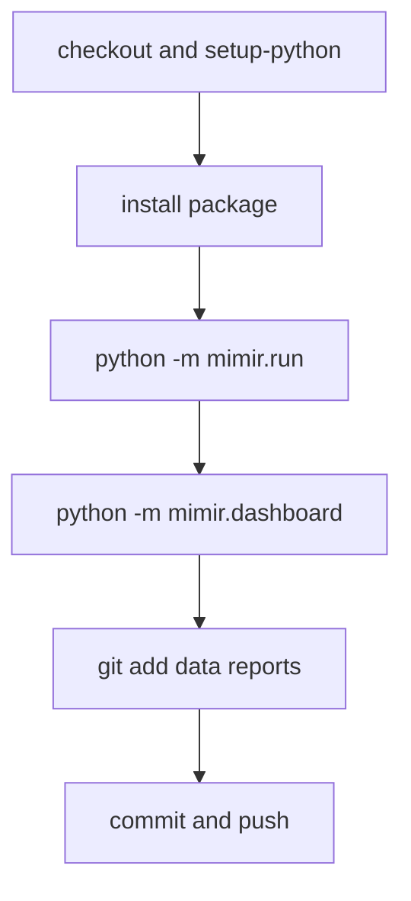

# OPS1. Scheduled Dashboard Publication — 설계

> **스펙 ID**: OPS1
> **작성일**: 2026-06-17
> **상태**: 구현 완료.
> **선행**: [데이터 닥터 설계](2026-06-13-data-doctor-design.md) · [대시보드 CLI](../../architecture/improvement-catalog.md) · [GitHub Actions Node24 설계](2026-06-16-github-actions-node24-design.md)

---

## 1. 한눈에 보기

OPS1 이전 scheduled pipeline은 `reports/status.html`, 날짜별 일일 리포트, `reports/index.html`을 커밋했지만 `reports/dashboard.html`은 갱신하지 않았다.

`mimir.dashboard`는 이미 저장된 데이터, 최신 manifest, doctor 결과를 읽어 한 장짜리 운영 대시보드를 만들 수 있었다. OPS1은 새 대시보드를 만들지 않고 기존 CLI를 reusable workflow에 연결해 scheduled run마다 `reports/dashboard.html`도 함께 커밋하게 했다.

중요한 결정은 **doctor hard gate(doctor 결과로 workflow를 실패시키는 정책)를 넣지 않는 것**이었다. Doctor 결과는 dashboard에 표시하고, workflow 실패 조건으로 쓰는 정책은 secrets 없는 운영, 누락 데이터 오탐, 데이터 커밋 순서가 정리된 뒤 별도 증분으로 남겼다.

이 결정은 doctor finding에만 적용된다. 기존 `mimir.run`의 collect failure gate, 즉 source 수집 실패가 있으면 pipeline step이 실패하는 동작은 OPS1에서 바꾸지 않았다.

---

## 2. OPS1 이전 문제와 근거

### 2.1 OPS1 이전 workflow는 dashboard를 publish하지 않았다

OPS1 이전 reusable workflow는 pipeline 실행 뒤 `data`와 `reports`를 커밋했다.

```yaml
# .github/workflows/_pipeline.yml
- name: Run pipeline
  run: python -m mimir.run --cadence "$CADENCE"
- name: Commit data + reports
  run: |
    git add data reports
```

`git add reports`는 dashboard 파일이 있으면 커밋할 수 있었다. 그러나 workflow가 `python -m mimir.dashboard`를 실행하지 않았기 때문에 scheduled run에서 `reports/dashboard.html`이 새로 만들어지지 않았다.

### 2.2 `mimir.run`과 workflow 주석의 흐름이 어긋나 있다

`mimir.run.run_pipeline`의 실제 흐름은 다음 순서다.

1. `collect`
2. `analyze`
3. `history`
4. `evaluate`
5. `deliver`

하지만 OPS1 이전 `_pipeline.yml`의 상단 주석은 `collect -> analyze -> history -> deliver`라고 설명했다. OPS1은 dashboard publish를 추가하면서 이 운영 문서 드리프트도 같이 정리했다.

### 2.3 Dashboard는 이미 doctor 결과를 표시한다

OPS1 이전에도 `mimir.dashboard.run_dashboard`는 다음 일을 이미 했다.

1. 최신 `insights`, `historical`, `evaluation` 데이터를 읽는다.
2. `run_doctor(...)`를 실행한다.
3. 최신 manifest를 읽는다.
4. `reports/dashboard.html`을 쓴다.

따라서 새 HTML renderer나 별도 doctor HTML 조각을 만들 필요가 없었다. Workflow가 기존 CLI를 호출하면 되는 상태였다.

---

## 3. 목표와 비목표

### 목표

- `_pipeline.yml`에서 `python -m mimir.run` 성공 뒤 `python -m mimir.dashboard`를 실행한다.
- Dashboard step은 `Commit data + reports` 전에 실행한다.
- `reports/dashboard.html`이 기존 `git add data reports` 흐름에 포함되게 한다.
- Workflow 테스트가 dashboard step의 존재와 순서를 검증한다.
- Workflow 테스트가 scheduled workflow에 `mimir.doctor` 또는 `--strict` hard gate가 들어오지 않는다는 정책을 검증한다.
- README 3개 언어가 scheduled workflow의 실제 산출물을 설명한다.
- `_pipeline.yml` 주석이 `collect -> analyze -> history -> evaluate -> deliver -> dashboard` 흐름을 말하게 한다.
- 확장성/개선 문서가 scheduled dashboard publish 상태를 추적하게 한다.

### 비목표

- Doctor finding을 workflow 실패 조건으로 쓰지 않는다.
- `mimir.doctor --strict`를 scheduled workflow에 넣지 않는다.
- `mimir.run` 내부에 dashboard 생성을 섞지 않는다.
- `mimir.run`의 collect failure exit-code 정책을 바꾸지 않는다.
- `mimir.dashboard`의 HTML 디자인을 바꾸지 않는다.
- Dashboard를 날짜별 archive로 저장하지 않는다. 이번 증분은 고정 경로 `reports/dashboard.html`만 갱신한다.
- Missing secret이 있는 운영에서 어떤 데이터셋을 기대해야 하는지 정책을 바꾸지 않는다.

---

## 4. 설계

### 4.1 Workflow 단계

`_pipeline.yml`에 `Run dashboard` 단계를 추가한다.

```yaml
- name: Run dashboard
  run: python -m mimir.dashboard --data-root data --reports-root reports
```

이 단계는 `Run pipeline` 다음, `Commit data + reports` 전에 둔다.



`--data-root data`와 `--reports-root reports`는 기본값과 같지만 workflow에서는 명시한다. 운영자가 workflow만 읽어도 dashboard가 어떤 tree를 읽고 어디에 쓰는지 바로 알 수 있어야 한다.

### 4.2 Dashboard가 doctor 결과를 표면화하는 방식

`mimir.dashboard`는 doctor를 직접 실행하지만, doctor severity를 exit code로 변환하지 않는다. `main()`은 정상 렌더링 후 0을 반환한다.

따라서 동작은 다음과 같다.

| 상황 | Workflow 결과 | 사용자에게 보이는 결과 |
|---|---|---|
| doctor finding 없음 | 성공 | dashboard health badge가 OK |
| doctor WARN | 성공 | dashboard health table에 WARN 표시 |
| doctor CRITICAL | 성공 | dashboard health table에 CRITICAL 표시 |
| dashboard 렌더링 코드가 예외 발생 | 실패 | reports를 잘못 publish하지 않음 |
| `mimir.run`이 source 실패를 반환 | 실패 | 기존 collect failure gate 유지 |

Doctor finding은 운영자가 봐야 하는 데이터 품질 신호다. 그러나 이번 증분에서는 deploy gate가 아니다.

### 4.3 왜 hard gate를 넣지 않는가

Doctor CLI는 CRITICAL이면 exit code 1을 반환한다. 이 기능은 수동 점검과 별도 엄격 cron에 유용하다.

하지만 scheduled collection workflow에 바로 연결하면 문제가 생긴다.

1. `Commit data + reports` 전에 workflow가 멈출 수 있다.
2. 그러면 사용자가 확인할 최신 report와 dashboard가 repo에 남지 않는다.
3. Secret이 없는 운영에서는 source builder가 일부 source를 건너뛰지만, doctor expectation은 명시 상수에서 온다.
4. 이 차이는 진단 관점에서는 맞지만, hard gate 관점에서는 상시 실패를 만들 수 있다.

그래서 이번 증분은 doctor finding을 **보이게 만들기**까지만 한다. **막는 정책**은 별도 설계로 분리한다.

단, 이는 `python -m mimir.run` 자체의 실패 정책을 완화한다는 뜻이 아니다. 현재 `mimir.run`은 source 수집 실패가 있으면 비-0 종료를 반환한다. 이 동작은 이미 status report와 manifest 의미를 가진 별도 운영 계약이므로 이번 증분에서 손대지 않는다. 따라서 publish-first 정책은 "pipeline이 성공한 뒤 dashboard가 발견한 doctor WARN/CRITICAL을 이유로 commit을 막지 않는다"로 한정한다.

### 4.4 테스트 설계

기존 `tests/test_workflows.py`는 workflow action major만 검증한다. 여기에 pipeline ordering test를 추가한다.

테스트는 YAML parser에 의존하지 않는다. GitHub Actions의 `on:` 키가 일부 YAML parser에서 boolean으로 해석될 수 있기 때문이다.

검증할 계약은 다음과 같다.

1. `_pipeline.yml`에 `- name: Run dashboard`가 있다.
2. 그 아래 command가 `python -m mimir.dashboard`를 실행한다.
3. command에는 `--data-root data`와 `--reports-root reports`가 있다.
4. `Run dashboard`는 `Run pipeline`보다 뒤에 있다.
5. `Run dashboard`는 `Commit data + reports`보다 앞에 있다.
6. `_pipeline.yml`은 `python -m mimir.doctor`를 직접 실행하지 않는다.
7. `_pipeline.yml`은 `--strict` hard gate를 포함하지 않는다.

### 4.5 문서 갱신 범위

README 3개 언어에서 scheduled workflow 설명을 갱신한다. 문구는 daily workflow에만 묶지 않는다. Hourly, daily, weekly, monthly caller가 모두 reusable `_pipeline.yml`을 쓰기 때문이다.

| 파일 | 변경 |
|---|---|
| `README.md` | scheduled workflow 설명에 dashboard publish를 추가 |
| `README.ko.md` | 같은 설명을 한국어로 반영 |
| `README.zh.md` | 같은 설명을 중국어로 반영 |
| `docs/architecture/extensibility/README.md` | 데이터 흐름 설명에 scheduled dashboard publish를 반영 |
| `docs/architecture/improvement-catalog.md` | OPS1 운영 가시성 항목과 hard gate 보류 정책을 반영 |

개발자용 CLI 목록은 이미 `mimir.dashboard`를 포함한다. 별도 새 CLI 설명은 필요 없다.

---

## 5. 운영 시나리오

### 5.1 정상 daily run

1. Workflow가 `python -m mimir.run --cadence daily`를 실행한다.
2. Pipeline이 새 data와 날짜별 report를 만든다.
3. Workflow가 `python -m mimir.dashboard --data-root data --reports-root reports`를 실행한다.
4. Dashboard가 방금 갱신된 data와 reports tree를 읽는다.
5. Commit step이 `data`와 `reports`를 함께 커밋한다.

핵심: 사용자는 날짜별 report와 최신 dashboard를 같은 commit에서 본다.

### 5.2 Doctor가 CRITICAL을 발견한 run

1. Pipeline은 성공한다.
2. Dashboard가 doctor를 실행한다.
3. Doctor report의 worst severity가 CRITICAL이어도 dashboard CLI는 렌더링을 마치고 0을 반환한다.
4. Commit step이 dashboard를 커밋한다.

핵심: 데이터 품질 문제는 dashboard에 남는다. Workflow가 doctor finding 때문에 evidence publish를 막지는 않는다.

### 5.3 Source 수집 실패가 있는 run

1. Workflow가 `python -m mimir.run --cadence ...`를 실행한다.
2. Source 수집 중 하나 이상이 실패한다.
3. `mimir.run`이 기존처럼 비-0 종료를 반환한다.
4. Dashboard step과 commit step은 실행되지 않는다.

핵심: 이번 증분은 doctor hard gate를 추가하지 않는 것이다. 기존 pipeline failure gate를 publish-first 정책으로 바꾸는 작업은 아니다.

### 5.4 Dashboard 렌더링 자체가 깨진 run

1. Pipeline은 성공한다.
2. Dashboard CLI가 예외를 낸다.
3. Workflow가 실패한다.
4. Commit step은 실행되지 않는다.

핵심: 깨진 dashboard를 조용히 publish하지 않는다. 이 실패는 doctor finding이 아니라 renderer regression이다.

### 5.5 Hourly, weekly, monthly run

Caller workflow는 모두 reusable `_pipeline.yml`을 호출한다. 따라서 dashboard publish는 daily에만 붙지 않는다.

핵심: cadence별 workflow 중복 없이 한 곳에서 운영 dashboard publish 계약을 관리한다.

### 5.6 나중에 hard gate를 추가하려는 경우

이 증분의 테스트는 dashboard publish 순서와 "현재 workflow에 doctor hard gate가 없다"는 정책을 고정한다. Hard gate를 추가하려면 별도 spec에서 다음 정책을 먼저 정해야 한다.

1. CRITICAL 발견 후에도 report/dashboard를 commit할지
2. Missing secret 환경에서 expected dataset을 어떻게 해석할지
3. WARN과 CRITICAL의 배포 차단 기준을 어떻게 다르게 둘지
4. 별도 scheduled doctor job으로 분리할지

핵심: 이 설계는 나중의 hard gate를 막지 않는다. 다만 지금은 publish-first 정책을 고정한다.

---

## 6. 예상 변경 파일

| 파일 | 변경 유형 | 내용 |
|---|---|---|
| `.github/workflows/_pipeline.yml` | workflow | `Run dashboard` step 추가, 상단 주석 갱신 |
| `tests/test_workflows.py` | test | dashboard step 순서, command 계약, doctor hard gate 부재 테스트 추가 |
| `README.md` | docs | scheduled workflow 산출물 설명 갱신 |
| `README.ko.md` | docs | 한국어 설명 갱신 |
| `README.zh.md` | docs | 중국어 설명 갱신 |
| `docs/architecture/extensibility/README.md` | docs | 데이터 흐름과 scheduled publication 설명 갱신 |
| `docs/architecture/improvement-catalog.md` | docs | OPS1 완료/보류 정책 반영 |
| `docs/superpowers/specs/2026-06-17-scheduled-dashboard-publication-design.md` | spec | 이 설계 문서 |

---

## 7. 수용 기준

- [x] `_pipeline.yml`이 `Run pipeline` 뒤, `Commit data + reports` 앞에서 `python -m mimir.dashboard --data-root data --reports-root reports`를 실행한다.
- [x] `_pipeline.yml` 주석이 실제 흐름을 `collect -> analyze -> history -> evaluate -> deliver -> dashboard`로 설명한다.
- [x] `tests/test_workflows.py`가 dashboard step의 존재, command, 순서를 검증한다.
- [x] `tests/test_workflows.py`가 `_pipeline.yml`에 `mimir.doctor`와 `--strict` hard gate가 없음을 검증한다.
- [x] README 3개 언어가 모든 scheduled cadence가 reusable workflow를 통해 `reports/dashboard.html`도 갱신한다고 설명한다.
- [x] Architecture/improvement docs가 OPS1 완료 상태와 doctor hard gate 보류 정책을 설명한다.
- [x] Doctor WARN/CRITICAL은 dashboard에 표시되지만 workflow 실패 조건으로 쓰지 않는다는 정책이 문서에 남는다.
- [x] 기존 `mimir.run` collect failure gate는 변경하지 않는다.
- [x] `uv run pytest tests/test_workflows.py -q`가 통과한다.
- [ ] `uv run ruff check .`, `uv run mypy mimir`, `uv run pytest -q`가 통과한다.

---

## 8. 구현 작업 분해

1. Workflow ordering test를 먼저 추가한다.
2. Workflow hard-gate negative test를 추가한다.
3. `_pipeline.yml`에 `Run dashboard` step과 최신 주석을 넣는다.
4. README 3개 언어와 architecture/improvement docs를 갱신한다.
5. Targeted test를 통과시킨다.
6. 전체 quality gate를 실행한다.
7. 구현 뒤 이 spec의 상태와 수용 기준을 갱신한다.

각 작업은 기존 workflow parser 테스트 스타일을 따른다. YAML parser 의존성은 추가하지 않는다.
