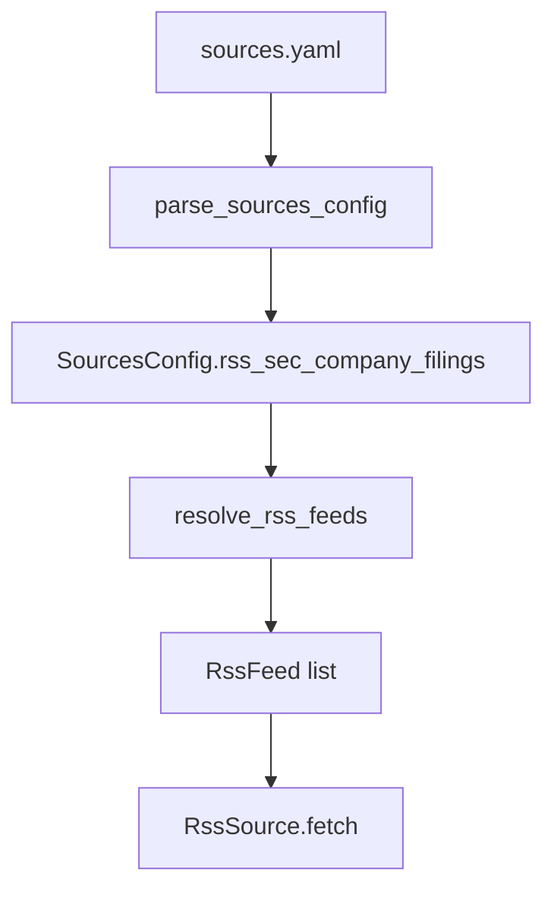

# R1f-SEC. SEC EDGAR RSS Provider — 설계

> **스펙 ID**: R1f-SEC
> **상태**: 구현 예정
> **작성일**: 2026-06-17
> **선행**: [정적 RSS feed catalog](2026-06-17-rss-feed-catalog-design.md) · [발전 카탈로그](../../architecture/improvement-catalog.md) · [개선 백로그](../../IMPROVEMENTS.md)

---

## 1. 한눈에 보기

R1f-SEC는 R1f의 전체 live discovery를 구현하지 않는다. 대신 SEC가 공식으로 제공하는 EDGAR Atom feed URL만 설정에서 안전하게 조립한다. 이 증분은 사용자가 CIK와 선택적 form type을 알고 있을 때, 종목별 SEC filing RSS feed를 `sources.rss`에 반복 입력하지 않아도 되게 만든다.

---

## 2. 문제와 근거

R1d는 사용자가 종목별 RSS URL을 알고 있으면 `sources.rss.feeds[].symbol`로 symbol 관계를 저장하게 했다. R1e는 `sources.rss.catalogs`로 검증된 정적 feed를 id로 고르게 했다. 하지만 둘 다 사용자가 회사별 SEC EDGAR RSS URL을 직접 만들어야 한다.

SEC 공식 문서는 Company Search와 Latest Filings Search의 일부 검색 결과가 RSS feed로 캡처될 수 있다고 설명한다. SEC Developer Resources는 스크립트 접근 시 효율적인 요청, 필요한 것만 다운로드, aggregate 10 requests/sec 이하, 선언된 automated tool 식별을 요구한다.

따라서 generic live discovery는 아직 이르다. 임의 provider 웹사이트를 크롤링하거나 URL pattern을 추측하면 Mimir의 무료·합법·공식 소스 우선 원칙을 깨뜨릴 수 있다.

---

## 3. 범위

### 3.1 포함

- `sources.rss.sec.company_filings` 설정을 추가한다.
- 각 항목은 `cik`, 선택적 `symbol`, 선택적 `forms`, 선택적 `count`, 선택적 `owner`를 받는다.
- Resolver는 각 항목을 하나 이상의 `RssFeed`로 확장한다.
- URL은 SEC의 `browse-edgar` Atom endpoint만 조립한다.
- 네트워크 호출은 하지 않는다. URL이 실제로 fetch되는 시점은 기존 `RssSource.fetch()`다.
- `RssSource`는 설정된 `MIMIR_SEC_USER_AGENT` 값을 `User-Agent` header로 보내야 한다.
- 중복 feed 검증은 기존 `resolve_rss_feeds()`의 `(url, symbol)` 정책을 그대로 쓴다.
- 문서는 SEC fair-access와 User-Agent 요구를 명시한다.

### 3.2 제외

- SEC HTML 페이지를 크롤링해 RSS link를 찾지 않는다.
- watchlist symbol에서 CIK를 자동 조회하지 않는다.
- Company name, ticker, SIC, full-text search query permutation을 자동 생성하지 않는다.
- SEC 외 provider를 지원하지 않는다.
- structured disclosure RSS categories는 이번 증분에서 추가하지 않는다. SEC가 형식 변경 가능성을 명시하므로 별도 spec으로 분리한다.
- Workflow에 새 네트워크 job을 추가하지 않는다.

---

## 4. 설정 계약

```yaml
sources:
  rss:
    sec:
      company_filings:
        - cik: "0000320193"
          symbol: "AAPL"
          forms: ["10-K", "10-Q", "8-K"]
          count: 40
          owner: "exclude"
```

| 필드 | 필수 | 기본값 | 의미 |
|---|---|---|---|
| `cik` | 예 | 없음 | SEC Central Index Key. 숫자 1~10자리 문자열을 받으며 URL에는 10자리 zero-pad를 쓴다. |
| `symbol` | 아니오 | 없음 | feed가 특정 watchlist symbol에 대응할 때 `RawRecord.symbol`로 저장할 값이다. |
| `forms` | 아니오 | 없음 | SEC form type 목록이다. 앞뒤 공백을 제거하고, URL에는 query encoder로 인코딩한다. 없으면 회사 전체 filing feed 하나를 만든다. |
| `count` | 아니오 | `40` | SEC Atom feed의 `count` query parameter다. 허용 범위는 10~100이다. |
| `owner` | 아니오 | `exclude` | SEC owner filter다. 허용 값은 `exclude`, `include`, `only`다. |

`forms`가 여러 개면 form별 URL을 각각 만든다. 예를 들어 위 설정은 `10-K`, `10-Q`, `8-K` 세 feed를 만든다. 같은 CIK와 form이 여러 symbol에 연결될 수 있으므로 중복 검증은 기존처럼 `(url, symbol)`을 기준으로 한다.

생성된 feed는 `publisher="SEC"`와 `market="US"`를 사용한다. 사용자가 이 두 값을 따로 입력하지 않는 이유는 이 설정 블록이 SEC EDGAR 전용 provider이기 때문이다.

---

## 5. URL 조립 규칙

Base URL은 `https://www.sec.gov/cgi-bin/browse-edgar`다.

Form filter가 없을 때:

```text
https://www.sec.gov/cgi-bin/browse-edgar?action=getcompany&CIK=0000320193&owner=exclude&count=40&output=atom
```

Form filter가 있을 때:

```text
https://www.sec.gov/cgi-bin/browse-edgar?action=getcompany&CIK=0000320193&type=10-K&owner=exclude&count=40&output=atom
```

Form filter는 string concat으로 붙이지 않는다. `urllib.parse.urlencode()` 같은 구조화된 query encoder를 사용한다. `10-K/A` 같은 amended form은 `type=10-K%2FA`로 인코딩되어야 한다.

Query parameter는 deterministic order를 쓴다. 테스트는 정확한 URL 문자열을 고정한다. URL 문자열이 흔들리면 JSONL `idempotency_key`가 아니라 feed 설정만 바뀌지만, 운영자가 diff를 보고 검토하기 어렵다.

---

## 6. 아키텍처



새 모델은 `mimir/sources/rss_catalog.py`에 둔다. R1e의 catalog resolver가 이미 RSS feed 확장을 소유하므로, SEC provider resolver도 같은 모듈 안에서 관리한다. 별도 source를 만들지 않는 이유는 결과가 여전히 RSS feed 목록이고, fetch 정책은 기존 `RssSource`가 담당하기 때문이다.

---

## 7. 실패와 예외 처리

| 상황 | 처리 |
|---|---|
| `cik`가 비어 있음 | pydantic validation error |
| `cik`에 숫자 외 문자가 있음 | pydantic validation error |
| `cik`가 10자리보다 김 | pydantic validation error |
| `forms` 항목이 빈 문자열 | pydantic validation error |
| `count`가 10 미만 또는 100 초과 | pydantic validation error |
| `owner`가 허용 값 밖 | pydantic validation error |
| manual feed와 SEC provider feed가 같은 `(url, symbol)` | `duplicate RSS feed` `ValueError` |

설정 오류는 기존 `parse_sources_config()` 경로에서 실패한다. CLI는 기존처럼 `[mimir] invalid sources.yaml` 메시지를 출력한다.

---

## 8. 운영 정책

SEC 요청은 기존 `RssSource.fetch()`에서만 발생한다. R1f-SEC는 설정 파싱과 URL 조립 중 네트워크를 호출하지 않는다. 따라서 이 증분은 scheduled workflow의 요청 수를 “설정한 feed 수”만큼 늘릴 뿐, discovery 단계의 별도 요청을 만들지 않는다.

SEC fair-access 정책 때문에 사용자는 `MIMIR_SEC_USER_AGENT`에 contact email을 포함해야 한다. 이 요구는 기존 `SecEdgarSource`에도 이미 있다. R1f-SEC는 같은 SEC 도메인을 쓰므로 config reference에서 User-Agent 책임을 다시 설명한다.

구현은 `RssSource(user_agent=settings.sec_user_agent)` 형태로 builder를 배선한다. 테스트는 SEC RSS fetch 요청에 `User-Agent` header가 실제로 붙는지 검증한다.

---

## 9. 문서 영향

| 파일 | 변경 |
|---|---|
| `docs/reference/config/sources.md` | `sources.rss.sec.company_filings` 설정, 제한, 예시 추가 |
| `docs/architecture/extensibility/README.md` | RSS 확장성 흐름에 SEC provider URL 조립 추가 |
| `docs/architecture/improvement-catalog.md` | R1f를 generic live discovery 보류에서 R1f-SEC 부분 구현으로 분리 |
| `docs/IMPROVEMENTS.md` | 후속 후보를 SEC constrained provider 구현 완료와 generic discovery 보류로 정리 |

README 3개 언어는 이번 증분에서 수정하지 않는다. 사용자 quickstart에 넣기에는 고급 설정이며, config reference가 더 적합한 위치다.

---

## 10. 수용 기준

- [ ] `parse_sources_config()`가 `sources.rss.sec.company_filings`를 typed model로 파싱한다.
- [ ] SEC company filing entry는 CIK를 10자리로 zero-pad한다.
- [ ] 생성된 SEC feed는 `publisher="SEC"`와 `market="US"`를 사용한다.
- [ ] form filter가 없으면 회사 전체 Atom URL 하나를 만든다.
- [ ] `forms`가 있으면 form별 Atom URL을 deterministic order로 만든다.
- [ ] amended form `10-K/A`는 `type=10-K%2FA`로 URL 인코딩된다.
- [ ] `symbol`은 기존 `RssFeed.symbol` 정규화 규칙을 재사용한다.
- [ ] duplicate `(url, symbol)`은 기존과 같은 `duplicate RSS feed` 오류를 낸다.
- [ ] 파싱과 resolver는 네트워크를 호출하지 않는다.
- [ ] `RssSource.fetch()`가 builder에서 받은 `MIMIR_SEC_USER_AGENT` 값을 `User-Agent` header로 보낸다.
- [ ] Config reference, extensibility docs, improvement catalog, backlog가 새 경계와 보류 범위를 설명한다.
- [ ] `uv run pytest tests/sources/test_rss_catalog.py tests/sources/test_config.py tests/sources/test_rss.py tests/core/test_builder.py -q`가 통과한다.
- [ ] `uv run ruff check .`, `uv run mypy mimir`, `uv run pytest -q`가 통과한다.

---

## 11. 추적 출처

- SEC RSS Feeds: `https://www.sec.gov/about/rss-feeds` (Last Reviewed or Updated: Oct. 16, 2024)
- SEC Developer Resources: `https://www.sec.gov/about/developer-resources` (Last Reviewed or Updated: March 10, 2025)
- SEC Structured Disclosure RSS Feeds: `https://www.sec.gov/data-research/structured-data/structured-disclosure-rss-feeds` (Last Reviewed or Updated: Jan. 21, 2026)
- Local verification: `curl -L -A 'Mimir research contact@example.com' 'https://www.sec.gov/cgi-bin/browse-edgar?action=getcompany&CIK=0000320193&owner=exclude&count=40&output=atom'` returned Atom XML on 2026-06-17.
