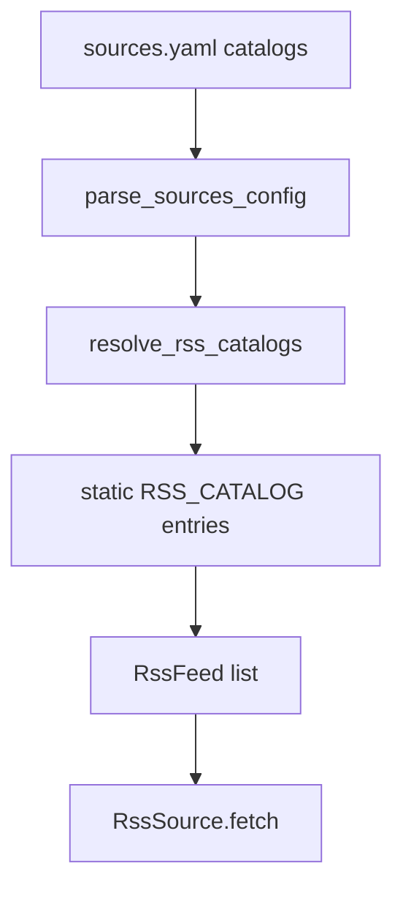

# R1g-SEC-STRUCTURED. SEC Structured Disclosure RSS Catalog — 설계

> **스펙 ID**: R1g-SEC-STRUCTURED
> **상태**: 구현 완료
> **작성일**: 2026-06-18
> **선행**: [정적 RSS feed catalog](2026-06-17-rss-feed-catalog-design.md) · [R1f-SEC EDGAR RSS provider](2026-06-17-sec-edgar-rss-provider-design.md) · [발전 카탈로그](../../architecture/improvement-catalog.md) · [개선 백로그](../../IMPROVEMENTS.md)

---

## 1. 한눈에 보기

R1g-SEC-STRUCTURED는 SEC가 공식으로 공개한 structured disclosure RSS feed 4개를 `sources.rss.catalogs`에서 고를 수 있게 한다. 사용자는 URL을 직접 복사하지 않고 catalog id만 적는다.

이번 증분은 live discovery가 아니다. Resolver는 네트워크를 호출하지 않고, SEC HTML을 크롤링하지 않으며, vendor URL pattern을 추측하지 않는다. 이미 검증된 공식 RSS URL을 정적 catalog에 추가하는 작은 확장이다.

---

## 2. 문제와 근거

R1e는 `sec_press_releases` catalog id를 추가했다. R1f-SEC는 사용자가 CIK를 알고 있을 때 SEC Company Search Atom URL을 조립하게 했다. 그러나 SEC가 따로 제공하는 structured disclosure RSS feed는 아직 catalog에 없다.

SEC Structured Disclosure RSS Feeds 문서는 EDGAR structured disclosure submissions용 RSS feed를 제공한다고 설명한다. 이 feed들은 평일 6am-10pm EST에 10분마다 갱신되며, SEC는 content와 format이 사전 고지 없이 바뀔 수 있다고 명시한다.

따라서 이 feed들을 정적 catalog로 추가하는 것은 안전하다. 반대로 ticker→CIK 자동 조회, HTML RSS link crawling, non-SEC provider discovery는 별도 정책과 실패 경계가 필요하다.

---

## 3. 범위

### 3.1 포함

- `RSS_CATALOG`에 SEC structured disclosure feed 4개를 추가한다.
- 새 catalog id는 `RssFeed(publisher="SEC", market="US")`로 확장된다.
- `resolve_rss_catalogs()`와 `resolve_rss_feeds()`의 기존 순서와 중복 정책을 유지한다.
- `sources.rss.catalogs` 문서에 새 id와 feed 성격을 추가한다.
- 발전 카탈로그와 개선 백로그에서 SEC structured disclosure category 자동화 부채를 부분 해소로 표시한다.
- `ticker→CIK` 자동 lookup은 설계-only deferred item으로 남긴다.

### 3.2 제외

| 제외 항목 | 이유 |
|---|---|
| SEC ticker→CIK 자동 lookup | SEC 공식 mapping file은 있지만 accuracy/scope가 보장되지 않는다. Resolver no-network 불변식과 캐시·모호성 실패 정책이 필요하다. |
| Watchlist 전체 SEC feed 자동 생성 | 요청 수를 watchlist 크기만큼 늘린다. 사용자가 명시한 feed만 수집하는 현재 정책과 다르다. |
| SEC HTML RSS link crawling | HTML 구조는 API 계약이 아니다. |
| SEC 외 provider discovery | Provider별 ToS와 rate limit 검토가 필요하다. |
| Monthly archive ingestion | structured disclosure monthly archive는 대량 historical backfill이며 RSS catalog 확장과 다른 문제다. |
| Structured disclosure URL templating | 이번 증분은 공식 문서에서 링크된 현재 URL 4개만 정적으로 담는다. |

---

## 4. Catalog ID 계약

새 id는 다음 네 개다.

| id | URL | 의미 |
|---|---|---|
| `sec_structured_usgaap` | `https://www.sec.gov/Archives/edgar/usgaap.rss.xml` | US GAAP 또는 IFRS taxonomy로 tagging된 financial statement filing |
| `sec_structured_risk_return` | `https://www.sec.gov/Archives/edgar/xbrl-rr.rss.xml` | US Mutual Fund Risk/Return taxonomy로 tagging된 mutual fund filing |
| `sec_structured_inline_xbrl` | `https://www.sec.gov/Archives/edgar/xbrl-inline.rss.xml` | Inline XBRL financial statement filing |
| `sec_structured_all_xbrl` | `https://www.sec.gov/Archives/edgar/xbrlrss.all.xml` | SEC에 제출된 all XBRL filing |

각 feed는 broad SEC/XBRL feed다. 특정 watchlist symbol 전용 feed가 아니므로 `symbol`을 설정하지 않는다. 뉴스 matcher는 이 feed를 제목·요약·alias 기반으로만 해석한다.

---

## 5. 아키텍처

`mimir/sources/rss_catalog.py`의 `RSS_CATALOG`만 확장한다. 새 resolver, 새 source, 새 network client는 만들지 않는다.

`resolve_rss_catalogs()`는 entry의 `feed`를 deep copy해서 반환한다. 이 정책은 기존 `sec_press_releases`와 같다. 호출자가 반환된 `RssFeed`를 mutate해도 catalog 원본은 바뀌지 않는다.

---

## 6. 실패와 예외 처리

| 상황 | 처리 |
|---|---|
| 새 catalog id 오타 | 기존과 같은 `ValueError("unknown RSS catalog id: ...")` |
| 같은 structured feed를 catalog와 manual feed에 동시에 설정 | 기존과 같은 `duplicate RSS feed` 오류 |
| structured feed fetch 실패 | 기존 `RssSource.fetch()` 실패 경로를 따른다 |
| SEC가 content/format을 바꿈 | parsing 실패나 skip은 기존 RSS fetch/parser 경계에서 드러난다. Catalog resolver는 네트워크를 호출하지 않는다 |

---

## 7. 운영 정책

SEC fair-access 정책은 자동화 도구가 효율적으로 필요한 요청만 보내고, 초당 10개 이하 요청을 유지하며, `User-Agent`에 조직과 연락처를 선언하라고 요구한다.

`build_sources()`로 만든 `RssSource`는 이미 `MIMIR_SEC_USER_AGENT` 값을 모든 RSS 요청의 `User-Agent` header로 보낸다. 이번 증분은 새 feed id만 추가하므로 fetch 정책을 바꾸지 않는다.

---

## 8. 문서 영향

| 파일 | 변경 |
|---|---|
| `config/sources.yaml` | structured disclosure catalog id 예시 추가 |
| `docs/reference/config/sources.md` | catalog id 목록과 broad/non-symbol feed 설명 추가 |
| `docs/architecture/extensibility/README.md` | RSS catalog 설명에 SEC structured disclosure feed 추가 |
| `docs/architecture/improvement-catalog.md` | R1g-SEC-STRUCTURED를 완료 항목으로 추가하고 generic discovery debt를 더 좁힘 |
| `docs/IMPROVEMENTS.md` | 후속 후보에서 SEC structured disclosure category를 제거하고 ticker→CIK/generic discovery를 남김 |

README 3개 언어는 수정하지 않는다. Structured disclosure feed는 고급 설정이며, quickstart보다 config reference와 architecture docs가 맞는 위치다.

---

## 9. 수용 기준

- [x] `resolve_rss_catalogs()`가 네 structured disclosure id를 예상 `RssFeed`로 확장한다.
- [x] 반환된 structured feed는 `publisher="SEC"`, `market="US"`, `symbol=None`이다.
- [x] Catalog entry는 deep copy로 반환되어 mutation이 원본 catalog에 남지 않는다.
- [x] Manual feed와 structured catalog feed의 동일 `(url, symbol)` 중복은 실패한다.
- [x] Unknown id, 기존 `sec_press_releases`, SEC company filing URL 조립 동작은 회귀하지 않는다.
- [x] Config reference와 architecture docs는 structured feed가 broad feed이며 symbol-specific feed가 아니라고 설명한다.
- [x] Improvement catalog와 backlog는 SEC structured disclosure RSS catalog는 해소됐고 ticker→CIK/generic discovery는 보류라고 말한다.
- [x] `uv run pytest tests/sources/test_rss_catalog.py tests/sources/test_config.py -q`가 통과한다.
- [ ] `uv run ruff check .`, `uv run mypy mimir`, `uv run pytest -q`, `git diff --check`가 통과한다.

---

## 10. 추적 출처

- SEC Structured Disclosure RSS Feeds: `https://www.sec.gov/data-research/structured-data/structured-disclosure-rss-feeds` (Last Reviewed or Updated: Jan. 21, 2026)
- SEC Developer Resources: `https://www.sec.gov/about/developer-resources` (Last Reviewed or Updated: March 10, 2025)
- SEC Accessing EDGAR Data: `https://www.sec.gov/search-filings/edgar-search-assistance/accessing-edgar-data` (Last Reviewed or Updated: June 26, 2024)
- Local verification on 2026-06-18 KST: all four structured disclosure URLs returned HTTP 200 and `content-type: text/xml` with declared `User-Agent`.
